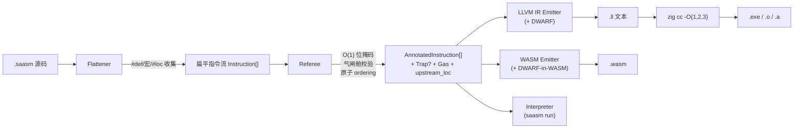
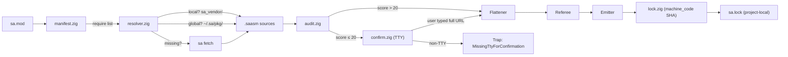

# SA 语言与编译器 技术设计文档

> 本设计承接 `requirements.md` 中的 23 条强约束需求。设计原则：**零 AST、线性扫描、O(1) 位掩码、直通 LLVM IR / WASM 二进制、五符号契约、气闸舱 FFI、前端降级责任制、上游源码映射**。
>
> 语言名称为 **SA**（Symbolic Affine）。CLI 前缀与文件扩展名仍用 `saasm` / `.saasm` 以兼容讨论历史。

---

## 1. Overview（总览）

### 1.1 物理定位

SA 不是一门"给人写的语言"，而是：

1. **一条指令流的物理验证协议**：仿射状态机 + O(1) 位掩码。
2. **一条直通 LLVM IR / WASM 的发射管线**：不经过任何高级语言源码中继。
3. **一套气闸舱 FFI**：把 unsafe 物理隔离到专属函数。
4. **一份前端降级合约**：词法作用域跟踪、隐式 Drop、Phi 一致性全部由**上游**（smrustc / LLM / 手写）负责。

三种形态：

| 形态 | 载体 | 物理本质 |
|---|---|---|
| 源码形态 | `.saasm` 文本 | 一维字节数组 |
| 指令形态 | `Instruction[]` | 扁平三地址码数组 |
| 产出形态 | `.exe` / `.o` / `.a` / `.wasm` | 原生目标文件 / WebAssembly |

**不存在任何阶段构造 AST**，**不经过 Zig 源码往返**。

### 1.2 编译管线



### 1.3 核心设计原则

1. **零 AST**：扁平数组 + `u32` 下标。
2. **线性扫描**：单次前向扫描；唯一例外是 Phi 汇聚点求交集。
3. **O(1) 位掩码**：`u8` 的 AND/OR。
4. **五符号契约**：`=` `&` `^` `!` `*`。
5. **直通 LLVM / WASM**：绝不生成 Zig 源码作为中间态。
6. **气闸舱隔离**：`*` / `assume_*` 只能出现在 `@ffi_wrapper` 内，Referee 一次位判断强制。
7. **前端责任制（NEW）**：Drop 插入、Phi 一致性由上游负责；SA 不做作用域分析，Referee 只做事后校验。
8. **上游可追溯（NEW）**：`#loc` 伪指令 → `upstream_loc` → DWARF `!DILocation` → gdb/lldb 断点。
9. **错误传播显式化（NEW）**：`!` 后缀函数 + `?` 早返回；不提供任何隐式 unwinding。

### 1.4 宏驱动高级特性演进 (Macro-Driven Advanced Features)
为了保持 SA-ASM 的核心指令集（ISA）极简（即 Zero-ISA 扩展），且同时具备等同于 Rust 的高级特性，我们确立了**纯宏与静态校验驱动**的实现路线。以下是亟待通过 `[MACRO]` 和 `referee.zig` 实现的 5 大特性：

1. **动态分发与间接调用 (Defunctionalization 代替 `dyn Trait`)**
   - **痛点**：目前 SA 缺乏 `call_indirect` 函数指针指令，无法优雅实现事件循环（Event Loop）和插件钩子。
   - **实现方案**：坚决不修改 ISA。通过宏 `[MACRO] DISPATCH` 生成基于 Enum Tag 的静态分支路由树（`eq` + `br`），实现去功能化（Defunctionalization），以 O(log N) 的极低性能损耗模拟动态分发。
2. **安全的枚举与模式匹配 (Tagged Unions / Sum Types)**
   - **痛点**：通过原生内存偏移和整数标记手工模拟 `Option/Result` 极易引发内存安全或越界漏洞。
   - **实现方案**：通过定义标准宏 `[MACRO] MATCH_RESULT`，自动根据内存 Layout 中的 Tag 执行安全解包和条件分支跳转（Exhaustive Match），屏蔽底层的裸指针计算。
3. **细粒度的结构体字段级借用 (Disjoint Field Borrows)**
   - **痛点**：目前 `referee.zig` 将借用绑定在整块内存上，造成网络引擎中大结构体（如 `ConnectionSlot`）频繁整块锁死。
   - **实现方案**：不增加任何新语法，仅强化编译器 `referee.zig` 中对 `ptr_add` 的识别。让编译器认识到借用 `ptr_add obj, 4` 和 `ptr_add obj, 8` 是独立互不干涉的。
4. **RAII 自动清理与 Drop 语义保护**
   - **痛点**：异常路径或中途 `return` 极易漏写 `!p` 导致内存或文件描述符泄漏。
   - **实现方案**：不引入运行时的 `defer`，而是通过强制规范化的作用域收尾宏（如 `[MACRO] DROP_AND_RETURN`）将资源释放指令与 `return` 强制捆绑。
5. **跨线程安全边界约束 (Send / Sync 类似机制)**
   - **痛点**：`sa_net_uring` 中的 SpscRing 进行线程间通信时，缺乏机制保证指针跨核心的安全传递。
   - **实现方案**：在 `verifier.zig` 层面增加对 Capability 的多线程逃逸校验，保障跨核数据投递不发生 Data Race。

### 1.4 为什么不再生成 Zig 源码

- Zig 前端会重建 AST / 类型推导，浪费已压平的工作。
- Zig 类型系统会污染 SA 语义（`@ptrCast` 对齐约束、`Allocator` 隐式约定）。
- 错误映射要穿两层前端，行号语义丢失。

改走 LLVM IR 后：
- IR 与三地址码 1:1 同构。
- 白嫖 O{1,2,3} 优化。
- Zig 降格为 LLVM 驱动器与跨平台链接器。

### 1.5 关于"物理极限"叙事的诚实校准

旧版曾宣称"编译速度达物理极限"。校准事实：

- Flattener + Referee 确实是毫秒级。
- **LLVM O3 是秒级到十秒级瓶颈**，和 rustc 的 LLVM 阶段一个数量级。
- **MVP 默认 `build-exe` 走 O1**（`-O ReleaseSmall` Zig 等价），O3 需显式 `--release-fast`。
- 真正的"毫秒级编译"只对 `saasm run` 内存解释器成立。

### 1.6 CLI 四模驱动

```
saasm run     <file.saasm> [args...]      # 内存解释执行
saasm build-exe  <file.saasm> -o out       # 原生可执行（默认 O1，可 --release-fast 切 O3）
saasm build-wasm <file.saasm> -o out.wasm  # WASM 二进制
saasm build-obj  <file.saasm> -o out.o     # C-ABI 目标文件
```

调试开关：`-g` 启用 DWARF；`--no-debug` 禁用以缩减体积。

### 1.7 Agent-First Toolchain 与 Plugin System (NEW)

SA 编译器全面拥抱 "Agent-First" 理念：
- **结构化诊断**：所有 CLI 命令支持 `--json` 输出，提供稳定的错误码（如 `SA-REF-042`）和基于行/列的修复建议 (`repair`)。
- **Token / Gas 计算**：编译成功时，以 JSON 格式吐出 `compile_tokens` 和 `instruction_count`，供 Agent 侧进行多轮博弈与代码瘦身优化。
- **Agent 交互指令**：提供 `saasm explain <code>` (讲解错误原理)、`saasm fix --plan` (生成结构化修补补丁)。
- **动态自解释与插件系统**：CLI 基于 Zig `comptime` 实现了可插拔插件架构（拆分了 `saasm db`, `saasm sax`, `saasm fetch` 等）。Agent 执行 `saasm skills` 时，主程序会聚合所有已激活插件的能力字典，动态生成完全对齐当前版本的开发手册，杜绝 Agent 幻觉。

### 1.8 SA 标准库 (sa_std) 的能力边界与 FFI 策略 (NEW)

- **纯汇编基元**：`Vec`, `HashMap`, `String`, `Arc/Mutex` 等极轻量数据结构完全由 `.saasm` 宏拼装，零 C 库依赖。
- **极简格式化打印 (NEW)**：提供 `[MACRO] PRINT!` / `FORMAT!` 高层级宏。采用**编译期静态展开**策略，将格式化字符串拆解为一系列底层的 `STRFMT_*` 调用，通过 Zig 端的 FFI 接口执行高效的类型转字符串（如 `f64` 转换）。
- **Zig-backed FFI 桥接**：对于高密度计算（JSON 解析、Regex、文件/网络 I/O、事件循环），走 C-ABI 桥接到高效的 Zig 标准库，对外暴露不透明句柄 (Opaque Handle)。
  - **双模 JSON**：提供 DOM 树解析和 100MB+ 大文件 Streaming 游标零拷贝双模 API。
- **严格剥离重型 C 库**：YAML、XML、TOML 等格式严禁放入 `sa_std`，将被下放至 Package 生态中，由用户按需引入，以维持编译器体积在几 MB 级别。

### 1.9 阶段性里程碑与设计对齐

| 阶段 | 周 | 需求涵盖 | 本设计章节 |
|---|---|---|---|
| 协议定型 | W1-2 | R1, R2, R3, R4, R18, R19, R20, R23 | §2, §3.1, §4 |
| Flattener | W3-5 | R7, R8, R19.1 | §3.2 |
| Referee | W6-9 | R9, R10, R11, R12, R13, R18.5, R19.2 | §3.3, §6, §7 |
| Emitters + CLI | W10-11 | R14, R15, R16, R19.3, R19.4 | §3.4, §3.5, §3.6 |
| sys/FFI/panic runtime | W12 | R13, R17, R18.4 | §3.7 |
| Pilot + Hello + AutoBevy 1K（最低优先级） | W13-14 | R21, R23.3 | §3.8 |

### 1.10 工业级可伸缩性架构 (Industrial Scalability Architecture) - 紧急 P0

针对大规模（10k+ 函数）工程测试中发现的性能瓶颈，借鉴 Zig 编译器内部实现进行如下核心校准：
1. **寄存器作用域局部化**：`Flattener` 必须在进入每个 `@func` 时重置寄存器 ID。确保单个函数的校验复杂度与全工程函数总量解耦。
2. **稀疏状态注解 (Sparse Annotation)**：仅存储状态 **Delta（增量）**，消除 $O(Inst \times Reg)$ 的冗余内存占用。
3. **声明级并行后端 (Per-Decl Parallelism)**：借鉴 Zig `Zcu.PerThread` 模型。不再生成单一庞大 `.ll` 文件，而是将发射任务打散至函数粒度，由多线程并行填充后端模块，彻底释放多核 LLVM 性能。
4. **内存直通物理路径 (In-memory Physical Path)**：借鉴 Zig `codegen/llvm.zig`。放弃文本 IR 发射，通过 `llvm-c` 绑定在内存中直接构造指令对象。消除“生成文本-磁盘写入-后端解析”的冗余链路。
5. **异步流水线 (Asynchronous Pipeline)**：`Referee` 验证与 `In-memory Emitter` 实现异步重叠，达成“瞬发级”编译体验。

---

## 2. Architecture（架构）

### 2.1 进程拓扑（不变）

单进程多阶段，仅 `build-exe` / `build-wasm` 最后派生 `zig cc` / `wasm-strip` 子进程。

### 2.2 工具链实现语言：Zig

- CLI 宿主、Flattener、Referee、Emitters、Interpreter 全部用 Zig 写。
- Zig 本身**不作为发射目标**。
- 产物是单文件静态可执行（libc 外无依赖）。

### 2.3 数据流契约

| 阶段 | 输入 | 输出 | 副作用 |
|---|---|---|---|
| Flattener | `[]const u8` | `[]Instruction` + `DefDict` + `LocTable` | 无 |
| Referee | `[]Instruction` + `LocTable` | `[]AnnotatedInstruction` 或 `TrapReport` | 无（纯函数） |
| LLVM IR Emitter | `[]AnnotatedInstruction` + `LocTable` | `[]const u8`（`.ll`） | 无 |
| WASM Emitter | `[]AnnotatedInstruction` + `LocTable` | `[]const u8`（WASM 字节） | 无 |
| Interpreter | `[]AnnotatedInstruction` + argv | exit code + stdout | 有 I/O |
| zig cc | `.ll` + `.o` + `.a` | `.exe` / `.wasm` | 派生子进程 |

除 Interpreter 与 zig cc 外，所有阶段均为**纯函数**。

### 2.4 版本治理

- 白皮书、Flattener、Referee、LLVM IR 映射、WASM 映射各自独立版本号。
- LLVM 版本随 Zig 内置版本锁定，进 CI 矩阵。
- 测试集（R22）为语义基线。

---

## 3. Components and Interfaces（组件与接口）

### 3.1 源码文本协议

每行属于以下 16 种形态之一（正则级可判别）：

| 形态 | 示例 |
|---|---|
| 空行/注释 | `// comment` |
| 常量定义 | `#def NODE_SIZE = 16` |
| **上游位置伪指令 (NEW)** | `#loc "main.rs":42:7` |
| 函数签名 | `@sum(^list, t) -> i32:` |
| 可失败函数签名（NEW） | `@fs_read(p) -> i32!:` |
| 气闸函数签名 | `@ffi_wrapper open_file(p):` |
| 外部声明 | `@extern malloc(size) -> *void` |
| 导出函数 | `@export tick(e, n):` |
| 跳转标签 | `L_LOOP:` |
| 宏定义起止 | `[MACRO]`, `[END_MACRO]` |
| REP 起止 | `[REP 8]`, `[END_REP]` |
| 宏调用 | `EXPAND SWAP r0, r1` |
| 分配/载入/存储/运算 | `v = load node+0` |
| 裸指针降级（气闸舱） | `raw = *safe` |
| 受洗（气闸舱） | `h = assume_borrow raw, mut` |
| 原子指令（NEW） | `v = atomic_load r+0 acquire` |
| 原生逃逸 | `$ ... $` |
| 错误传播（NEW） | `v = ? res` |

### 3.2 Flattener

**职责**：
1. 扫描 `#def` / `[MACRO]` / `EXPAND` / `[REP]` 做文本展开。
2. 扫描 `#loc` 伪指令 → 为下一条真实指令附带 `upstream_loc`，并维护 `LocTable: Map<expanded_line, UpstreamLoc>`。
3. 禁用语法扫描：`{` `}` `if` `else` `while` `for` `a.b.c` → `ForbiddenSyntax`。
4. 寄存器名规范化为 `u32` ID。
5. 函数签名解析，识别 `@func` / `@ffi_wrapper` / `@extern` / `@export` 四类及 `!` 后缀。

**公开 API**：
```zig
pub fn flatten(
    allocator: std.mem.Allocator,
    source: []const u8,
) !FlattenResult;

pub const FlattenResult = struct {
    instructions: []Instruction,
    def_dict: DefDict,
    loc_table: LocTable,
    trap: ?TrapReport,
};
```

### 3.3 Referee

**职责**：
1. 线性扫描指令数组，逐条"查表 → 位运算校验 → 更新掩码"。
2. Phi 汇聚点求按位 AND。
3. 函数出口残留 Active/Locked → `MemoryLeak`。
4. 气闸舱校验：`RawCast` / `AssumeSafe` / `AssumeBorrow` 仅允许在 `is_ffi_wrapper` 函数内。
5. FFI 所有权越界校验：对 `FfiBorrow` 寄存器禁止 `^` / `!`（物理释放）。
6. **错误传播校验（NEW）**：`?` 早返回分支若有未释放寄存器 → `EarlyReturnLeak`。
7. **原子 ordering 校验（NEW）**：读-改-写对同一地址时，`ordering` 组合必须满足 happens-before 一致性。
8. Gas 计数。

**公开 API**：
```zig
pub fn verify(
    allocator: std.mem.Allocator,
    instructions: []const Instruction,
    loc_table: LocTable,
) !VerifyResult;
```

**实现约束**：
- MVP 核心代码 ≤ 2500 行 Zig（stretch ≤ 1500）。
- 单线程吞吐 ≥ 500K 行/秒（真实代码基准）。

### 3.4 LLVM IR Emitter

**职责**：1:1 映射三地址码到 LLVM IR 文本。

**核心映射**：见附录 A。

**DWARF 输出（NEW）**：
- 为每条指令生成 `!DILocation`，指向 `upstream_loc`；`loc` 缺失则 fallback 到 `.saasm` 文件行号。
- 顶部生成 `!DICompileUnit` / `!DIFile` / `!DISubprogram`。
- 允许 `--no-debug` 关闭。

### 3.5 WASM Emitter

**职责**：内存中拼接标准 WASM 二进制。

**DWARF-in-WASM（NEW）**：
- 生成 `.debug_info` / `.debug_line` 自定义段（可被 `wasmtime --debug`、Chrome DevTools、`wasm-objdump` 消费）。
- `--no-debug` 关闭，产物压缩至目标体积。

**wasm32 / wasm64 切换**：通过 `--target` 控制，仅改 `memory` section 与 `i32/i64.load/store` opcode。

### 3.6 Interpreter（`saasm run`）

大 `switch` 分派所有 `InstKind`。`@sys_*` 走 Zig `std.fs` / `std.process`。

### 3.6b `saasm layout` 布局生成工具（R7b）

**职责**：接受结构体字段描述，自动计算对齐与偏移量，输出 `#def` 字典。

**为什么需要**：LLM 本质上是语言模型，不是计算器。手算复杂结构体的偏移量（尤其是混合 `i32` + `f64` 时的对齐填充）是 LLM 生成 SA 代码时的**头号错误来源**。此工具将偏移量计算从"LLM 必须正确"降级为"工具保证正确"。

**使用方式**：
```bash
saasm layout --name Entity --fields "id:u32, pos_x:f64, pos_y:f64, hp:i32"
```

**输出**：
```
#def Entity_SIZE  = 32
#def Entity_id    = +0     // u32, 4 bytes
                           // 4 bytes padding
#def Entity_pos_x = +8    // f64, 8 bytes
#def Entity_pos_y = +16   // f64, 8 bytes
#def Entity_hp    = +24   // i32, 4 bytes
                           // 4 bytes tail padding
```

**对齐规则**：
- `i8/u8` → align 1
- `i16/u16` → align 2
- `i32/u32/f32` → align 4
- `i64/u64/f64/ptr` → align 8（`--target 32` 时 ptr align 4）
- 结构体总大小对齐到最大字段对齐

**实现**：~100 行 Zig，作为 `src/cli.zig` 的一个子命令。不影响核心管线。

**LLM 工作流**：
1. LLM 决定需要一个结构体
2. LLM 调用 `saasm layout --name X --fields "..."` 获取 `#def` 字典
3. LLM 把字典粘贴到 `.saasm` 文件顶部
4. LLM 用 `#def` 常量名写代码（如 `load ptr+Entity_pos_x as f64`）
5. 永远不需要手算偏移量

### 3.7 `@sys_*` 原语 + FFI 气闸舱 + 错误传播 runtime

| 原语 | Native | WASM (WASI) |
|---|---|---|
| `@sys_print(*msg, len)` | `write(1, ...)` | `fd_write` |
| `@sys_read_file(*p, pl, *olp) -> *buf` | `open+read+close` + malloc | `path_open + fd_read` |
| `@sys_write_file(...)` | `open+write+close` | `path_open + fd_write` |
| `@sys_exit(code)` | `_exit` | `proc_exit` |
| `@sys_argv(i)` / `@sys_argc()` | 进程栈 | `args_get / args_sizes_get` |
| **`panic(code)`（NEW）** | `__sa_panic(code)` → 写 `PANIC: code=<N>` 到 stderr + `_exit(128+code)` | `unreachable` opcode |
| **`sa_fmt_*` (FFI)** | 调 Zig `std.fmt` 实现高性能格式化 | 调 Zig 导出符号 |

**`PRINT!` 宏工作原理**：
```sa
// 源码
EXPAND PRINT! "val: {}", x
// 展开后 (伪代码)
tmp_s = call @sa_fmt_i64(x, 10)
@sys_print("val: ", 5)
s_ptr = call @sa_fmt_buffer_data(&tmp_s)
s_len = call @sa_fmt_buffer_len(&tmp_s)
@sys_print(s_ptr, s_len)
!tmp_s
```

**`__sa_panic` 实现**：Zig 写一小段 stub（≤ 30 行），Native 链接期嵌入；WASM 不需要（`unreachable` 即 trap）。

### 3.8 `libsa_scope` — 前端降级合约 helper（NEW，对应 R20.8）

写 smrustc 或其它前端时，最痛苦的两件事是：

1. **作用域末尾的显式 Drop**：每退出一个 `{}` 要为所有还 Active 的寄存器补 `!reg`。
2. **Phi 汇聚一致性**：多分支到达同一 Label 时，两边的所有权状态必须交集合法。

`libsa_scope` 是一个纯文本级别的 helper，以 C-ABI 暴露，可被任何前端调用：

```c
// 创建/销毁 scope tracker
void* scope_new(void);
void  scope_drop(void*);

// 进入/退出词法作用域
void scope_enter(void*);
void scope_exit(void* /* 自动对当前作用域所有 Active reg 发射 "!reg" 文本 */);

// 注册寄存器到当前 scope
void scope_bind(void*, const char* reg_name);
void scope_move(void*, const char* reg_name);   // 标记已 Move，exit 时跳过
void scope_release(void*, const char* reg_name);

// 分支合流
void scope_branch_begin(void*);
void scope_branch_add_path(void*);
void scope_branch_merge(void* /* 自动为不一致路径补齐 !reg */);

// 获取需要发射的释放指令文本
const char* scope_emit_releases(void*);
```

用法：前端在生成 SA 源码时调用 `scope_exit` / `scope_branch_merge`，拿到 `"!x\n!y\n"` 之类的文本直接拼接进指令流。这**不是**在 SA 内部做作用域分析，而是给前端一个**可选**的便利库（非依赖，不用也可以手工插入 `!reg`）。

### 3.9 应用场景：AutoBevy 1K 最低优先级验证（R21）

- Component Buffer：裸内存 + offset。
- Entity：连续 u32 + 稀疏表。
- System：声明对 Component Buffer 的独占/共享借用权限（`Locked_Mut` vs `Locked_Read`）。
- 并行分析器：复用 Referee CapabilityMask AND。
- **最低优先级，仅要求 1K 实体冒烟**；1M + Bevy ±30% 留 post-MVP。

### 3.10 包管理子系统（NEW，对应 R31–R31g，v0.5）

> 完整设计文档见 [`docs/package_management.md`](../../../docs/package_management.md)。本节给出与编译器主管线对接的关键模块 / 数据流契约。

#### 3.10.1 子模块拓扑

```
src/pkg/
├── manifest.zig        # sa.mod / sa.lock / sa.sum 解析与序列化
├── fetch.zig           # HTTP/Git 哑下载（图灵不完备：无 hooks）
├── resolver.zig        # @import URL → 物理路径短路（局部 / 全局缓存）
├── audit.zig           # AST X 光扫描 + Trust Score
├── confirm.zig         # 破窗确权（TTY-only 输入校验）
├── lock.zig            # 机器码 SHA 钉版（项目级孤岛）
├── ci.zig              # 双轨核验 + 染色 / 熔断策略
└── mirror.zig          # 进程级 SA_MIRROR_<HOST> 环境变量解析
```

各模块均为纯函数式，可独立 PBT。

#### 3.10.2 数据流（与主编译管线对接）



#### 3.10.3 Permission Audit 与 Referee 的解耦

- **Audit 阶段**（`audit.zig`）：纯静态 token 扫描，识别 `@sys_*` 调用，与 `sa.mod` 的 `grants` 比对。**不依赖** Referee 的 CapabilityMask 状态机。
- **Referee 阶段**：仍按既有合同处理 `@sys_*` 调用的所有权与 FFI 气闸舱语义。
- 失败路径分别为：
  - Audit 失败 → `UnauthorizedPrimitive` / `NonTransitivePrimitive`（早于 Flattener）
  - Referee 失败 → 既有 23 个 Trap

#### 3.10.4 CLI 命令对应表

| CLI | 主调函数 | 写入文件 |
|---|---|---|
| `sa fetch` | `fetch.zig::download_local()` | `sa_vendor/<URL>/` |
| `sa fetch -g` | `fetch.zig::download_global()` | `~/.sa/pkg/<URL>@<ref>/`（只读） |
| `sa audit <URL>` | `audit.zig::xray_scan()` | 仅 stdout |
| `sa audit --update-lock` | `lock.zig::update_machine_code_hash()` | `sa.lock`（**唯一**允许修改的命令） |
| `sa build` | 全部子模块 | 内存确权状态进程级（不写盘） |
| `sa build --ci` | `ci.zig::dual_track_verify()` | `$GITHUB_STEP_SUMMARY`（可选） |
| `sa build --offline` | `resolver.zig` + `audit.zig`（禁网） | 不写盘 |
| `sa build --all-targets --lock-only` | 全平台 Emitter + `lock.zig` | `sa.lock` 多 target hash |

#### 3.10.5 与 R20 前端降级合约的关系

- 前端（smrustc / LLM）在生成代码时**不需要**关心 `@sys_*` 是否被授权——audit 是**部署期**的事，不是**生成期**的事。
- 前端只要保证生成的 `@sys_*` 调用语法合法即可；如果调用越权，由编译器在 `sa.mod` 比对阶段拦截并打印精确的修复建议（"添加 `grants [...]` 到 `sa.mod`"）。

---

## 4. Data Models（数据模型）

### 4.1 Instruction / Operand（扩展版）

```zig
pub const InstKind = enum(u8) {
    // 元信息
    FuncDecl, FfiWrapperDecl, ExternDecl, ExportDecl,
    ConstDecl,                          // NEW: @const 全局只读
    Label, Native, LocHint,

    // 内存
    Alloc,
    StackAlloc,                         // NEW: stack_alloc N
    Load, Store, Take,
    PtrAdd,                             // NEW: base + off -> InteriorPtr

    // 运算
    Op,

    // 控制流
    Jmp, Br, BrNull, Call, CallIndirect, Return,

    // 错误传播
    Try, EarlyReturn,
    Panic,                              // NEW: panic(code)
    PanicMsg,                           // NEW: panic_msg(code, *s, len)

    // 原子
    AtomicLoad, AtomicStore, Cmpxchg,
    AtomicRmw,                          // NEW: rmw_{add,sub,and,or,xor,xchg,smin,smax,umin,umax}
    Fence,

    // FFI 气闸舱
    RawCast, AssumeSafe, AssumeBorrow,
};

pub const OpKind = enum(u8) {
    // 整数算术
    add, sub, mul, sdiv, udiv, srem, urem, neg,
    // 位运算
    @"and", @"or", xor, shl, lshr, ashr, not,
    // 整数比较
    eq, ne, slt, sle, sgt, sge, ult, ule, ugt, uge,
    // 浮点算术
    fadd, fsub, fmul, fdiv, fneg,
    // 浮点比较（全谱）
    fcmp_eq, fcmp_ne, fcmp_lt, fcmp_le, fcmp_gt, fcmp_ge,
    // 类型转换
    trunc, zext, sext, fptosi, sitofp, uitofp, fptrunc, fpext, bitcast,
    // SIMD 最小集
    add_v128, sub_v128, mul_v128, shuffle_v128, extract_lane, insert_lane,
};

pub const AtomicRmwOp = enum(u8) {
    add, sub, @"and", @"or", xor, xchg, smin, smax, umin, umax,
};

pub const AtomicOrdering = enum(u8) { relaxed, acquire, release, acq_rel, seq_cst };

pub const Instruction = struct {
    kind: InstKind,
    source_line: u32,
    expanded_line: u32,
    upstream_loc: ?UpstreamLoc,   // NEW：来自 #loc 伪指令
    operands: [4]Operand,
    raw_text: []const u8,
};

pub const UpstreamLoc = struct {
    file: []const u8,
    line: u32,
    col: u32,
};
```

### 4.2 CapabilityMask（9 位扩展版）

```
bit 0  (0x0001)  Active
bit 1  (0x0002)  Locked_Read
bit 2  (0x0004)  Locked_Mut
bit 3  (0x0008)  Consumed
bit 4  (0x0010)  BorrowView
bit 5  (0x0020)  FfiBorrow
bit 6  (0x0040)  Untracked
bit 7  (0x0080)  Fallible
bit 8  (0x0100)  Immutable          （@const 全局永续常量）
bit 9  (0x0200)  InteriorPtr        （从借用派生的内部裸地址，生命周期同步母借用）
bit 10-15        保留
```

掩码存储类型从 `u8` 扩展到 `u16`。真值表详见白皮书附录 D。

### 4.3 函数元数据

```zig
pub const FunctionSig = struct {
    id: u32,
    name: []const u8,
    kind: FunctionKind,            // normal / ffi_wrapper / external / exported
    params: []ParamSpec,
    return_cap: ?CapPrefix,
    return_fallible: bool,         // NEW：带 `!` 后缀
    entry_inst_idx: u32,
    is_ffi_wrapper: bool,
    upstream_file: ?[]const u8,    // NEW：整个函数的上游文件锚点
};
```

### 4.4 TrapReport（扩展版）

The canonical trap catalog, stage-local error split, and runtime ABI exit-code taxonomy live in [`docs/errorcode.md`](../../../docs/errorcode.md). This section only fixes the `TrapReport` schema and emission shape.

```jsonc
{
  "trap": "BorrowConflict",
  "line": 42,                       // expanded_line
  "source_line": 37,                // .saasm 原始行
  "upstream_loc": {                 // NEW: 上游业务源码位置
    "file": "main.rs",
    "line": 29,
    "col": 11
  },
  "register": "node",
  "registers": ["node", "r_view"],
  "expected_mask": 1,
  "actual_mask": 4,
  "function": "@update_transform",
  "is_ffi_wrapper": false,
  "message": "cannot move `node` while it is mutably borrowed by `r_view`",
  "hint": "release `r_view` first via `!r_view`"
}
```

### 4.5 Fallible Return ABI（NEW）

`@f(...) -> T!:` 的 ABI 降级为：

```c
struct sa_result_T {
    uint32_t status;    // 0 = ok, !0 = error code
    T value;            // 仅当 status == 0 有效
};
```

Emitter 把 `? res` 展平为：

```
; %res 是 sa_result_T
%st = extractvalue %sa_result_T %res, 0
%ok = icmp eq i32 %st, 0
br i1 %ok, label %L_ok, label %L_early
L_early:
  ret %sa_result_T %res   ; 整体原样返回（保留 status）
L_ok:
  %v = extractvalue %sa_result_T %res, 1
  ; 继续使用 %v
```

Referee 层面不需要新增真值表：`Try` 指令被 Flattener 直接展平为 `br` + `EarlyReturn`，Referee 只需在 `EarlyReturn` 处像 `Return` 一样检查 MemoryLeak，差别是 Label `L_early` 之后 Active 寄存器若未释放 → `EarlyReturnLeak`。

### 4.6 DWARF Metadata Mapping（NEW）

| SA 元素 | DWARF |
|---|---|
| `.saasm` 源文件 | `!DIFile("file.saasm")` |
| 上游文件（来自 `#loc`） | `!DIFile("main.rs")` |
| 函数 | `!DISubprogram` |
| 指令行 | `!DILocation(line, col, scope)` |
| 寄存器（寿命 Active 期间） | `llvm.dbg.value` intrinsic |

关闭 `-g` 时全部不发射，产物完全干净。

### 4.7 Gas / Snapshot / DefDict / MacroDict（不变，见旧版）

### 4.8 Package Manifest Models（NEW，v0.5，对应 R31–R31g）

`sa.mod` / `sa.lock` / `sa.sum` 三个清单文件由 `src/pkg/manifest.zig` 解析为以下扁平结构（**不构造 AST**，仍按 SA 的零 AST 原则）：

```zig
pub const Capability = enum(u8) {
    mem_alloc,  mem_slice,
    io_read,    io_write,
    net_tx,     net_rx,
    proc_spawn, time_now,
    rand_get,
    // 未来扩展……
};

pub const RequireEntry = struct {
    url:     []const u8,         // e.g. "github.com/xiaoming/sa-ecs"
    ref:     []const u8,         // e.g. "v1.2.0" / commit SHA
    source_sha256: [32]u8,       // 源码字节哈希
    grants:  []const Capability, // 缺省为空切片 = 绝对零权限
    upstream_loc: UpstreamLoc,   // 在 sa.mod 中的行号，用于 Trap 报告
};

pub const Manifest = struct {        // sa.mod
    requires:    []RequireEntry,
    mirrors:     []MirrorRule,        // 可选 [mirrors] 块
};

pub const MirrorRule = struct {
    host_pattern: []const u8,         // e.g. "github.com"
    rewrite_to:   []const u8,         // e.g. "gitlab.corp.local/mirror"
};

pub const LockEntry = struct {        // sa.lock 一条记录
    url:                         []const u8,
    ref:                         []const u8,
    source_sha256:               [32]u8,
    approved_machine_code_hashes: TargetHashMap,
    // ↑ target_triple → SHA-256，全平台并行编译时多键
    acknowledged_at_utc:         i64,
    acknowledged_target_count:   u8,
};

pub const TargetHashMap = std.StringHashMap([32]u8);

pub const SumEntry = struct {         // sa.sum：全树拍平
    url:           []const u8,
    ref:           []const u8,
    source_sha256: [32]u8,
    depth:         u32,               // 0 = 直接依赖，>0 = 传递依赖
};
```

**关键不变量**：

| 字段 | 不变量 |
|---|---|
| `grants` 缺省 = `&.{}` | 绝对零权限；解析器**禁止**为 nil 或 magic |
| `source_sha256` | 平台无关，所有平台一致 |
| `approved_machine_code_hashes` | 平台相关；按 `target_triple` 字符串键索引 |
| `acknowledged_at_utc` | 仅由 `sa audit --update-lock` / 全平台 `--lock-only` 写入 |
| `mirrors` | 解析自当前项目的 `sa.mod` 或 `.sa_env`；**禁止**从 `~/.sa/*` 等全局位置读取 |
| `LockEntry` 存储位置 | **只能**在当前项目根（`./sa.lock`）；解析器拒绝其它路径 |

**线程模型**：清单解析在主线程一次完成；后续 audit / verify 步骤是无状态纯函数，可在 Zig 的 worker pool 中按依赖并行跑。

### 4.9 Capability Mask 不扩展

包管理的权限校验（R31c）**不**新增 `CapabilityMask` 位。原因：

- 包级权限属于"部署期合同"而非"指令级状态机"
- 把它塞进 `CapabilityMask` 会污染 Referee O(1) 位运算的纯净性
- audit / referee 走两条独立通路，各司其职（详见 §3.10.3）

---

## 5. PBT 适用性（不变）

所有核心组件仍为纯函数，PBT 仍为首选验证方法。

---

## 6. Correctness Properties（扩展至 32 条）

保留 P1–P23，新增 P24 / P25 / P26 / P27 / P28 / P29 / P30 / P31 / P32：

### Property 24 (NEW): 错误传播早返回泄漏校验

*For any* 含 `?` 操作符的指令流，若早返回分支上存在尚未释放的 `Active` / `Locked_*` 寄存器，Referee SHALL 返回 `Trap: EarlyReturnLeak`；若早返回分支上所有局部寄存器都已在 `?` 之前被释放或 Move，Referee SHALL 放行。

**Validates: R18.5**

### Property 25 (NEW): 上游 Source Map 单调映射

*For any* 指令流经 Flattener 产出的 `LocTable`，对任意 `expanded_line`，其 `upstream_loc` 字段 SHALL 满足：若源码中紧邻的 `#loc` 伪指令指定了 `(file, line, col)`，则该下一条指令的 `upstream_loc == (file, line, col)`；若无 `#loc`，则 `upstream_loc == null`；Trap 报告与 DWARF `!DILocation` 中的位置信息 SHALL 与 `LocTable` 一致。

**Validates: R19.1, R19.2, R19.3**

### Property 26 (NEW): InteriorPtr 生命周期与母借用同步

*For any* 普通 `@func` 内通过 `ptr_add` 或从借用寄存器 `load` 出的 `InteriorPtr` 寄存器 `IP`，其源借用寄存器 `B` 被 `!B` 释放后，对 `IP` 的任何访问 SHALL 触发 `Trap: UseAfterMove`；对 `IP` 作为 `@extern` 或 `@ffi_wrapper` 参数传递 SHALL 触发 `Trap: InteriorPtrEscape`。

**Validates: R4.9, R4.10, R13.6, R13.7**

### Property 27 (NEW): StackAlloc 不可逃逸

*For any* 通过 `stack_alloc` 产生的寄存器 `S`，任何形如 `return ^S` 或 `@f(^S)` 或 `store r+O, ^S` 的操作 SHALL 触发 `Trap: StackEscape`；函数出口处无论 `S` 是否处于 `Active` 状态，Referee SHALL 不报 `MemoryLeak`（stack_alloc 自动回收）。

**Validates: R2.1 (stack_alloc), R2.8**

### Property 28 (NEW): 常量只读不可变性

*For any* 通过 `@const NAME = ...` 声明的全局寄存器，对其执行 `^`、`!`、独占借用操作 SHALL 触发 `Trap: ConstMutation`；对其执行 `&`（只读借用）或 `load` SHALL 通过；在函数出口，该寄存器 SHALL 不被纳入 `MemoryLeak` 扫描。

**Validates: R4.8, R6.5, R6.6**

### Property 29 (NEW): 原子 RMW 返回语义

*For any* `dst = atomic_rmw_<OP> r+O, v [ord]` 指令，在合法指令流中其 `dst` 寄存器 SHALL 获得 `Active` 掩码并绑定到修改前的旧值；`cmpxchg` 的双返回值 `(old, ok)` SHALL 同时获得 `Active`，且 `ok` 寄存器类型 SHALL 为 `i1`（布尔），仅可被 `br` 消费。

**Validates: R2.1 (cmpxchg/rmw), R2.7**

### Property 30 (NEW, v0.2): 紧凑糖语义等价性

*For any* 同一业务逻辑的两份 SA 源码 `S_k`（纯关键字形态）与 `S_c`（启用 `#mode compact` 后使用中缀糖），若两者在语义上等价（即中缀糖 1:1 展开即为关键字形态），则 Flattener 产出的 `Instruction[]` SHALL 在字段级（`kind` / `operands` / `upstream_loc` 除外）完全深度相等；Referee 在两份输入上的判决结果（Pass 或同一 Trap 类型）SHALL 相同。

**Validates: R24.2, R24.4**

### Property 31 (NEW, v0.3): VTable 签名静态校验

*For any* `@const NAME = vtable { slot = @func }` 声明与任意 `call_indirect` 调用点，若调用点参数 tuple `(cap_prefix, ty)[]` 与 VTable 槽位声明的函数签名 tuple 完全一致，Referee SHALL 放行；若存在任意位置的 cap_prefix 或 ty 不匹配，Referee SHALL 返回 `Trap: VTableSignatureMismatch`。对 FFI 传入的外部 VTable（裸指针），此校验 SHALL 不适用。

**Validates: R25.1, R25.2, R25.3, R25.4**

### Property 32 (NEW, v0.3): libsa_async 宏展开等价性

*For any* 使用 `libsa_async.saasm` 宏模板（`EXPAND ASYNC_AWAIT_POINT ...`）生成的指令流 `I_macro`，与手写等价 SA 代码的指令流 `I_manual`，两者经 Flattener 展平后的 `Instruction[]` SHALL 在字段级完全深度相等；Referee 在两份输入上的判决结果 SHALL 相同。

**Validates: R26.2, R26.3**

### Property 33 (NEW, v0.5): 包管理 grants 静态权限校验

*For any* `sa.mod` 中声明 `require <URL> ... grants [C1, C2, ...]` 的依赖包 P，与 P 内任意 `@sys_*` 调用的 token 集合 `S(P)`：

- IF `S(P) ⊆ grants(P)` THEN audit SHALL 放行
- IF `S(P) ⊄ grants(P)` THEN audit SHALL 报 `Trap: UnauthorizedPrimitive`，并在错误中精确点出超出 `grants` 的所有 `@sys_*` token 的 `upstream_loc`

附加：缺省 grants（未写）等价于 `grants []`，任何 `@sys_*` 调用即报错。

**Validates: R31c.1, R31c.2, R31c.4**

### Property 34 (NEW, v0.5): 源码 SHA 与机器码 SHA 双轨独立性

*For any* 已记录于 `sa.lock` 的依赖 P：

- IF P 的源码字节序列 == 计算时的 `source_sha256` THEN 拉取核验放行；否则 `UpstreamShaMismatch`
- IF P 的源码完全一致但生成的机器码字节流变化（如编译器升级） THEN `MachineCodeHashMismatch` 并重弹审判台
- 两条轨道的核验互不耦合：源码一致但机器码变 → 仍熔断；机器码缓存命中但源码变（理论上不可能） → 立即熔断

**Validates: R31.6, R31f.3**

### Property 35 (NEW, v0.5): 破窗确权的零状态生命周期

*For any* 高危依赖 P 触发审判台并被用户输入完整 URL 通过：

- 该确权状态 SHALL 仅存在于当前进程的内存（`compiler_state` 结构）
- 进程退出后 SHALL 在物理内存中蒸发：再次启动编译器 → 必须重新输入
- 任何写盘的 side effect（修改 `sa.mod` / `sa.lock` / 全局配置文件 / 项目本地配置文件） SHALL 视为 bug

**Validates: R31e.5, R31e.6, R31e.7**

### Property 36 (NEW, v0.5): 项目级孤岛信任不漂移

*For any* 同一台机器上的两个项目 A、B，都依赖同一高危包 P：

- A 完成审判台并写入 `A/sa.lock` SHALL **不**影响 B 的编译流程
- B 编译时 SHALL 仍触发独立的审判台
- 全局缓存 `~/.sa/pkg/<P>` 仅复用纯文本源码；`approved_machine_code_hash` 与 `.samx` 二进制缓存绝不出现在全局路径

**Validates: R31f.4, R31f.5, R31f.6**

### Property 37 (NEW, v0.5): CI 模式自动探测的非欺骗性

*For any* CI 环境信号（`CI=true` / `GITHUB_ACTIONS=true` / `isatty=false` / `--ci`）的非空交集子集：

- 编译器 SHALL 进入 CI 模式
- 进入 CI 模式后任意人肉 stdin 输入 SHALL 被拒绝（不存在"伪 TTY 注入"绕过）
- 触发未授权 `@sys_*` 时，按 `--allow-unaudited-risks` 是否设置二选一执行（熔断 / 染色）

**Validates: R31g.1, R31g.2, R31e.4**

---

## 7. Error Handling

### 7.1 Trap 枚举全表（v0.2 扩展版）

原 21 个 Trap + 新增 8 个：

| 新增 Trap | 触发源 | 条件 |
|---|---|---|
| **`EarlyReturnLeak`** | Referee | `?` 早返回分支有未释放 Active 寄存器 |
| **`AtomicOrderingMismatch`** | Referee | 同一地址 RMW 组合违反 happens-before |
| **`InvalidAtomicOrdering`** | Flattener | `cmpxchg` 的 `failure_ord` 强于 `success_ord` |
| **`FallibleContractMismatch`** | Referee | `?` 作用于非 Fallible 返回值寄存器 |
| **`InteriorPtrEscape`** | Referee | `InteriorPtr` 寄存器作为 `@extern` / `@ffi_wrapper` 参数 |
| **`StackEscape`** | Referee | `stack_alloc` 产物被 `^` Move 或 `return` |
| **`ConstMutation`** | Referee | `@const` 寄存器被 `^` / `!` / 独占借用 |
| **`InvalidParamType`** | Flattener | `&` / `^` 参数的 `ty` 不是 `ptr`；或签名中出现用户自定义类型名 |
| **`InfixSugarDisabled`** | Flattener | 未启用 `#mode compact` 时出现中缀算术 |
| **`CompactMultipleInfix`** | Flattener | `#mode compact` 下单行出现多个中缀操作符 |
| **`InvalidModeDirective`** | Flattener | `#mode` 出现次数 > 1 或位置错误 |
| **`VTableSignatureMismatch`** | Referee | `call_indirect` 调用点参数 tuple 与 VTable 槽位声明不匹配（v0.3 R25） |
| **`TagMismatch`** | Referee | 调用点实参的布局标签与签名声明的 `tag NAME` 不匹配（v0.5 R32） |
| **`MissingTag`** | Referee | `--strict-tags` 模式下 `alloc` 未携带 `tag NAME`（v0.5 R32.8） |
| **`DuplicateExportSymbol`** | Linker | 两个依赖包声明了同名 `@export` 函数（v0.5 R31） |
| **`UpstreamShaMismatch`** | PkgManager（`audit.zig` / `ci.zig`） | 当前拉取的源码字节 SHA-256 ≠ `sa.mod` 中 `sha256:` 字段（v0.5 R31.6, R31g.3） |
| **`UnauthorizedPrimitive`** | PkgManager（`audit.zig`） | 依赖包 AST 中 `@sys_*` 调用未被该包的 `grants` 列表覆盖（v0.5 R31c.4） |
| **`NonTransitivePrimitive`** | PkgManager / Referee 协作 | 零权限包 A 调用了高权限包 B 的公开函数，企图间接复用 B 的权限（v0.5 R31c.5） |
| **`MachineCodeHashMismatch`** | PkgManager（`lock.zig`） | 当前编译生成的机器码 SHA ≠ `sa.lock` 中 `approved_machine_code_hash`（v0.5 R31f.3） |
| **`BlockedRiskUnconfirmed`** | PkgManager（`confirm.zig`） | 高危依赖处于 `BLOCKED_RISK` 内存态，用户输入 URL 不完全匹配 / 未输入（v0.5 R31e.3, R31e.5） |
| **`MissingTtyForConfirmation`** | PkgManager（`confirm.zig`） | 高危依赖触发审判台但 `isatty(stdin) == false`，且未使用 `--allow-unaudited-risks`（v0.5 R31e.4） |
| **`PackageNotResolved`** | PkgManager（`resolver.zig`） | `@import <URL>` 在 `sa_vendor/` 与 `~/.sa/pkg/` 均找不到，且当前为 `--offline` 模式（v0.5 R31a.3） |
| **`PrecompiledArtifactRejected`** | PkgManager（`fetch.zig`） | 拉取的依赖目录包含 `.so` / `.dll` / `.dylib` / `.a` / `.lib` / `.whl` / `.node` 等编译产物（v0.5 R31b.4） |
| **`ForbiddenGlobalConfig`** | PkgManager（`mirror.zig` / `manifest.zig`） | 探测到 `~/.sa/config.toml` / `~/.sa/mirror.toml` / `/etc/sa/*` 等任何全局配置文件（v0.5 R31g.6） |

其余 Trap 与前版一致。包管理 9 个新增 Trap 的发射源分布：
- Flattener / Referee：0
- PkgManager：9
- Linker：1（原有 `DuplicateExportSymbol`）

这印证 §3.10.3 的解耦原则：包管理失败路径**不**污染 Referee 状态机。

### 7.2 前端 Trap 反馈闭环

当前端（smrustc / LLM）违反 R20 降级合约时，其产出的 SA 代码必然在 Referee 上失败。前端应在测试期把 Referee 的 JSON Trap 作为自修复信号：

- `MemoryLeak` → 前端漏发 `!reg`
- `PhiStateConflict` → 前端未平衡分支释放
- `UseAfterMove` → 前端 Move 后仍引用
- `EarlyReturnLeak` → 前端 `?` 之前忘记释放

建议使用 `libsa_scope`（§3.8）自动插入这些释放指令。

### 7.3–7.6 其余章节不变。

---

## 8. Testing Strategy

### 8.1 测试分层（更新）

| 层次 | 覆盖 | 数量 |
|---|---|---|
| 单元 | 指令解码 / 掩码 / 原子 ordering 表 | ~250 例 |
| 属性 | §6 全部 32 条 Property × ≥100 次 | 32 × 100+ |
| 集成 | 完整管线 `.saasm → .exe/.wasm` | ~45 个 |
| 冒烟 | 文档 / CI / 符号链接 / DWARF 存在性 | ~25 项 |
| 基准 | 吞吐 / 体积 / 帧耗时 / **真实代码** Referee 吞吐 | ~8 组 |

### 8.5 集成测试基线（扩展）

在旧版 10 个基础上新增：

11. **Error-Propagation-Roundtrip**：可失败函数 + `?` + panic 的端到端流。
12. **Debuginfo-Breakpoint-Upstream**：编 `-g` 的 `.exe` 在 gdb 中对上游 `.rs` 行号下断点。
13. **Atomic-Ordering-Contract**：两个 goroutine（via Rust std 桥接）对同一地址的 RMW 在不同 ordering 下的 Referee 放行/拒绝。
14. **LLM-Pilot-30**：R23.3 pilot 30 题执行脚本（独立于 CI 门禁，结果归档）。
15. **Frontend-Contract-Violation**：故意漏发 `!x` 的合成样例，必 Trap `MemoryLeak`。
16. **PkgMgr-Fetch-Smoke** (v0.5)：`sa fetch github.com/...` 拉取到 `sa_vendor/`，落盘字节级哈希与远端一致；落盘后**不执行**任何源码片段。
17. **PkgMgr-Audit-Score** (v0.5)：合成三个包（信用分 100 / 50 / 12），断言 `sa audit` 报告的 Trust Score 等级与权限列表与预期一致。
18. **PkgMgr-Confirm-Tty** (v0.5)：在伪 TTY 中跑 `sa build` 触发审判台，输入完整 URL 通过；输入错误 → 进程退出。
19. **PkgMgr-Confirm-NonTty** (v0.5)：在管道流（`echo ... | sa build`）触发审判台，断言 `MissingTtyForConfirmation` 立刻退出。
20. **PkgMgr-Lock-Idempotency** (v0.5)：连续两次 `sa build`，第二次跳过审判台直接放行（机器码哈希一致）；改一行依赖源码 → 重弹审判台。
21. **PkgMgr-Sum-Transitive** (v0.5)：A → B → C 链式依赖；篡改 C 源码 → 顶层 `sa.sum` 哈希失配。
22. **PkgMgr-Offline-Build** (v0.5)：拷贝 `sa_vendor/` + `sa.mod` + `sa.lock` 到断网容器，`sa build --offline` 完整可用。
23. **PkgMgr-CI-DualTrack** (v0.5)：模拟 GitHub Actions 环境（`GITHUB_ACTIONS=true`），同时跑双轨核验，断言 `UpstreamShaMismatch` / `UnauthorizedPrimitive` 各被触发一次。
24. **PkgMgr-Tainted-Artifact** (v0.5)：`--allow-unaudited-risks` 染色路径下，二进制元数据段含 `TAINTED_UNAUDITED_CODE`，运行时 stderr 红字警告。
25. **PkgMgr-ForbiddenGlobal** (v0.5)：放一个 `~/.sa/mirror.toml` 测试 sandbox，编译器启动即报 `ForbiddenGlobalConfig`。
26. **PkgMgr-Mirror-Env** (v0.5)：设置 `SA_MIRROR_GITHUB_COM=gitlab.corp.local/mirror`，`sa fetch github.com/...` 实际访问内网镜像；进程结束后规则消失。
27. **PkgMgr-PrecompiledRejected** (v0.5)：在依赖目录注入 `libfoo.so` / `foo.dll`，断言 `PrecompiledArtifactRejected`。

### 8.6 性能基准（更新）

| 基准 | MVP | Stretch |
|---|---|---|
| Flattener + Referee（真实 1M 行）| ≤ 300 ms | ≤ 100 ms |
| Referee 单线程吞吐（真实代码） | ≥ 500K 行/秒 | ≥ 1M |
| Hello-Compute `.wasm` 体积 | ≤ 48 KB | ≤ 32 KB |
| Hello-Compute `.exe` 体积 | ≤ 800 KB | ≤ 500 KB |
| Referee LOC | ≤ 2500 行 | ≤ 1500 |
| AutoBevy 1K 冒烟 | 最低优先级验证 | — |
| AutoBevy 1M ±30% | — | 最低优先级 post-MVP |
| **PkgMgr AST X 光扫描单包**（v0.5） | ≤ 50 ms | ≤ 20 ms |
| **PkgMgr 双轨核验单依赖**（v0.5） | ≤ 30 ms | ≤ 10 ms |
| **PkgMgr `sa.sum` 全树哈希拍平 100 依赖**（v0.5） | ≤ 200 ms | ≤ 80 ms |

### 8.9 CI 门禁（更新）


---

## 9. 附录 A：SA → LLVM IR 映射表（扩展版）

| # | SA | LLVM IR |
|---|---|---|
| M01 | `r = alloc N` | `%r = call ptr @malloc(i64 N)` |
| M02 | `!r`（所有权） | `call void @free(ptr %r)` |
| M03 | `!r`（借用） | （无） |
| M04 | `v = load r+O as i32` | `%p = getelementptr ... / %v = load i32, ptr %p` |
| M05 | `store r+O, v as i32` | 同上 + `store ...` |
| M06 | `d = add a, b` | `%d = add i32 %a, %b` |
| M07 | `d = gt a, b` | `%d.i1 = icmp sgt ... / %d = zext` |
| M08 | `jmp L_X` | `br label %L_X` |
| M09 | `br c -> L_T, L_F` | `%cb = icmp ne ... / br i1 ...` |
| M10 | `br_null r -> L_N, L_NN` | `%n = icmp eq ptr ... null / br i1 ...` |
| M11 | `call @f(^x)` | `%ret = call T @f(ptr %x)` |
| M12 | `call_indirect fp(x)` | `%ret = call T %fp(...)` |
| M13 | `return [reg]` | `ret T %reg` / `ret void` |
| M14 | `next = take r+O` | GEP + load ptr |
| M15 | `$ S $` | 原样 IR 片段 |
| M16 | `@f(...) -> T:` | `define T @f(...)` |
| M17 | `L_X:` | `L_X:` |
| M18 | `raw = *safe` | `%raw = ptrtoint ptr %safe to i64` |
| M19 | `safe = assume_safe raw` | `%safe = inttoptr i64 ... to ptr` |
| M20 | `view = assume_borrow raw` | `%view = inttoptr`（+ Referee 记 FfiBorrow） |
| M21 | `@extern f(...)` | `declare T @f(...)` |
| M22 | `@export f(...)` | `define T @f(...)` 无修饰 |
| M23 | `@sys_print` | Native `@write` / WASM `$fd_write` |
| **M24** | `v = atomic_load r+O [ord]` | `%v = load atomic T, ptr %p [ord]` |
| **M25** | `atomic_store r+O, v [ord]` | `store atomic T %v, ptr %p [ord]` |
| **M26** | `old, ok = cmpxchg t+O, e, n [s_ord] [f_ord]` | `%pair = cmpxchg ptr %p, T %e, T %n [s_ord] [f_ord]` <br> `%old = extractvalue {T,i1} %pair, 0` <br> `%ok = extractvalue {T,i1} %pair, 1` |
| **M27** | `fence [ord]` | `fence [ord]` |
| **M28** | `v = ? res` | `%st = extractvalue ... / %ok = icmp eq / br ...` |
| **M29** | `panic(c)` | Native `call void @__sa_panic(i32 c, ptr null, i64 0) noreturn` / WASM `unreachable` |
| **M30** | `@f(...) -> T!:` | `define { i32, T } @f(...)` |
| **M31** | `#loc "f":l:c` | `!DILocation(line: l, column: c, scope: !F)` |
| **M32 (NEW)** | `dst = atomic_rmw_add r+O, v [ord]` | `%dst = atomicrmw add ptr %p, T %v [ord]` |
| **M33 (NEW)** | `dst = atomic_rmw_<OP>` | 对应 `atomicrmw {sub,and,or,xor,xchg,min,max,umin,umax}` |
| **M34 (NEW)** | `r = stack_alloc N` | `%r = alloca i8, i64 N`（入口块） |
| **M35 (NEW)** | `dst = ptr_add base, off` | `%dst = getelementptr i8, ptr %base, i64 %off`（InteriorPtr 视作普通 GEP） |
| **M36 (NEW)** | `@const NAME: T = ...` | `@NAME = private constant T <initializer>`（`.rodata`，VTable 用数组形式） |
| **M37 (NEW)** | `panic_msg(c, *s, len)` | Native `call void @__sa_panic(i32 c, ptr %s, i64 %len) noreturn` / WASM `fd_write(2,...)` + `unreachable` |
| **M38 (NEW)** | 浮点比较 `fcmp_{le,ge,ne}` | `fcmp ole/oge/one ... / zext to i32` |
| **M39 (NEW)** | `dst = trunc / zext / sext / fptosi / ...` | 对应 LLVM 转换指令 1:1 |

---

## 10. 附录 B：SA → WASM 二进制映射（核心片段）

- opcode 表按 WASM Core 2.0 + memory64 + atomics proposal。
- 原子指令需 `atomic.*` opcodes（`0xFE` 前缀）。
- `?` 早返回直接用 `br_if` + `return`。
- DWARF 段以 `custom section` `name=".debug_info"` 插入，可被 `wasmtime --debug` 消费。

---

## 11. 附录 C：EBNF 语法规范（扩展版）

```ebnf
program        = { toplevel } ;
toplevel       = def | loc | macro_def | func_def | ffi_wrapper_def | extern_decl | export_def ;
def            = "#def" IDENT "=" LITERAL ;
loc            = "#loc" STRING ":" NUMBER ":" NUMBER ;
func_def       = "@" IDENT "(" [ param_list ] ")" [ "->" [ "^" ] type [ "!" ] ] ":" { line } ;
ffi_wrapper_def= "@ffi_wrapper" IDENT "(" [ param_list ] ")" [ "->" type [ "!" ] ] ":" { line } ;
extern_decl    = "@extern" IDENT "(" [ param_list ] ")" [ "->" type ] ;
export_def     = "@export" IDENT "(" [ param_list ] ")" [ "->" type [ "!" ] ] ":" { line } ;
param          = [ "&" | "^" | "*" ] IDENT [ ":" type ] ;
type           = "i8"|...|"u64"|"f32"|"f64"|"ptr"|"v128" ;
line           = label | inst | native ;
inst           = alloc | load | store | op | jmp | br | call | return | take
               | release | move | borrow | rawcast | assume_safe | assume_borrow
               | atomic_load | atomic_store | cmpxchg | fence | try_op | panic_op ;
try_op         = IDENT "=" "?" IDENT ;
panic_op       = "panic" "(" LITERAL ")" ;
atomic_load    = IDENT "=" "atomic_load" IDENT "+" LITERAL [ AtomicOrd ] ;
atomic_store   = "atomic_store" IDENT "+" LITERAL "," operand [ AtomicOrd ] ;
cmpxchg        = IDENT "=" "cmpxchg" IDENT "+" LITERAL "," operand "," operand [ AtomicOrd ] ;
fence          = "fence" [ AtomicOrd ] ;
AtomicOrd      = "relaxed" | "acquire" | "release" | "acq_rel" | "seq_cst" ;
rawcast        = IDENT "=" "*" IDENT ;
assume_safe    = IDENT "=" "assume_safe" IDENT ;
assume_borrow  = IDENT "=" "assume_borrow" IDENT [ "," "mut" ] ;
```

---

## 12. 附录 D：Capability Mask 真值表（扩展版）

旧版真值表全部保留，新增气闸舱行（见前版）与 Fallible 行：

| 当前 mask | 操作 | 合法? | 新 mask | Trap |
|---|---|---|---|---|
| `0x80` (Fallible) | `?` 展平后 | ✅ | 提取后的 value → `0x01`；status 路径走 early return | — |
| `0x01`（非 Fallible） | `?` | ❌ | — | `FallibleContractMismatch` |
| 原子指令同地址冲突 ordering | RMW | ❌ | — | `AtomicOrderingMismatch` |
| 其余见旧版 | — | — | — | — |

---

## 13. 附录 E：关键设计决策（校准版）

| 决策 | 旧版 | 本版 | 理由 |
|---|---|---|---|
| 后端中继 | Zig 源码 | LLVM IR + WASM 直出 | 跳过 Zig 前端，白嫖 O3 |
| 编译速度叙事 | "物理极限" | MVP 默认 O1；O3 只是选项 | LLVM O3 仍是秒级瓶颈，诚实 |
| Referee LOC | ≤ 1500 | ≤ 2500 MVP / 1500 stretch | 加入气闸舱 + Phi + 原子 + 错误传播后 1500 不现实 |
| AutoBevy 1M ±30% | 最低优先级 stretch | post-MVP stretch | 依赖 SIMD + 并行调度，12 周难达成 |
| LLM 零训练 80% | KPI | Pilot 实测 baseline | 无证据时不预设数字 |
| 调试信息 | 未提 | `#loc` + DWARF + `-g` | 生产语言硬需求 |
| 错误传播 | 未提 | `!` 后缀 + `?` + `panic` | 避免每个前端各造一套返回协议 |
| SIMD/浮点/原子 ISA | 未定义 | 首轮就定义 | AutoBevy 这类后续场景必备 |
| 前端合约 | 隐含 | R20 显式合约 + `libsa_scope` helper | 避免"机械映射"误导，划清责任 |
| 名称 | SA-ASM | SA | 命名简化 |
| **包管理 registry** | crates.io / npm 中心化 | URL 即命名空间，去中心化（v0.5） | 去中心化消灭抢注 + 单点故障 |
| **依赖求解** | SemVer SAT | 绝对哈希钉版（无 SAT 求解） | 杜绝依赖地狱、保证编译可重复性 |
| **包默认权限** | 进程级 `--allow-net` | 模块级零权限 + 显式 `grants`（v0.5） | 主程序联网不等于第三方包能联网 |
| **生命周期钩子** | npm `postinstall` | `sa fetch` 图灵不完备（v0.5） | 物理消除投毒温床 |
| **二进制分发** | wheels / `.so` / `.dll` | 拒绝预编译，强制全源码白盒（v0.5） | 黑盒 = 后门温床 |
| **风险确认机制** | y/n 提示（容易绕过） | 完整 URL 人肉敲入 + 零状态（v0.5） | "摩擦即安全"，剥夺侥幸成本 |
| **信任锚点** | 包名 + 版本号 | 项目本地的源码 SHA + 机器码 SHA（v0.5） | 抵御源码层混淆 + 上下文绑定 |
| **全局缓存复用** | 默认行为 | 项目级孤岛，绝不跨项目复用机器码（v0.5） | 信任污染防御 |
| **全局配置文件** | `~/.cargo/config` 等 | 严禁，强制环境变量或项目本地（v0.5） | 拒绝隐式宿主机状态 |

---

## §5 SA 零信任列式数据库（v0.6 — 数据库生态）

### 5.1 架构定位

`sa-db` 不是 SQL 数据库，是 SA 包管理在数据维度上的同构延伸：

| 维度 | 包管理 | 数据库 |
|---|---|---|
| **身份** | URL（`github.com/x/y`） | URL（`github.com/x/y`） |
| **版本锁定** | `sha256:...`（源码哈希） | `sha256:...`（schema + 查询源码） |
| **权限声明** | `grants [net_tx, net_rx]` | `grants [db_read:tbl, db_write:tbl, db_atomic_cursor:tbl, db_alloc_blob:arena]` |
| **源码透明** | 纯文本 `.saasm` | 纯文本 `.sadb-schema` + `.query.saasm` |
| **零隐式状态** | 无 `postinstall` 钩子 | 无运行时 SQL 解析 |
| **零权限默认** | 缺省 `grants []` | 缺省 `grants []` |

### 5.2 核心设计决策

1. **Schema 编译期映射**：`.sadb-schema` → `#def COL_*_STRIDE` + `#def TABLE_*_ROW_BYTES`（复用 `src/common/const_decl.zig`）
2. **查询预编译**：`.query.saasm` → `<sha256>.qmod` 二进制模块（复用 Flattener + Referee）
3. **权限 X 光扫描**：Referee 扩展校验 `load` / `store` / `atomic_rmw_*` 是否在 `grants` 白名单内，违规 → `Trap: DbCapabilityEscalation`
4. **零拷贝沙箱**：mmap 只读切片（`MAP_PRIVATE | PROT_READ`）+ CPU MMU 级物理隔离 + SIGSEGV 熔断
5. **无锁并发**：`atomic_rmw_add global_len, 1` 单点串行化 + 无锁读（snapshot epoch）
6. **Blob Arena**：Bump Allocator（纯追加）+ 墓碑标记 + 段压缩（整段 mmap 视为单个 `alloc`）
7. **冷热分层**：RAM(7d) → mmap NVMe(1m) → Zstd+S3(1y+, 10–15%)
8. **否决 MVCC**：采用乐观锁（行版本号 + `cmpxchg`）替代，避免版本链 GC 与 SoA 顺序写冲突
9. **无 WAL**：快照 epoch + 不可变段 + 原子游标的等价方案

### 5.3 与现有子系统的耦合

| 子系统 | 复用点 |
|---|---|
| `src/common/const_decl.zig` | Schema `#def` 常量声明 |
| `src/common/atomic.zig` | `atomic_rmw_add` / `cmpxchg` 原语 |
| `src/common/capability.zig` | 10 位能力掩码 |
| `src/common/trap.zig` | 12 条新 Db* Trap 错误码 |
| `src/verifier.zig` | Referee 主入口 + X 光扫描扩展 |
| `src/pkg/manifest.zig` | `grants` 语法解析 |
| `src/pkg/fetch.zig` | Schema 与查询模块分发 |
| `src/cli.zig` | 10 条 `saasm db` 子命令 |
| `docs/package_management.md` | 零权限默认 + SHA-256 锁版 + URL 即命名空间 |

### 5.4 文件与目录约定

```
src/db/                    # 新增数据库子系统（后续 PR）
├── schema.zig            # .sadb-schema 编译
├── arena.zig             # MemTable + writev 落盘
├── blob.zig              # Bump Allocator + 墓碑
├── qmod.zig              # 查询模块编译/注册
├── exec.zig              # 列基址注入 + mmap + SIGSEGV
├── referee_db.zig        # X 光扫描权限（hook 进 verifier.zig）
├── cli_db.zig            # saasm db 子命令
├── snapshot.zig          # epoch 快照与恢复
├── compact.zig           # 段压缩
├── concurrent.zig        # 乐观锁辅助
├── trap_db.zig           # 12 条 Db* Trap
└── tests/                # 单元测试与 e2e
```

### 5.5 实施里程碑（v0.6，W1–W12）

| Milestone | 周 | 内容 |
|---|---|---|
| M1 | W1–W3 | schema + 列存 + Arena MemTable + Insert |
| M2 | W4 | Blob Arena + Bump 分配 |
| M3 | W5–W6 | 查询模块编译 + SHA-256 注册 + X 光扫描 |
| M4 | W7 | mmap 沙箱 + SIGSEGV handler |
| M5 | W8 | CLI 子命令 + ingest + snapshot |
| M6 | W9–W10 | 冷热分层 + Zstd 压缩 + S3 |
| M7 | W11–W12 | 测试集 + 双 11 抢购 demo |

**详细设计文档**：见 `docs/database.md`（§0–§15 + 附录 A/B）

---

## §6 SA 极速网络引擎 `sa_netx`（v0.8 — 物理打败魔法的网络基座）

> 版本号说明：v0.7 已规划为"原生单元测试框架"（见 `tasks.md` Version 0.7），故网络引擎排期至 v0.8。

### 6.1 架构定位

`sa_netx` 不是一个 Web 框架，而是 SA 数据库（v0.6）在网络维度上的同构延伸：

| 维度 | sa-db (v0.6) | sa_netx (v0.8) |
|---|---|---|
| **物理基座** | mmap SoA 列存 + bump arena | mmap 连接池 + provided buffer ring |
| **执行核心** | SA-ASM 算子（线性所有权） | SA-ASM 算子（线性所有权） |
| **零拷贝路径** | 列基址注入 `@ffi_wrapper` | io_uring DMA + `IORING_OP_SEND_ZC` |
| **无锁并发** | `atomic_rmw_add global_len, 1` | per-core sharded SPSC 三环 |
| **零分配运行时** | bump allocator + 墓碑 | 启动期预分配 + 槽位回收 |
| **能力边界** | grants `db_read/db_write/...` | TLS 由前置代理终结，引擎只跑明文内网 |

设计原则：**物理打败魔法**——把网络层还原为"基于 io_uring 的极速字节流到内存切片的翻译器"，把 Bun/Node/Go 在用户态做的所有"框架"工作下沉到内核 DMA + sharded SPSC + SIMD 一整套硬件 fast path。

### 6.2 核心设计决策

1. **并行模块（不取代现有 `sa_std.net`）**：新增 `src/runtime/sa_net_uring.zig`，与 `sa_std.zig` 并列；导出符号统一以 `sa_netx_` 前缀，**零修改现有 117 个 `sa_*` export**
2. **连接池预分配**：`mmap(MAP_POPULATE | MAP_HUGETLB)` 一次申请，`ConnectionSlot align(64) struct` 含 4 KB inline scratch + overflow 链；运行时禁止 `malloc`
3. **io_uring 全替代 epoll**：`IORING_OP_ACCEPT_MULTISHOT` + `IORING_OP_RECV_MULTISHOT` + `IORING_REGISTER_PBUF_RING`，per-core sharded reactor 绑核
4. **协议薄膜 Zig 侧完成**：HTTP DFA、WebSocket 帧解析、SIMD 解掩码全部用 Zig `@Vector(16/32, u8)`；**SA-ASM ISA 不新增向量算子，不引入 `bitcast`**
5. **per-core sharded SPSC 三环**：reactor↔SA-core 一对一绑定，避免 MPSC 的 `cmpxchg` 抖动；现有 `sa_std/sync/mpsc.saasm` 仅作跨分片回收
6. **Ticket 偏移直读**：SA-ASM 用现有 `ptr_add` + `load ... as u32/u64` 读取 Ticket 字段，**无需扩 ISA**
7. **分层使用 SEND / SEND_ZC**：小包（< 1.5 KB 或 fanout < 8）走 `IORING_OP_SEND` + provided buffer；大广播走 `IORING_OP_SEND_ZC` + 共享切片 + refcount + 代纪元回收
8. **背压物理化**：入站环满 → reactor 停 arm RECV → TCP 窗口自然收窄；出站环满 → SA 业务收到 EAGAIN
9. **TLS 边界裁决**：由前置 Nginx/Envoy/HAProxy 终结，SA 引擎裸跑明文 HTTP/TCP/WS；HTTP/2、HTTP/3 (QUIC) 本期不做
10. **连接生命周期九态**：`Free / Accepting / Handshake / Reading / Http / WebSocket / RawBinary / HalfClosed / Closing`；`IORING_OP_TIMEOUT` 配对清扫闲置连接

### 6.3 与现有子系统的耦合

| 子系统 | 复用点 | 修改 |
|---|---|---|
| `src/common/instruction.zig` | `atomic_load/store/cmpxchg/atomic_rmw/fence`、`ptr_add`、`load/store as T` | **零修改** |
| `src/verifier.zig` | 现有契约校验路径，`sa_netx_*` extern 走通用 FFI 路径 | **零修改** |
| `src/flattener/`、`src/referee/`、`src/common/` | 全栈复用 | **零修改** |
| `src/emit_llvm.zig` | LLVM IR 发射，目标三元组保持 x86_64-linux-gnu / aarch64-linux-gnu | **零修改** |
| `src/emit_wasm/` | 网络引擎不使用（WASM 不暴露 io_uring） | **不参与** |
| `src/runtime/sa_std.zig` | 旧版同步 TCP API 保留为兼容性慢路径 | **零修改** |
| `sa_std/net.*` | 旧版 API 保留 | **零修改** |
| `sa_std/sync/mpsc.saasm` | 跨分片回收慢路径 | **零修改** |
| `sa_std/core/mem.saasm` | 标量循环 memcpy/memset；网络热路径**禁止调用** | **零修改**（仅冷路径） |
| `build.zig` | 注册 `sa_net_uring.zig` 模块 | ~10 行追加 |

### 6.4 文件与目录约定

```
src/runtime/
└── sa_net_uring.zig           # 【新增】io_uring 网络引擎主体（~2500–3500 行）
    ├── ConnectionSlot          # align(64) 槽位结构（4 KB inline + overflow 链）
    ├── SlotPool                # mmap(MAP_POPULATE|MAP_HUGETLB) 预分配
    ├── Reactor                 # per-core io_uring 实例 + multishot accept/recv
    ├── PbufRing                # IORING_REGISTER_PBUF_RING provided buffer 环
    ├── HttpDfaParser           # @Vector(32, u8) 扫描 \r\n / Header 偏移
    ├── WsFrameParser           # @Vector(16/32, u8) 解掩码 + 状态机
    ├── SpscRing                # per-reactor↔per-SA-core inbound/outbound 环
    ├── BroadcastArena          # SEND_ZC 共享切片池 + refcount + generation
    ├── TimerWheel              # IORING_OP_TIMEOUT 配对的 idle/handshake 超时
    └── 导出符号                # sa_netx_init / sa_netx_listen / sa_netx_recv_ticket /
                                # sa_netx_push_outbound / sa_netx_broadcast /
                                # sa_netx_close_slot / sa_netx_shutdown

sa_std/
├── netx.saasm-iface           # 【新增】@extern 契约（7 条 FFI 声明）
├── netx.saasm-layout          # 【新增】Ticket_SIZE / Ticket_slot_id / NetxProto_*
└── netx.saasm                 # 【新增】@import 上面两个文件，作为 SA 业务层入口

examples/netx_echo/             # 【新增】业务示范（M5 之后）
├── echo.saasm                  # 最小 echo server：recv_ticket → push_outbound
├── flash_sale.saasm            # 秒杀 demo：扣库存 + 广播售罄
└── ws_bench.saasm              # 对标 Bun 的 32 client ping-pong

docs/
├── network_engine_plan.md     # 完整施工蓝图（v0.9+）
└── std_rfc.md                 # sa_netx_* 加入标准库的 RFC（待补）
```

### 6.5 SA-ASM 侧 FFI 契约（落到新增 `sa_std/netx.saasm-iface`）

```
@extern sa_netx_init(slot_capacity: u64, reactor_count: u32) -> i32!
@extern sa_netx_listen(&host: ptr, host_len: u64, port: u16) -> i32!
@extern sa_netx_recv_ticket(reactor_id: u32, &out_ticket: ptr) -> i32!
@extern sa_netx_push_outbound(reactor_id: u32, slot_id: u32, &msg: ptr, len: u32) -> i32!
@extern sa_netx_broadcast(reactor_id: u32, &slot_ids: ptr, n: u32, &msg: ptr, len: u32) -> i32!
@extern sa_netx_close_slot(slot_id: u32) -> i32!
@extern sa_netx_shutdown() -> i32!
```

**`sa_std/netx.saasm-layout`**：
```
#def Ticket_SIZE = 24
#def Ticket_slot_id      = +0    // u32
#def Ticket_op_code      = +4    // u16
#def Ticket_proto        = +6    // u8 (Http / Ws / Raw)
#def Ticket_flags        = +7    // u8
#def Ticket_payload      = +8    // *u8
#def Ticket_payload_len  = +16   // u32
#def Ticket_pad          = +20   // u32 reserved

#def NetxProto_HTTP = 1
#def NetxProto_WS   = 2
#def NetxProto_RAW  = 3
```

### 6.6 性能模型与对标

#### 单核 K1 周期预算（5 GHz，64B WS ping-pong）

| 阶段 | 周期预算 | 实现 |
|---|---:|---|
| recv 完成 → CQE 解析 | 30 ns | io_uring busy-poll |
| WS 帧头解析 | 10 ns | 标量 |
| SIMD 解掩码（64B） | 8 ns | `@Vector(32, u8)` 一周期 |
| Ticket 入站环 SPSC | 15 ns | release store |
| SA 业务（pong 直回） | 50 ns | 拷贝指针 + outbound push |
| Outbound SPSC 出 | 15 ns | acquire load |
| WS Header 拼装 + send SQE | 40 ns | 写 sqe |
| **合计每消息** | **~170 ns** | **理论 ~5.9M msg/s 单核** |

#### 两条 KPI 双轨

| KPI | 场景 | 武器 | 目标 |
|---|---|---|---|
| **K1: 单点 ping-pong** | 32 client × 64B（Bun 官方跑分） | `RECV_MULTISHOT` + `SEND` + provided buffer + sharded SPSC + SIMD unmask | **≥ 2.5M msg/s（持平 Bun）→ M6 ≥ 3.5M msg/s** |
| **K2: 广播扇出** | 1 source × 10⁵ receivers × 1 KB | `SEND_ZC` + DMA 扇出 + 共享物理切片 | **≥ 30 GB/s（≥ 10× Bun）** |

### 6.7 实施里程碑（v0.8，W1–W12+）

| Milestone | 周 | 内容 |
|---|---|---|
| M0 | W0 | 编译器准备：确认 SA-ASM ISA 足够；登记 `netx.*` iface/layout 骨架 |
| M1 | W1–W3 | 物理基座：`ConnectionSlot` 池 + io_uring 单 reactor + ACCEPT_MULTISHOT + RECV_MULTISHOT + provided buffer ring |
| M2 | W4–W5 | HTTP/WS 拆包：Zig DFA + SIMD 解掩码 + 状态拨转；fuzz 1M 次 |
| M3 | W6–W7 | 三环 + SA 贯通：per-core sharded SPSC + 7 条 `sa_netx_*` FFI 接入 |
| M4 | W8–W9 | K1 跑分（不启用 SEND_ZC）：单机 32 client 64B ping-pong ≥ 2.5M msg/s |
| M5 | W10 | SEND_ZC + DMA 扇出 + 广播切片 refcount + 代纪元；K2 ≥ 30 GB/s |
| M6 | W11–W12 | 反向超越 Bun：busy-poll、SQPOLL 调优、CPU pinning、零分配审计；K1 ≥ 3.5M msg/s |

### 6.8 风险登记

| 风险 | 概率 | 影响 | 缓解 |
|---|---|---|---|
| 内核版本 < 6.0，`SEND_ZC` 不可用 | 中 | M5 失效 | 降级为 `SENDMSG + MSG_ZEROCOPY`（5.0+）或 `sendmmsg` |
| `RECV_MULTISHOT` 在某些发行版被禁用 | 低 | M1 退化为单发 RECV | 编译期探测内核能力，运行时 fallback |
| Ticket 偏移直读触发对齐惩罚 | 低 | 若干 ns 抖动 | Ticket 强制 8 字节对齐 |
| 误用 `sa_mem_set` 标量循环清零连接池 | 中 | 性能崩盘 | M1 明确规定 Zig `@memset`，禁止 SA-ASM 路径触达 mem.saasm 热路径 |
| TLS 必须本地终结的需求出现 | 低 | §6.2 决议失效 | 仍走前置代理；如真需要，集成 `boringssl` 作为独立 Zig 模块 |
| Bun/Deno 在 M4–M6 期间大幅迭代 | 中 | KPI 跟随上调 | KPI 标注 "vs Bun vX.Y on Linux 6.x"，每次跑分锁版本 |

**详细设计文档**：见 `docs/network_engine_plan.md`（§0–§8）

---

## §7 SAX 前端 UI 方言（v0.9 — Symbolic Affine XML，全栈 SA 闭环）

### 7.1 架构定位

SAX 不是又一个 JS 框架，而是 SA 语言的**前端方言层**：在 `.saasm` 之上仅增加一层 XML 结构描述，由 SAX Parser **降级为合法的 `.saasm` 文本**，再走现有 Flattener → Referee → WASM 管线。

| 维度 | React / Vue / Solid | **SAX (v0.9)** |
|---|---|---|
| **语言** | JS / TS | **SA-ASM（汇编级）** |
| **编译目标** | JS Bundle | **WASM（`wasm32-unknown-unknown`）** |
| **状态管理** | `useState` / `ref` / `Signal` | **`<state>` 显式所有权 + Capability Mask** |
| **内存安全** | GC | **Referee 编译期验证** |
| **运行时 GC** | 有 | **无** |
| **内存泄漏** | 运行时定位困难 | **编译期触发 `SaxStateLeak`** |
| **控制流** | JSX 表达式 / `v-if` | **扁平 `L_LABEL:` + `br`（同 SA）** |
| **运行时 DOM 边界** | 直接访问 `document` | **气闸舱 `airlock.js`，唯一合法通道** |
| **LLM 生成友好度** | 中 | **高（结构化 + 无嵌套）** |
| **AST 构造** | 必有 | **零 AST，线性扫描，与 SA 同构** |

设计原则：**SAX 是 SA 的方言，不是新语言**——SA-ASM ISA 零扩展，Referee 仅追加 7 条 Trap 规则，所有 DOM 操作走气闸舱 FFI。

### 7.2 核心设计决策

1. **降级而非翻译**：SAX Parser 直接输出**合法 `.saasm` 文本**，不构造 AST，遵循 SA "零 AST、线性扫描" 原则
2. **复用 SA 全部基础设施**：`flattener/` / `common/` / `emit_wasm/` 完全复用零修改；`referee/` 仅追加 `sax_rules.zig`（约 200 行 / 7 条 Trap）
3. **气闸舱 DOM 唯一通道**：所有 DOM / Web API 通过 `@extern` 声明，仅允许在 `@ffi_wrapper` 内调用；`airlock.js` 由 `airlock_gen.zig` 自动生成
4. **状态零隐式 Drop**：`<state>` 每个变量必须出现在组件末尾 `!var` 序列，遗漏触发 `SaxStateLeak`（同构于 SA 的 `MemoryLeak`）
5. **事件绑定零代码注入**：`onclick={^handler}` 走 `BorrowView` 掩码 + 函数索引（整数 export idx），不接受字符串 eval
6. **DOM 标签 / 事件白名单**：编译期 `SaxUnknownTag` / `SaxUnknownEvent`，防止 `<script>` / `onhover` 之类的字面错误
7. **控制流统一扁平化**：handler 函数体与 `.saasm` 完全相同——`L_LABEL:` + `br` / `jmp`，禁用 `if` / `while` / `for`
8. **WASM 目标 `wasm32-unknown-unknown`**：非 WASI，纯浏览器；不引入 GC，不引入 JS 运行时
9. **响应式分相**：Phase 1 = 手动 `call @render()`（最小依赖追踪）；Phase 2 = 编译期依赖分析 + 细粒度 DOM 更新
10. **TLS / 网络在外**：SAX 仅 UI 层；后端通信由 `sa_netx`（v0.8）或第三方网关承担

### 7.3 与现有子系统的耦合

| 子系统 | 复用点 | 修改 |
|---|---|---|
| `src/flattener/` | 全栈复用（`.saasm` 输入与普通 SA 无异） | **零修改** |
| `src/common/` | `Instruction` / `Capability` / `Trap` / `UpstreamLoc` 全栈复用 | **零修改** |
| `src/emit_wasm/` | WASM 二进制发射，目标 `wasm32-unknown-unknown` | **零修改**（仅切换 target） |
| `src/referee/` / `src/verifier.zig` | 主流程复用 | **追加 hook**：调用 `src/sax/sax_rules.zig` |
| `src/sax/parser.zig` | 已存在（XML + SA 混合解析 → `.saasm` 文本） | **既有** |
| `src/sax/lowerer.zig` | 已存在（`<Component>` / `<state>` / DOM → SA 指令序列） | **既有** |
| `src/sax/airlock_gen.zig` | 已存在（自动生成 `airlock.js`） | **既有** |
| `src/sax/sax_rules.zig` | 7 条 SAX 专属 Trap | **既有** |
| `src/sax/cli.zig` | `saasm sax build / check / new / dev` | **既有** |
| `src/cli.zig` | 主 CLI dispatcher | **hook 到 sax cli** |
| `docs/sax_*.md` | 完整规范四件套 | **既有** |

### 7.4 文件与目录约定

```
src/sax/                       # 已存在五件套
├── mod.zig                    # SAX 模块入口
├── parser.zig                 # XML + SA 混合解析，输出合法 .saasm 文本（不构造 AST）
├── lowerer.zig                # Component / state / DOM 节点 → SA 指令序列
├── airlock_gen.zig            # 自动生成 airlock.js（WASM ↔ DOM 胶水）
├── sax_rules.zig              # Referee 扩展：7 条 SAX Trap
└── cli.zig                    # saasm sax build / check / new / dev

docs/                          # 已存在四件套
├── sax_whitepaper.md          # SAX v0.1 白皮书
├── sax_design.md              # 完整设计文档
├── sax_airlock.md             # DOM Airlock API 清单
└── sax_syntax.md              # 语法规范 + DOM 白名单

输出产物（编译后）
└── dist/
    ├── app.wasm               # SAX → SA → WASM
    ├── airlock.js             # 自动生成的胶水层（~20 个白名单 API）
    └── index.html             # 最小 HTML shell
```

### 7.5 SAX → SA 降级范例（Counter 组件）

**输入 `counter.sax`**（节选）：
```xml
<Component name="Counter">
  <state>
    count = 0
    last  = 0
  </state>
  <div class="counter">
    <h1 id="display">{count}</h1>
    <button class="btn-inc" onclick={^inc}>+1</button>
  </div>
  @inc:
  L_ENTRY:
    count = load state+Counter_count as i64
    count = add count, 1
    store state+Counter_count, count as i64
    call @render()
    ret
  !count !last
</Component>
```

**输出 `counter.saasm`**（由 `parser.zig` + `lowerer.zig` 自动生成）：
```
#def Counter_count = +0
#def Counter_last  = +8
#def Counter_SIZE  = 16

@export sax_counter_init():
L_ENTRY:
  state = alloc Counter_SIZE
  store state+Counter_count, 0 as i64
  store state+Counter_last,  0 as i64
  // DOM 查询与事件绑定（走气闸舱）
  ...
  ret

@export sax_counter_inc():
L_ENTRY:
  count = load state+Counter_count as i64
  count = add count, 1
  store state+Counter_count, count as i64
  call @sax_counter_render(&state, &dom)
  ret

@export sax_counter_destroy():
L_ENTRY:
  !state
  !dom
  ret
```

降级后产物**与手写 `.saasm` 完全等价**，由同一套 Flattener + Referee 验证。

### 7.6 Referee 扩展：7 条 SAX 专属 Trap

| Trap | 阶段 | 触发条件 | 同构 SA 规则 |
|---|---|---|---|
| `SaxStateLeak` | Referee | `<state>` 变量在销毁函数出口仍是 `Active` | `MemoryLeak`（R4.5） |
| `SaxEventEscape` | Referee | `^handler` 引用跨 `<Component>` 函数 | 借用逃逸 |
| `SaxRenderOutsideHandler` | Referee | `call @render()` 出现在 `@handler` 外 | 新规则 |
| `SaxInvalidInterpolation` | SAX Parser | `{expr}` 包含 `^` / `!` | `ForbiddenSyntax` 类比 |
| `SaxStateWriteFromOutside` | Referee | 组件外部代码写入 `<state>` 内存槽 | 封装性 |
| `SaxUnknownTag` | SAX Parser | DOM 标签不在 HTML5 白名单 | `ForbiddenSyntax` |
| `SaxUnknownEvent` | SAX Parser | 事件不在 `onclick / oninput / ...` 白名单 | `ForbiddenSyntax` |

每条 Trap 携带诊断字段：`component`, `handler`, `tag`, `event`, `upstream_loc`。

### 7.7 DOM Airlock 安全模型

| 层 | 职责 | 信任边界 |
|---|---|---|
| WASM (SA 代码) | 业务逻辑、状态管理 | 完全沙箱，无法直接访问 JS |
| Airlock (`airlock.js`) | WASM ↔ DOM 转发，参数白名单校验 | 只转发白名单操作 |
| 浏览器 DOM | 渲染 / 事件分发 | 受 CSP 保护 |

**防护措施**：
- **防 XSS**：`sax_dom_set_text` 走 `textContent`（非 `innerHTML`），文本不被解析为 HTML
- **防属性注入**：`sax_dom_set_attr` 只允许白名单属性（`class / style / value / placeholder / disabled`）；`href / src` 等敏感属性走独立 API
- **防代码注入**：事件绑定走 WASM 函数 export 索引（整数），不接受字符串函数名
- **防 DOM 逃逸**：节点句柄是整数 ID，由 Airlock 内部映射表维护，WASM 无法伪造

Airlock 白名单 API（约 20 个，详见 `docs/sax_airlock.md`）：
- 查询：`sax_dom_query / sax_dom_query_all`
- 创建 / 销毁：`sax_dom_create / sax_dom_append_child / sax_dom_remove_self / sax_dom_insert_before`
- 内容：`sax_dom_set_text / sax_dom_get_text / sax_dom_set_value / sax_dom_get_value`
- 属性：`sax_dom_set_attr / sax_dom_add_class / sax_dom_remove_class`
- 事件：`sax_dom_bind_event / sax_dom_unbind_event`
- 工具：`sax_get_time / sax_itoa / sax_set_interval / sax_clear_interval`

### 7.8 编译管线

```
.sax 源文件
    ▼
[SAX Parser]                    src/sax/parser.zig（既有）
  • 解析 <Component> / <state> / DOM 标签
  • 识别 {expr} / ^handler / @name:
  • 不构建 AST，输出 .saasm 文本流
    ▼
[SAX Lowerer]                   src/sax/lowerer.zig（既有）
  • 状态变量 → alloc + 固定偏移
  • DOM 树 → @ffi_wrapper 内 Airlock 调用
    ▼
[SA Flattener]                  src/flattener/（零修改）
    ▼
[SA Referee + SAX Rules]        src/referee/ + src/sax/sax_rules.zig
    ▼
[WASM Emitter]                  src/emit_wasm/（零修改，target 切换为 wasm32-unknown-unknown）
    ▼
[Airlock JS Gen]                src/sax/airlock_gen.zig（既有）
    ▼
[HTML Shell Gen]                src/sax/cli.zig（既有）
    ▼
dist/app.wasm + dist/airlock.js + dist/index.html
```

### 7.9 工具链命令

| 命令 | 说明 | 输出 |
|---|---|---|
| `saasm sax build <file.sax>` | 完整编译 | `dist/app.wasm + dist/airlock.js + dist/index.html` |
| `saasm sax check <file.sax>` | 仅 Referee 验证（含 SAX 规则） | Trap 报告或 OK |
| `saasm sax new <name>` | 脚手架：最小项目结构 | 目录 + 示例 |
| `saasm sax dev` *(Phase 2)* | 开发服务器 + 文件监听 + WASM 热替换 | HTTP :8080 |

### 7.10 分阶段路线图

| Phase | 时长 | 内容 |
|---|---|---|
| **Phase 1（MVP）** | 6–8 周 | SAX Parser / Lowerer / Airlock 白名单 ~20 API / Referee 5 条核心 Trap / WASM 目标切换 / `saasm sax build / check` |
| **Phase 2** | 4–6 周 | 编译期细粒度响应式 / `@onMount` / `@onUnmount` / `<Router>` / `<Page>` / `saasm sax dev` 热重载 / VS Code 语法高亮 |
| **Phase 3** | 6–8 周 | `--target native` 原生桌面 / `--target js` 降级 / WebGPU / Canvas / 包管理集成（v0.5）/ `<style>` 块 |

### 7.11 与 React / Vue / Solid 的差异化定位

| 特性 | React | Vue SFC | Solid | **SAX** |
|---|---|---|---|---|
| 语言 | JS/TS | JS/TS | JS/TS | **SA（汇编级）** |
| 输出 | JS Bundle | JS Bundle | JS Bundle | **WASM** |
| 状态 | `useState` Hook | `ref / reactive` | Signal | **`<state>` 显式所有权** |
| 内存安全 | GC | GC | GC | **Referee 编译期** |
| GC 暂停 | 有 | 有 | 有 | **无** |
| 泄漏检测 | 运行时 | 运行时 | 运行时 | **编译期 `SaxStateLeak`** |
| 控制流 | JSX | `v-if / v-for` | JSX | **扁平 `L_LABEL:` + `br`** |
| LLM 生成友好 | 中 | 中 | 中 | **高（结构化 + 无嵌套）** |
| 首屏 | JS 解析 + JIT | JS 解析 + JIT | JS 解析 + JIT | **WASM AOT** |

### 7.12 风险登记

| 风险 | 概率 | 影响 | 缓解 |
|---|---|---|---|
| WASM 体积超 Phase 1 预算（< 50 KB for Counter） | 中 | 用户接受度低 | 复用 v0.2 自研 WASM 后端 + 树摇 / Phase 3 引入压缩 |
| Airlock JS 胶水层成为漏洞面 | 中 | XSS / 代码注入 | 严格白名单 + textContent / 函数索引 / CSP 保护 |
| 全量 render 在大列表场景性能差 | 高 | UX 卡顿 | Phase 2 细粒度响应式 |
| 浏览器 WASM ABI 变更 | 低 | 兼容性 | 锁定 `wasm32-unknown-unknown`，CI 多浏览器矩阵 |
| 用户期望 JSX-like 语法 | 高 | 学习曲线 | 文档强调"SAX 是 SA 的方言而非 JSX 替代品"，提供 React 迁移指南 |

**详细设计文档**：见 `docs/sax_whitepaper.md` / `docs/sax_design.md` / `docs/sax_airlock.md` / `docs/sax_syntax.md`

---

**文档终态（v0.9 修订）**：本设计覆盖需求文档 36 条 Requirements（R1–R24 MVP + R25–R27 v0.3 + R28–R30 v0.4 + R31 + R31a–R31g + R32 v0.5 + R33 v0.6 + R34 v0.6 sa-db + R35 v0.8 sa_netx + **R36 v0.9 SAX**）的全部契约，含 **40 条形式化 Property**、5 层测试策略（含 v0.5 包管理 12 条新集成基线 + v0.6 数据库 12 条新 Trap + v0.7 原生单元测试框架 + v0.8 网络引擎 K1/K2 双轨 KPI + **v0.9 SAX 7 条专属 Trap + E2E 浏览器验证**）、完整的 LLVM IR / WASM 映射表、气闸舱隔离（SA FFI + DOM Airlock 双气闸）、前端降级合约、`libsa_scope` helper、v0.2 `#mode compact`、v0.3 VTable 签名校验 + `libsa_async` + 诊断级别、v0.4 并行开发基建、v0.5 零信任包管理（去中心化 + 哈希钉版 + 模块级零权限 + AST X 光扫描 + 破窗确权 + 项目级孤岛 + CI 双轨）+ 布局标签校验 + `sa_std` 标准库、v0.6 Referee 形式化验证 + FPGA 硬件化 + 零信任列式数据库（预编译查询 + SHA-256 锁版 + 权限 X 光扫描 + 零拷贝沙箱 + 无锁并发 + Bump Arena + 冷热分层）、v0.7 原生单元测试框架、v0.8 极速网络引擎 sa_netx（io_uring + per-core sharded SPSC + SIMD 解掩码 + DMA 扇出广播 + 对标 Bun 双轨 KPI）、**v0.9 SAX 前端方言（XML 结构层 + WASM AOT + DOM Airlock + 7 条 SAX Trap + 全栈 SA 闭环）**。
