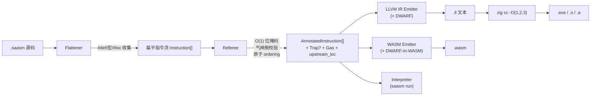

# SA 语言与编译器 技术设计文档

> 本设计承接 `requirements.md` 中的 23 条强约束需求。设计原则：**零 AST、线性扫描、O(1) 位掩码、直通 LLVM IR / WASM 二进制、五符号契约、气闸舱 FFI、前端降级责任制、上游源码映射**。
>
> 语言名称为 **SA**（Symbolic Affine）。CLI 前缀与文件扩展名仍用 `saasm` / `.saasm` 以兼容讨论历史。

---

## 1. Overview（总览）

### 1.1 物理定位

SA 不是一门"给人写的语言"，而是：

1. **一条指令流的物理验证协议**：仿射状态机 + O(1) 位掩码。
2. **一条直通 LLVM IR / WASM 的发射管线**：不经过任何高级语言源码中继。
3. **一套气闸舱 FFI**：把 unsafe 物理隔离到专属函数。
4. **一份前端降级合约**：词法作用域跟踪、隐式 Drop、Phi 一致性全部由**上游**（smrustc / LLM / 手写）负责。

三种形态：

| 形态 | 载体 | 物理本质 |
|---|---|---|
| 源码形态 | `.saasm` 文本 | 一维字节数组 |
| 指令形态 | `Instruction[]` | 扁平三地址码数组 |
| 产出形态 | `.exe` / `.o` / `.a` / `.wasm` | 原生目标文件 / WebAssembly |

**不存在任何阶段构造 AST**，**不经过 Zig 源码往返**。

### 1.2 编译管线



### 1.3 核心设计原则

1. **零 AST**：扁平数组 + `u32` 下标。
2. **线性扫描**：单次前向扫描；唯一例外是 Phi 汇聚点求交集。
3. **O(1) 位掩码**：`u8` 的 AND/OR。
4. **五符号契约**：`=` `&` `^` `!` `*`。
5. **直通 LLVM / WASM**：绝不生成 Zig 源码作为中间态。
6. **气闸舱隔离**：`*` / `assume_*` 只能出现在 `@ffi_wrapper` 内，Referee 一次位判断强制。
7. **前端责任制（NEW）**：Drop 插入、Phi 一致性由上游负责；SA 不做作用域分析，Referee 只做事后校验。
8. **上游可追溯（NEW）**：`#loc` 伪指令 → `upstream_loc` → DWARF `!DILocation` → gdb/lldb 断点。
9. **错误传播显式化（NEW）**：`!` 后缀函数 + `?` 早返回；不提供任何隐式 unwinding。

### 1.4 为什么不再生成 Zig 源码

- Zig 前端会重建 AST / 类型推导，浪费已压平的工作。
- Zig 类型系统会污染 SA 语义（`@ptrCast` 对齐约束、`Allocator` 隐式约定）。
- 错误映射要穿两层前端，行号语义丢失。

改走 LLVM IR 后：
- IR 与三地址码 1:1 同构。
- 白嫖 O{1,2,3} 优化。
- Zig 降格为 LLVM 驱动器与跨平台链接器。

### 1.5 关于"物理极限"叙事的诚实校准

旧版曾宣称"编译速度达物理极限"。校准事实：

- Flattener + Referee 确实是毫秒级。
- **LLVM O3 是秒级到十秒级瓶颈**，和 rustc 的 LLVM 阶段一个数量级。
- **MVP 默认 `build-exe` 走 O1**（`-O ReleaseSmall` Zig 等价），O3 需显式 `--release-fast`。
- 真正的"毫秒级编译"只对 `saasm run` 内存解释器成立。

### 1.6 CLI 四模驱动

```
saasm run     <file.saasm> [args...]      # 内存解释执行
saasm build-exe  <file.saasm> -o out       # 原生可执行（默认 O1，可 --release-fast 切 O3）
saasm build-wasm <file.saasm> -o out.wasm  # WASM 二进制
saasm build-obj  <file.saasm> -o out.o     # C-ABI 目标文件
```

调试开关：`-g` 启用 DWARF；`--no-debug` 禁用以缩减体积。

### 1.7 阶段性里程碑与设计对齐

| 阶段 | 周 | 需求涵盖 | 本设计章节 |
|---|---|---|---|
| 协议定型 | W1-2 | R1, R2, R3, R4, R18, R19, R20, R23 | §2, §3.1, §4 |
| Flattener | W3-5 | R7, R8, R19.1 | §3.2 |
| Referee | W6-9 | R9, R10, R11, R12, R13, R18.5, R19.2 | §3.3, §6, §7 |
| Emitters + CLI | W10-11 | R14, R15, R16, R19.3, R19.4 | §3.4, §3.5, §3.6 |
| sys/FFI/panic runtime | W12 | R13, R17, R18.4 | §3.7 |
| Pilot + AutoBevy 1K + Hello | W13-14 | R21, R23.3 | §3.8 |

---

## 2. Architecture（架构）

### 2.1 进程拓扑（不变）

单进程多阶段，仅 `build-exe` / `build-wasm` 最后派生 `zig cc` / `wasm-strip` 子进程。

### 2.2 工具链实现语言：Zig

- CLI 宿主、Flattener、Referee、Emitters、Interpreter 全部用 Zig 写。
- Zig 本身**不作为发射目标**。
- 产物是单文件静态可执行（libc 外无依赖）。

### 2.3 数据流契约

| 阶段 | 输入 | 输出 | 副作用 |
|---|---|---|---|
| Flattener | `[]const u8` | `[]Instruction` + `DefDict` + `LocTable` | 无 |
| Referee | `[]Instruction` + `LocTable` | `[]AnnotatedInstruction` 或 `TrapReport` | 无（纯函数） |
| LLVM IR Emitter | `[]AnnotatedInstruction` + `LocTable` | `[]const u8`（`.ll`） | 无 |
| WASM Emitter | `[]AnnotatedInstruction` + `LocTable` | `[]const u8`（WASM 字节） | 无 |
| Interpreter | `[]AnnotatedInstruction` + argv | exit code + stdout | 有 I/O |
| zig cc | `.ll` + `.o` + `.a` | `.exe` / `.wasm` | 派生子进程 |

除 Interpreter 与 zig cc 外，所有阶段均为**纯函数**。

### 2.4 版本治理

- 白皮书、Flattener、Referee、LLVM IR 映射、WASM 映射各自独立版本号。
- LLVM 版本随 Zig 内置版本锁定，进 CI 矩阵。
- 测试集（R22）为语义基线。

---

## 3. Components and Interfaces（组件与接口）

### 3.1 源码文本协议

每行属于以下 16 种形态之一（正则级可判别）：

| 形态 | 示例 |
|---|---|
| 空行/注释 | `// comment` |
| 常量定义 | `#def NODE_SIZE = 16` |
| **上游位置伪指令 (NEW)** | `#loc "main.rs":42:7` |
| 函数签名 | `@sum(^list, t) -> i32:` |
| 可失败函数签名（NEW） | `@fs_read(p) -> i32!:` |
| 气闸函数签名 | `@ffi_wrapper open_file(p):` |
| 外部声明 | `@extern malloc(size) -> *void` |
| 导出函数 | `@export tick(e, n):` |
| 跳转标签 | `L_LOOP:` |
| 宏定义起止 | `[MACRO]`, `[END_MACRO]` |
| REP 起止 | `[REP 8]`, `[END_REP]` |
| 宏调用 | `EXPAND SWAP r0, r1` |
| 分配/载入/存储/运算 | `v = load node+0` |
| 裸指针降级（气闸舱） | `raw = *safe` |
| 受洗（气闸舱） | `h = assume_borrow raw, mut` |
| 原子指令（NEW） | `v = atomic_load r+0 acquire` |
| 原生逃逸 | `$ ... $` |
| 错误传播（NEW） | `v = ? res` |

### 3.2 Flattener

**职责**：
1. 扫描 `#def` / `[MACRO]` / `EXPAND` / `[REP]` 做文本展开。
2. 扫描 `#loc` 伪指令 → 为下一条真实指令附带 `upstream_loc`，并维护 `LocTable: Map<expanded_line, UpstreamLoc>`。
3. 禁用语法扫描：`{` `}` `if` `else` `while` `for` `a.b.c` → `ForbiddenSyntax`。
4. 寄存器名规范化为 `u32` ID。
5. 函数签名解析，识别 `@func` / `@ffi_wrapper` / `@extern` / `@export` 四类及 `!` 后缀。

**公开 API**：
```zig
pub fn flatten(
    allocator: std.mem.Allocator,
    source: []const u8,
) !FlattenResult;

pub const FlattenResult = struct {
    instructions: []Instruction,
    def_dict: DefDict,
    loc_table: LocTable,
    trap: ?TrapReport,
};
```

### 3.3 Referee

**职责**：
1. 线性扫描指令数组，逐条"查表 → 位运算校验 → 更新掩码"。
2. Phi 汇聚点求按位 AND。
3. 函数出口残留 Active/Locked → `MemoryLeak`。
4. 气闸舱校验：`RawCast` / `AssumeSafe` / `AssumeBorrow` 仅允许在 `is_ffi_wrapper` 函数内。
5. FFI 所有权越界校验：对 `FfiBorrow` 寄存器禁止 `^` / `!`（物理释放）。
6. **错误传播校验（NEW）**：`?` 早返回分支若有未释放寄存器 → `EarlyReturnLeak`。
7. **原子 ordering 校验（NEW）**：读-改-写对同一地址时，`ordering` 组合必须满足 happens-before 一致性。
8. Gas 计数。

**公开 API**：
```zig
pub fn verify(
    allocator: std.mem.Allocator,
    instructions: []const Instruction,
    loc_table: LocTable,
) !VerifyResult;
```

**实现约束**：
- MVP 核心代码 ≤ 2500 行 Zig（stretch ≤ 1500）。
- 单线程吞吐 ≥ 500K 行/秒（真实代码基准）。

### 3.4 LLVM IR Emitter

**职责**：1:1 映射三地址码到 LLVM IR 文本。

**核心映射**：见附录 A。

**DWARF 输出（NEW）**：
- 为每条指令生成 `!DILocation`，指向 `upstream_loc`；`loc` 缺失则 fallback 到 `.saasm` 文件行号。
- 顶部生成 `!DICompileUnit` / `!DIFile` / `!DISubprogram`。
- 允许 `--no-debug` 关闭。

### 3.5 WASM Emitter

**职责**：内存中拼接标准 WASM 二进制。

**DWARF-in-WASM（NEW）**：
- 生成 `.debug_info` / `.debug_line` 自定义段（可被 `wasmtime --debug`、Chrome DevTools、`wasm-objdump` 消费）。
- `--no-debug` 关闭，产物压缩至目标体积。

**wasm32 / wasm64 切换**：通过 `--target` 控制，仅改 `memory` section 与 `i32/i64.load/store` opcode。

### 3.6 Interpreter（`saasm run`）

大 `switch` 分派所有 `InstKind`。`@sys_*` 走 Zig `std.fs` / `std.process`。

### 3.6b `saasm layout` 布局生成工具（R7b）

**职责**：接受结构体字段描述，自动计算对齐与偏移量，输出 `#def` 字典。

**为什么需要**：LLM 本质上是语言模型，不是计算器。手算复杂结构体的偏移量（尤其是混合 `i32` + `f64` 时的对齐填充）是 LLM 生成 SA 代码时的**头号错误来源**。此工具将偏移量计算从"LLM 必须正确"降级为"工具保证正确"。

**使用方式**：
```bash
saasm layout --name Entity --fields "id:u32, pos_x:f64, pos_y:f64, hp:i32"
```

**输出**：
```
#def Entity_SIZE  = 32
#def Entity_id    = +0     // u32, 4 bytes
                           // 4 bytes padding
#def Entity_pos_x = +8    // f64, 8 bytes
#def Entity_pos_y = +16   // f64, 8 bytes
#def Entity_hp    = +24   // i32, 4 bytes
                           // 4 bytes tail padding
```

**对齐规则**：
- `i8/u8` → align 1
- `i16/u16` → align 2
- `i32/u32/f32` → align 4
- `i64/u64/f64/ptr` → align 8（`--target 32` 时 ptr align 4）
- 结构体总大小对齐到最大字段对齐

**实现**：~100 行 Zig，作为 `src/cli.zig` 的一个子命令。不影响核心管线。

**LLM 工作流**：
1. LLM 决定需要一个结构体
2. LLM 调用 `saasm layout --name X --fields "..."` 获取 `#def` 字典
3. LLM 把字典粘贴到 `.saasm` 文件顶部
4. LLM 用 `#def` 常量名写代码（如 `load ptr+Entity_pos_x as f64`）
5. 永远不需要手算偏移量

### 3.7 `@sys_*` 原语 + FFI 气闸舱 + 错误传播 runtime

| 原语 | Native | WASM (WASI) |
|---|---|---|
| `@sys_print(*msg, len)` | `write(1, ...)` | `fd_write` |
| `@sys_read_file(*p, pl, *olp) -> *buf` | `open+read+close` + malloc | `path_open + fd_read` |
| `@sys_write_file(...)` | `open+write+close` | `path_open + fd_write` |
| `@sys_exit(code)` | `_exit` | `proc_exit` |
| `@sys_argv(i)` / `@sys_argc()` | 进程栈 | `args_get / args_sizes_get` |
| **`panic(code)`（NEW）** | `__sa_panic(code)` → 写 `PANIC: code=<N>` 到 stderr + `_exit(128+code)` | `unreachable` opcode |

**`__sa_panic` 实现**：Zig 写一小段 stub（≤ 30 行），Native 链接期嵌入；WASM 不需要（`unreachable` 即 trap）。

### 3.8 `libsa_scope` — 前端降级合约 helper（NEW，对应 R20.8）

写 smrustc 或其它前端时，最痛苦的两件事是：

1. **作用域末尾的显式 Drop**：每退出一个 `{}` 要为所有还 Active 的寄存器补 `!reg`。
2. **Phi 汇聚一致性**：多分支到达同一 Label 时，两边的所有权状态必须交集合法。

`libsa_scope` 是一个纯文本级别的 helper，以 C-ABI 暴露，可被任何前端调用：

```c
// 创建/销毁 scope tracker
void* scope_new(void);
void  scope_drop(void*);

// 进入/退出词法作用域
void scope_enter(void*);
void scope_exit(void* /* 自动对当前作用域所有 Active reg 发射 "!reg" 文本 */);

// 注册寄存器到当前 scope
void scope_bind(void*, const char* reg_name);
void scope_move(void*, const char* reg_name);   // 标记已 Move，exit 时跳过
void scope_release(void*, const char* reg_name);

// 分支合流
void scope_branch_begin(void*);
void scope_branch_add_path(void*);
void scope_branch_merge(void* /* 自动为不一致路径补齐 !reg */);

// 获取需要发射的释放指令文本
const char* scope_emit_releases(void*);
```

用法：前端在生成 SA 源码时调用 `scope_exit` / `scope_branch_merge`，拿到 `"!x\n!y\n"` 之类的文本直接拼接进指令流。这**不是**在 SA 内部做作用域分析，而是给前端一个**可选**的便利库（非依赖，不用也可以手工插入 `!reg`）。

### 3.9 应用场景：AutoBevy 1K MVP（R21）

- Component Buffer：裸内存 + offset。
- Entity：连续 u32 + 稀疏表。
- System：声明对 Component Buffer 的独占/共享借用权限（`Locked_Mut` vs `Locked_Read`）。
- 并行分析器：复用 Referee CapabilityMask AND。
- **MVP 仅要求 1K 实体冒烟**；1M + Bevy ±30% 留 post-MVP。

---

## 4. Data Models（数据模型）

### 4.1 Instruction / Operand（扩展版）

```zig
pub const InstKind = enum(u8) {
    // 元信息
    FuncDecl, FfiWrapperDecl, ExternDecl, ExportDecl,
    ConstDecl,                          // NEW: @const 全局只读
    Label, Native, LocHint,

    // 内存
    Alloc,
    StackAlloc,                         // NEW: stack_alloc N
    Load, Store, Take,
    PtrAdd,                             // NEW: base + off -> InteriorPtr

    // 运算
    Op,

    // 控制流
    Jmp, Br, BrNull, Call, CallIndirect, Return,

    // 错误传播
    Try, EarlyReturn,
    Panic,                              // NEW: panic(code)
    PanicMsg,                           // NEW: panic_msg(code, *s, len)

    // 原子
    AtomicLoad, AtomicStore, Cmpxchg,
    AtomicRmw,                          // NEW: rmw_{add,sub,and,or,xor,xchg,smin,smax,umin,umax}
    Fence,

    // FFI 气闸舱
    RawCast, AssumeSafe, AssumeBorrow,
};

pub const OpKind = enum(u8) {
    // 整数算术
    add, sub, mul, sdiv, udiv, srem, urem, neg,
    // 位运算
    @"and", @"or", xor, shl, lshr, ashr, not,
    // 整数比较
    eq, ne, slt, sle, sgt, sge, ult, ule, ugt, uge,
    // 浮点算术
    fadd, fsub, fmul, fdiv, fneg,
    // 浮点比较（全谱）
    fcmp_eq, fcmp_ne, fcmp_lt, fcmp_le, fcmp_gt, fcmp_ge,
    // 类型转换
    trunc, zext, sext, fptosi, sitofp, uitofp, fptrunc, fpext, bitcast,
    // SIMD 最小集
    add_v128, sub_v128, mul_v128, shuffle_v128, extract_lane, insert_lane,
};

pub const AtomicRmwOp = enum(u8) {
    add, sub, @"and", @"or", xor, xchg, smin, smax, umin, umax,
};

pub const AtomicOrdering = enum(u8) { relaxed, acquire, release, acq_rel, seq_cst };

pub const Instruction = struct {
    kind: InstKind,
    source_line: u32,
    expanded_line: u32,
    upstream_loc: ?UpstreamLoc,   // NEW：来自 #loc 伪指令
    operands: [4]Operand,
    raw_text: []const u8,
};

pub const UpstreamLoc = struct {
    file: []const u8,
    line: u32,
    col: u32,
};
```

### 4.2 CapabilityMask（9 位扩展版）

```
bit 0  (0x0001)  Active
bit 1  (0x0002)  Locked_Read
bit 2  (0x0004)  Locked_Mut
bit 3  (0x0008)  Consumed
bit 4  (0x0010)  BorrowView
bit 5  (0x0020)  FfiBorrow
bit 6  (0x0040)  Untracked
bit 7  (0x0080)  Fallible
bit 8  (0x0100)  Immutable          （@const 全局永续常量）
bit 9  (0x0200)  InteriorPtr        （从借用派生的内部裸地址，生命周期同步母借用）
bit 10-15        保留
```

掩码存储类型从 `u8` 扩展到 `u16`。真值表详见白皮书附录 D。

### 4.3 函数元数据

```zig
pub const FunctionSig = struct {
    id: u32,
    name: []const u8,
    kind: FunctionKind,            // normal / ffi_wrapper / external / exported
    params: []ParamSpec,
    return_cap: ?CapPrefix,
    return_fallible: bool,         // NEW：带 `!` 后缀
    entry_inst_idx: u32,
    is_ffi_wrapper: bool,
    upstream_file: ?[]const u8,    // NEW：整个函数的上游文件锚点
};
```

### 4.4 TrapReport（扩展版）

The canonical trap catalog, stage-local error split, and runtime ABI exit-code taxonomy live in [`docs/errorcode.md`](../../../docs/errorcode.md). This section only fixes the `TrapReport` schema and emission shape.

```jsonc
{
  "trap": "BorrowConflict",
  "line": 42,                       // expanded_line
  "source_line": 37,                // .saasm 原始行
  "upstream_loc": {                 // NEW: 上游业务源码位置
    "file": "main.rs",
    "line": 29,
    "col": 11
  },
  "register": "node",
  "registers": ["node", "r_view"],
  "expected_mask": 1,
  "actual_mask": 4,
  "function": "@update_transform",
  "is_ffi_wrapper": false,
  "message": "cannot move `node` while it is mutably borrowed by `r_view`",
  "hint": "release `r_view` first via `!r_view`"
}
```

### 4.5 Fallible Return ABI（NEW）

`@f(...) -> T!:` 的 ABI 降级为：

```c
struct sa_result_T {
    uint32_t status;    // 0 = ok, !0 = error code
    T value;            // 仅当 status == 0 有效
};
```

Emitter 把 `? res` 展平为：

```
; %res 是 sa_result_T
%st = extractvalue %sa_result_T %res, 0
%ok = icmp eq i32 %st, 0
br i1 %ok, label %L_ok, label %L_early
L_early:
  ret %sa_result_T %res   ; 整体原样返回（保留 status）
L_ok:
  %v = extractvalue %sa_result_T %res, 1
  ; 继续使用 %v
```

Referee 层面不需要新增真值表：`Try` 指令被 Flattener 直接展平为 `br` + `EarlyReturn`，Referee 只需在 `EarlyReturn` 处像 `Return` 一样检查 MemoryLeak，差别是 Label `L_early` 之后 Active 寄存器若未释放 → `EarlyReturnLeak`。

### 4.6 DWARF Metadata Mapping（NEW）

| SA 元素 | DWARF |
|---|---|
| `.saasm` 源文件 | `!DIFile("file.saasm")` |
| 上游文件（来自 `#loc`） | `!DIFile("main.rs")` |
| 函数 | `!DISubprogram` |
| 指令行 | `!DILocation(line, col, scope)` |
| 寄存器（寿命 Active 期间） | `llvm.dbg.value` intrinsic |

关闭 `-g` 时全部不发射，产物完全干净。

### 4.7 Gas / Snapshot / DefDict / MacroDict（不变，见旧版）

---

## 5. PBT 适用性（不变）

所有核心组件仍为纯函数，PBT 仍为首选验证方法。

---

## 6. Correctness Properties（扩展至 32 条）

保留 P1–P23，新增 P24 / P25 / P26 / P27 / P28 / P29 / P30 / P31 / P32：

### Property 24 (NEW): 错误传播早返回泄漏校验

*For any* 含 `?` 操作符的指令流，若早返回分支上存在尚未释放的 `Active` / `Locked_*` 寄存器，Referee SHALL 返回 `Trap: EarlyReturnLeak`；若早返回分支上所有局部寄存器都已在 `?` 之前被释放或 Move，Referee SHALL 放行。

**Validates: R18.5**

### Property 25 (NEW): 上游 Source Map 单调映射

*For any* 指令流经 Flattener 产出的 `LocTable`，对任意 `expanded_line`，其 `upstream_loc` 字段 SHALL 满足：若源码中紧邻的 `#loc` 伪指令指定了 `(file, line, col)`，则该下一条指令的 `upstream_loc == (file, line, col)`；若无 `#loc`，则 `upstream_loc == null`；Trap 报告与 DWARF `!DILocation` 中的位置信息 SHALL 与 `LocTable` 一致。

**Validates: R19.1, R19.2, R19.3**

### Property 26 (NEW): InteriorPtr 生命周期与母借用同步

*For any* 普通 `@func` 内通过 `ptr_add` 或从借用寄存器 `load` 出的 `InteriorPtr` 寄存器 `IP`，其源借用寄存器 `B` 被 `!B` 释放后，对 `IP` 的任何访问 SHALL 触发 `Trap: UseAfterMove`；对 `IP` 作为 `@extern` 或 `@ffi_wrapper` 参数传递 SHALL 触发 `Trap: InteriorPtrEscape`。

**Validates: R4.9, R4.10, R13.6, R13.7**

### Property 27 (NEW): StackAlloc 不可逃逸

*For any* 通过 `stack_alloc` 产生的寄存器 `S`，任何形如 `return ^S` 或 `@f(^S)` 或 `store r+O, ^S` 的操作 SHALL 触发 `Trap: StackEscape`；函数出口处无论 `S` 是否处于 `Active` 状态，Referee SHALL 不报 `MemoryLeak`（stack_alloc 自动回收）。

**Validates: R2.1 (stack_alloc), R2.8**

### Property 28 (NEW): 常量只读不可变性

*For any* 通过 `@const NAME = ...` 声明的全局寄存器，对其执行 `^`、`!`、独占借用操作 SHALL 触发 `Trap: ConstMutation`；对其执行 `&`（只读借用）或 `load` SHALL 通过；在函数出口，该寄存器 SHALL 不被纳入 `MemoryLeak` 扫描。

**Validates: R4.8, R6.5, R6.6**

### Property 29 (NEW): 原子 RMW 返回语义

*For any* `dst = atomic_rmw_<OP> r+O, v [ord]` 指令，在合法指令流中其 `dst` 寄存器 SHALL 获得 `Active` 掩码并绑定到修改前的旧值；`cmpxchg` 的双返回值 `(old, ok)` SHALL 同时获得 `Active`，且 `ok` 寄存器类型 SHALL 为 `i1`（布尔），仅可被 `br` 消费。

**Validates: R2.1 (cmpxchg/rmw), R2.7**

### Property 30 (NEW, v0.2): 紧凑糖语义等价性

*For any* 同一业务逻辑的两份 SA 源码 `S_k`（纯关键字形态）与 `S_c`（启用 `#mode compact` 后使用中缀糖），若两者在语义上等价（即中缀糖 1:1 展开即为关键字形态），则 Flattener 产出的 `Instruction[]` SHALL 在字段级（`kind` / `operands` / `upstream_loc` 除外）完全深度相等；Referee 在两份输入上的判决结果（Pass 或同一 Trap 类型）SHALL 相同。

**Validates: R24.2, R24.4**

### Property 31 (NEW, v0.3): VTable 签名静态校验

*For any* `@const NAME = vtable { slot = @func }` 声明与任意 `call_indirect` 调用点，若调用点参数 tuple `(cap_prefix, ty)[]` 与 VTable 槽位声明的函数签名 tuple 完全一致，Referee SHALL 放行；若存在任意位置的 cap_prefix 或 ty 不匹配，Referee SHALL 返回 `Trap: VTableSignatureMismatch`。对 FFI 传入的外部 VTable（裸指针），此校验 SHALL 不适用。

**Validates: R25.1, R25.2, R25.3, R25.4**

### Property 32 (NEW, v0.3): libsa_async 宏展开等价性

*For any* 使用 `libsa_async.saasm` 宏模板（`EXPAND ASYNC_AWAIT_POINT ...`）生成的指令流 `I_macro`，与手写等价 SA 代码的指令流 `I_manual`，两者经 Flattener 展平后的 `Instruction[]` SHALL 在字段级完全深度相等；Referee 在两份输入上的判决结果 SHALL 相同。

**Validates: R26.2, R26.3**

---

## 7. Error Handling

### 7.1 Trap 枚举全表（v0.2 扩展版）

原 21 个 Trap + 新增 8 个：

| 新增 Trap | 触发源 | 条件 |
|---|---|---|
| **`EarlyReturnLeak`** | Referee | `?` 早返回分支有未释放 Active 寄存器 |
| **`AtomicOrderingMismatch`** | Referee | 同一地址 RMW 组合违反 happens-before |
| **`InvalidAtomicOrdering`** | Flattener | `cmpxchg` 的 `failure_ord` 强于 `success_ord` |
| **`FallibleContractMismatch`** | Referee | `?` 作用于非 Fallible 返回值寄存器 |
| **`InteriorPtrEscape`** | Referee | `InteriorPtr` 寄存器作为 `@extern` / `@ffi_wrapper` 参数 |
| **`StackEscape`** | Referee | `stack_alloc` 产物被 `^` Move 或 `return` |
| **`ConstMutation`** | Referee | `@const` 寄存器被 `^` / `!` / 独占借用 |
| **`InvalidParamType`** | Flattener | `&` / `^` 参数的 `ty` 不是 `ptr`；或签名中出现用户自定义类型名 |
| **`InfixSugarDisabled`** | Flattener | 未启用 `#mode compact` 时出现中缀算术 |
| **`CompactMultipleInfix`** | Flattener | `#mode compact` 下单行出现多个中缀操作符 |
| **`InvalidModeDirective`** | Flattener | `#mode` 出现次数 > 1 或位置错误 |
| **`VTableSignatureMismatch`** | Referee | `call_indirect` 调用点参数 tuple 与 VTable 槽位声明不匹配（v0.3 R25） |
| **`TagMismatch`** | Referee | 调用点实参的布局标签与签名声明的 `tag NAME` 不匹配（v0.5 R32） |
| **`MissingTag`** | Referee | `--strict-tags` 模式下 `alloc` 未携带 `tag NAME`（v0.5 R32.8） |
| **`DuplicateExportSymbol`** | Linker | 两个依赖包声明了同名 `@export` 函数（v0.5 R31） |

其余 Trap 与前版一致。

### 7.2 前端 Trap 反馈闭环

当前端（smrustc / LLM）违反 R20 降级合约时，其产出的 SA 代码必然在 Referee 上失败。前端应在测试期把 Referee 的 JSON Trap 作为自修复信号：

- `MemoryLeak` → 前端漏发 `!reg`
- `PhiStateConflict` → 前端未平衡分支释放
- `UseAfterMove` → 前端 Move 后仍引用
- `EarlyReturnLeak` → 前端 `?` 之前忘记释放

建议使用 `libsa_scope`（§3.8）自动插入这些释放指令。

### 7.3–7.6 其余章节不变。

---

## 8. Testing Strategy

### 8.1 测试分层（更新）

| 层次 | 覆盖 | 数量 |
|---|---|---|
| 单元 | 指令解码 / 掩码 / 原子 ordering 表 | ~250 例 |
| 属性 | §6 全部 32 条 Property × ≥100 次 | 32 × 100+ |
| 集成 | 完整管线 `.saasm → .exe/.wasm` | ~45 个 |
| 冒烟 | 文档 / CI / 符号链接 / DWARF 存在性 | ~25 项 |
| 基准 | 吞吐 / 体积 / 帧耗时 / **真实代码** Referee 吞吐 | ~8 组 |

### 8.5 集成测试基线（扩展）

在旧版 10 个基础上新增：

11. **Error-Propagation-Roundtrip**：可失败函数 + `?` + panic 的端到端流。
12. **Debuginfo-Breakpoint-Upstream**：编 `-g` 的 `.exe` 在 gdb 中对上游 `.rs` 行号下断点。
13. **Atomic-Ordering-Contract**：两个 goroutine（via Rust std 桥接）对同一地址的 RMW 在不同 ordering 下的 Referee 放行/拒绝。
14. **LLM-Pilot-30**：R23.3 pilot 30 题执行脚本（独立于 CI 门禁，结果归档）。
15. **Frontend-Contract-Violation**：故意漏发 `!x` 的合成样例，必 Trap `MemoryLeak`。

### 8.6 性能基准（更新）

| 基准 | MVP | Stretch |
|---|---|---|
| Flattener + Referee（真实 1M 行）| ≤ 300 ms | ≤ 100 ms |
| Referee 单线程吞吐（真实代码） | ≥ 500K 行/秒 | ≥ 1M |
| Hello-Compute `.wasm` 体积 | ≤ 48 KB | ≤ 32 KB |
| Hello-Compute `.exe` 体积 | ≤ 800 KB | ≤ 500 KB |
| Referee LOC | ≤ 2500 行 | ≤ 1500 |
| AutoBevy 1K 冒烟 | 必须通过 | — |
| AutoBevy 1M ±30% | — | post-MVP |

### 8.9 CI 门禁（更新）


---

## 9. 附录 A：SA → LLVM IR 映射表（扩展版）

| # | SA | LLVM IR |
|---|---|---|
| M01 | `r = alloc N` | `%r = call ptr @malloc(i64 N)` |
| M02 | `!r`（所有权） | `call void @free(ptr %r)` |
| M03 | `!r`（借用） | （无） |
| M04 | `v = load r+O as i32` | `%p = getelementptr ... / %v = load i32, ptr %p` |
| M05 | `store r+O, v as i32` | 同上 + `store ...` |
| M06 | `d = add a, b` | `%d = add i32 %a, %b` |
| M07 | `d = gt a, b` | `%d.i1 = icmp sgt ... / %d = zext` |
| M08 | `jmp L_X` | `br label %L_X` |
| M09 | `br c -> L_T, L_F` | `%cb = icmp ne ... / br i1 ...` |
| M10 | `br_null r -> L_N, L_NN` | `%n = icmp eq ptr ... null / br i1 ...` |
| M11 | `call @f(^x)` | `%ret = call T @f(ptr %x)` |
| M12 | `call_indirect fp(x)` | `%ret = call T %fp(...)` |
| M13 | `return [reg]` | `ret T %reg` / `ret void` |
| M14 | `next = take r+O` | GEP + load ptr |
| M15 | `$ S $` | 原样 IR 片段 |
| M16 | `@f(...) -> T:` | `define T @f(...)` |
| M17 | `L_X:` | `L_X:` |
| M18 | `raw = *safe` | `%raw = ptrtoint ptr %safe to i64` |
| M19 | `safe = assume_safe raw` | `%safe = inttoptr i64 ... to ptr` |
| M20 | `view = assume_borrow raw` | `%view = inttoptr`（+ Referee 记 FfiBorrow） |
| M21 | `@extern f(...)` | `declare T @f(...)` |
| M22 | `@export f(...)` | `define T @f(...)` 无修饰 |
| M23 | `@sys_print` | Native `@write` / WASM `$fd_write` |
| **M24** | `v = atomic_load r+O [ord]` | `%v = load atomic T, ptr %p [ord]` |
| **M25** | `atomic_store r+O, v [ord]` | `store atomic T %v, ptr %p [ord]` |
| **M26** | `old, ok = cmpxchg t+O, e, n [s_ord] [f_ord]` | `%pair = cmpxchg ptr %p, T %e, T %n [s_ord] [f_ord]` <br> `%old = extractvalue {T,i1} %pair, 0` <br> `%ok = extractvalue {T,i1} %pair, 1` |
| **M27** | `fence [ord]` | `fence [ord]` |
| **M28** | `v = ? res` | `%st = extractvalue ... / %ok = icmp eq / br ...` |
| **M29** | `panic(c)` | Native `call void @__sa_panic(i32 c, ptr null, i64 0) noreturn` / WASM `unreachable` |
| **M30** | `@f(...) -> T!:` | `define { i32, T } @f(...)` |
| **M31** | `#loc "f":l:c` | `!DILocation(line: l, column: c, scope: !F)` |
| **M32 (NEW)** | `dst = atomic_rmw_add r+O, v [ord]` | `%dst = atomicrmw add ptr %p, T %v [ord]` |
| **M33 (NEW)** | `dst = atomic_rmw_<OP>` | 对应 `atomicrmw {sub,and,or,xor,xchg,min,max,umin,umax}` |
| **M34 (NEW)** | `r = stack_alloc N` | `%r = alloca i8, i64 N`（入口块） |
| **M35 (NEW)** | `dst = ptr_add base, off` | `%dst = getelementptr i8, ptr %base, i64 %off`（InteriorPtr 视作普通 GEP） |
| **M36 (NEW)** | `@const NAME: T = ...` | `@NAME = private constant T <initializer>`（`.rodata`，VTable 用数组形式） |
| **M37 (NEW)** | `panic_msg(c, *s, len)` | Native `call void @__sa_panic(i32 c, ptr %s, i64 %len) noreturn` / WASM `fd_write(2,...)` + `unreachable` |
| **M38 (NEW)** | 浮点比较 `fcmp_{le,ge,ne}` | `fcmp ole/oge/one ... / zext to i32` |
| **M39 (NEW)** | `dst = trunc / zext / sext / fptosi / ...` | 对应 LLVM 转换指令 1:1 |

---

## 10. 附录 B：SA → WASM 二进制映射（核心片段）

- opcode 表按 WASM Core 2.0 + memory64 + atomics proposal。
- 原子指令需 `atomic.*` opcodes（`0xFE` 前缀）。
- `?` 早返回直接用 `br_if` + `return`。
- DWARF 段以 `custom section` `name=".debug_info"` 插入，可被 `wasmtime --debug` 消费。

---

## 11. 附录 C：EBNF 语法规范（扩展版）

```ebnf
program        = { toplevel } ;
toplevel       = def | loc | macro_def | func_def | ffi_wrapper_def | extern_decl | export_def ;
def            = "#def" IDENT "=" LITERAL ;
loc            = "#loc" STRING ":" NUMBER ":" NUMBER ;
func_def       = "@" IDENT "(" [ param_list ] ")" [ "->" [ "^" ] type [ "!" ] ] ":" { line } ;
ffi_wrapper_def= "@ffi_wrapper" IDENT "(" [ param_list ] ")" [ "->" type [ "!" ] ] ":" { line } ;
extern_decl    = "@extern" IDENT "(" [ param_list ] ")" [ "->" type ] ;
export_def     = "@export" IDENT "(" [ param_list ] ")" [ "->" type [ "!" ] ] ":" { line } ;
param          = [ "&" | "^" | "*" ] IDENT [ ":" type ] ;
type           = "i8"|...|"u64"|"f32"|"f64"|"ptr"|"v128" ;
line           = label | inst | native ;
inst           = alloc | load | store | op | jmp | br | call | return | take
               | release | move | borrow | rawcast | assume_safe | assume_borrow
               | atomic_load | atomic_store | cmpxchg | fence | try_op | panic_op ;
try_op         = IDENT "=" "?" IDENT ;
panic_op       = "panic" "(" LITERAL ")" ;
atomic_load    = IDENT "=" "atomic_load" IDENT "+" LITERAL [ AtomicOrd ] ;
atomic_store   = "atomic_store" IDENT "+" LITERAL "," operand [ AtomicOrd ] ;
cmpxchg        = IDENT "=" "cmpxchg" IDENT "+" LITERAL "," operand "," operand [ AtomicOrd ] ;
fence          = "fence" [ AtomicOrd ] ;
AtomicOrd      = "relaxed" | "acquire" | "release" | "acq_rel" | "seq_cst" ;
rawcast        = IDENT "=" "*" IDENT ;
assume_safe    = IDENT "=" "assume_safe" IDENT ;
assume_borrow  = IDENT "=" "assume_borrow" IDENT [ "," "mut" ] ;
```

---

## 12. 附录 D：Capability Mask 真值表（扩展版）

旧版真值表全部保留，新增气闸舱行（见前版）与 Fallible 行：

| 当前 mask | 操作 | 合法? | 新 mask | Trap |
|---|---|---|---|---|
| `0x80` (Fallible) | `?` 展平后 | ✅ | 提取后的 value → `0x01`；status 路径走 early return | — |
| `0x01`（非 Fallible） | `?` | ❌ | — | `FallibleContractMismatch` |
| 原子指令同地址冲突 ordering | RMW | ❌ | — | `AtomicOrderingMismatch` |
| 其余见旧版 | — | — | — | — |

---

## 13. 附录 E：关键设计决策（校准版）

| 决策 | 旧版 | 本版 | 理由 |
|---|---|---|---|
| 后端中继 | Zig 源码 | LLVM IR + WASM 直出 | 跳过 Zig 前端，白嫖 O3 |
| 编译速度叙事 | "物理极限" | MVP 默认 O1；O3 只是选项 | LLVM O3 仍是秒级瓶颈，诚实 |
| Referee LOC | ≤ 1500 | ≤ 2500 MVP / 1500 stretch | 加入气闸舱 + Phi + 原子 + 错误传播后 1500 不现实 |
| AutoBevy 1M ±30% | MVP 硬指标 | post-MVP stretch | 依赖 SIMD + 并行调度，12 周难达成 |
| LLM 零训练 80% | KPI | Pilot 实测 baseline | 无证据时不预设数字 |
| 调试信息 | 未提 | `#loc` + DWARF + `-g` | 生产语言硬需求 |
| 错误传播 | 未提 | `!` 后缀 + `?` + `panic` | 避免每个前端各造一套返回协议 |
| SIMD/浮点/原子 ISA | 未定义 | 首轮就定义 | AutoBevy 等场景必备 |
| 前端合约 | 隐含 | R20 显式合约 + `libsa_scope` helper | 避免"机械映射"误导，划清责任 |
| 名称 | SA-ASM | SA | 命名简化 |

---

**文档终态**：本设计覆盖需求文档 33 条 Requirements（R1–R24 MVP + R25–R27 v0.3 + R28–R30 v0.4 + R31–R32 v0.5 + R33 v0.6）的全部契约，含 **32+ 条形式化 Property**、5 层测试策略、完整的 LLVM IR / WASM 映射表、气闸舱隔离、前端降级合约、`libsa_scope` helper、v0.2 `#mode compact`、v0.3 VTable 签名校验 + `libsa_async` + 诊断级别、v0.4 并行开发基建、v0.5 包管理 + 布局标签校验 + `sa_std` 标准库、v0.6 Referee 形式化验证 + FPGA 硬件化。
