# SA 编译器性能优化方案

> 文档版本：1.0
>
> 评估日期：2026-07-15
>
> 状态：优化设计与实施路线图，不表示所有建议均已实现
>
> 适用范围：`sci` 主仓库中的 Flattener、SAB、Referee、LLVM-C 后端、链接、缓存、测试与 daemon 调度

---

## 0. 执行摘要

当前编译器已经具备项目制品缓存、进程内导入缓存、验证 verdict 缓存、函数级并行 Referee、函数级并行 lowering、CGU、多测试并行、daemon、受影响测试选择等基础能力。下一阶段不应再增加一条彼此独立的“快速路径”，而应围绕同一套可观测、可失效、可回退的编译图完成优化。

本方案给出五个优先结论：

1. **先修正缓存与受影响测试的正确性，再扩大复用范围。** 当前 verdict key 只散列指令流，而验证结果还受常量声明、package grants、SAX context、预解码签名及 `check_exit_leaks` 等输入影响；native 制品 key、`--affected` baseline 和 cache hit 前的 package preflight 也需要补齐作用域。任何进一步缓存优化都必须先保证 key 和安全边界完整。
2. **最优先的前端收益来自“少做工作”。** 对 SAB 应先确定所需函数，再按需解码；对文本输入应复用稳定的导入/宏片段，避免全量展开后再裁剪。
3. **Referee 最明确的源码级算法候选是状态复制和结果合并。** 当前每条执行指令复制完整寄存器状态，再两遍扫描生成 delta；并行路径结束后又把 worker 结果复制回主 allocator。mutation journal 和可转移 region 值得优先画像，但在取得 state-copy/merge 独立占比前不宣称它是所有 workload 的首要耗时。
4. **后端要消除重复扫描和重复优化。** CGU 与 per-function object 路径会重复扫描/emit；native 非 CGU `build-exe` 先在 LLVM-C 中运行优化，又把 bitcode 交给 `zig cc -O1/-O3`。但 `sa test` 当前是 LLVM-C O0 后交给外部 O1，`build-obj` 也已有 direct-object 路径，必须按命令分别测量；direct object 只能移除第二次 compile/optimize，linker 子进程仍然存在。
5. **所有性能提交必须同时通过正确性、cache population、单核/多核和内存门禁。** `disabled`、`cold-populate`、`hit` 分桶报告；不接受只报告单次最快值，也不接受以跳过验证、放宽 trap 或改变输出顺序换取速度。

### 0.1 决策与优先级

| 优先级 | 工作包 | 核心目标 | 决策 |
| --- | --- | --- | --- |
| P0 | 正确性止血与可信基线 | 先关闭不安全快返并补全 verdict/build/affected key 和 preflight 边界，再建立正式基线 | 立即执行 |
| P0 | daemon 请求隔离 | 移除进程级 cwd 竞态；把 max-workers 变为硬上限 | 立即执行 |
| P1 | SAB 按需解码 | 在解码前完成测试/函数可达性选择 | Phase 0 exit gate 后执行 |
| P1 | Referee 状态增量化 | 移除逐指令完整 state copy/diff | Phase 0 exit gate 后执行 |
| P1 | 后端去重 | 消除重复 pass、重复 CGU 扫描和不必要子进程 | P0.8 决策后执行 |
| P1 | 增量制品与测试缓存 | 未变函数、未受影响测试不重做 | 继续完善 |
| P2 | Flattener 结构化缓存 | 从展开文本缓存升级为可复用 fragment | 条件执行 |
| P2 | 统一调度与内存预算 | 避免嵌套并行和 daemon 过载 | 条件执行 |
| P3 | 模块级 SAB 构建图 | 跨模块并行、精确失效、独立制品 | 长期路线 |

---

## 1. 目标、非目标与约束

### 1.1 目标

- 降低 `sa check`、`sa build-exe`、`sa build-obj`、`sa build-wasm` 和 `sa test` 的 P50/P95 延迟。
- 让未变输入尽可能在项目缓存或 daemon 缓存处结束，不进入 Flattener、Referee 和 LLVM。
- 让单函数修改的增量成本与项目总规模尽量解耦。
- 在多 Agent 并发下保持有界内存、可预测吞吐、确定性诊断和公平调度。
- 保持 `.sa`、`.sab`、native、WASM、测试路径之间的验证语义一致。
- 让每项优化都能由仓库内命令复现，并能独立禁用和回退。

### 1.2 非目标

- 不改变 SA-ASM 的五符号所有权模型、显式释放语义或 Trap 定义。
- 不以跳过必要验证、忽略 package grants、降低 DCE 正确性或弱化 ABI 校验换取速度。
- 不把模块拆分本身当成缓存；模块边界只有在拥有稳定 key、独立制品和精确失效时才构成增量编译。
- 不在没有阶段画像前重写整个 Flattener、Referee 或 LLVM 后端。
- 不在本方案中承诺未经基准验证的百分比收益。

### 1.3 硬约束

1. 相同输入、相同验证选项必须产生相同 verdict、相同最早源码顺序 Trap 和等价制品。
2. 缓存命中不得复用悬空指针、caller-owned `VerifyOk` 或 allocator 生命周期不兼容的数据。
3. 并行执行必须按源码顺序归并错误，不得因线程完成顺序改变诊断。
4. 项目缓存必须项目本地、版本化、可审计；不复用来源不明的全局机器码。
5. Linux、macOS、Windows 的主机路径应保持可构建；daemon 不可用时必须自动退回进程内执行。

---

## 2. 事实来源与评估方法

本文按以下可信度排序使用证据：

1. 当前源码和当前 CLI 行为；
2. 2026-07-09 之后带复现命令的性能记录；
3. 当前仓库中的设计文档；
4. README 或历史完成度描述。

当文档与代码冲突时，以代码为准。例如 `docs/agent_native_compiler_gap_and_plan_cn.md` 保留了早期“daemon/affected test 未实现”的历史矩阵，但当前 `src/cli.zig`、`src/daemon_cancel.zig`、`src/daemon_client.zig` 和 `src/affected_tests.zig` 已经存在对应实现。

### 2.1 核心代码证据

| 能力或问题 | 当前证据 |
| --- | --- |
| 文本编译入口和阶段计时 | `src/cli.zig:5141-5338` |
| 项目 cache hit 在完整编译前返回 | `src/cli.zig:6840-6855`, `7064-7078`, `7123-7137` |
| 导入源/展开结果缓存 | `src/flattener.zig:224-273`, `518-660`, `4176-4214` |
| Flattener 顺序扫描与宏展开 | `src/flattener.zig:4824-4924` |
| `#def` 值参与 operand、layout 和 repeat 展开 | `src/flattener.zig:1271-1348`, `1665`, `1933-1962`, `3045-3070` |
| verdict key 当前仅散列 instruction stream | `src/incr_verify.zig:194-230`, `src/cli.zig:5294-5310` |
| Referee 逐指令 state copy/diff | `src/verifier.zig:2691-2708`, `3013-3018`, `3653-3662` |
| label restore/声明 seed 会改 state，但对应 delta 为空 | `src/verifier.zig:919-969`, `2637-2668`, `2981-2998` |
| Referee 函数级 CPU 并行与顺序归并 | `src/verifier.zig:3718-3945` |
| lowering 函数任务并行 | `src/emit_llvm_llvmc.zig:1122-1205`, `1457-1509` |
| CGU 启用条件和最多四路并行 | `src/cli.zig:6872-6989` |
| LLVM legacy pass pipeline | `src/emit_llvm_llvmc_shim.c:204-264` |
| native 非 CGU 再调用 `zig cc -O1/-O3` | `src/cli.zig:7018-7035`, `src/driver/zigcc.zig:41-69` |
| daemon、generation cancel 和 per-agent quota | `src/cli.zig:3260-3547`, `src/daemon_cancel.zig:3-180` |
| `sa test --affected` | `src/cli.zig:7577-7712`, `src/affected_tests.zig` |

### 2.2 测量纪律

- 所有正式数字必须记录 commit、编译器构建模式、LLVM/Zig 版本、CPU、内存、操作系统和缓存状态。
- 不使用一个“冷/热”词覆盖所有层：分别记录 fresh/daemon process、project/verdict/import/fragment layer，以及 disabled/cold-populate/hit；只有隔离对应 layer、固定进程条件并由 telemetry 证实，才给该层标状态。
- 轻量编译场景先预热 2 次，再正式运行至少 20 次；重型测试步骤至少运行 3 次。噪声较大时增加样本，而不是挑选最快值。
- 报告中位数、P95、最小值、最大值和峰值 RSS；不使用单次最优值作为结论。
- 性能门禁必须同时执行 `--jobs 1` 与 `--jobs auto`；多核结果不得掩盖单线程回退。
- 优化前后必须使用相同输入、相同 DCE、相同优化级别和相同缓存条件。

---

## 3. 当前编译流水线

```mermaid
flowchart LR
    A[CLI / daemon request] --> B{project artifact cache}
    B -->|hit| Z[return artifact / result]
    B -->|miss| C{input kind}
    C -->|.sa| D[load + resolve]
    D --> E[expand imports]
    E --> F[scan + macro collect/emit]
    C -->|.sab| G[section decode]
    G --> H[selected-test prune]
    F --> I[FlattenResult]
    H --> I
    I --> J[verification key lookup]
    J -->|policy-complete hit| L[annotated result/shell]
    J -->|miss| K[Referee classify/metadata/body/merge]
    K --> L
    L --> M[DCE/reachability + per-function lowering]
    M --> N[LLVM module + optimization]
    N --> O[bitcode/object]
    O --> P[zig cc / link]
    P --> Q[artifact/test execution]
```



这是用于表达可能阶段与复用点的概念总图，不表示每个命令都经过全部节点：metadata-only SAB list 直接在 metadata 后返回；普通 SAB 当前不查文本 verdict map；`build-obj` 可直接产 object；WASM、test 和 compile-only 的外部 compile/link 条件也不同。

### 3.1 文本输入路径

`compileSource()` 依次完成读取、workspace/package 解析、`@import` 展开、宏收集与展开、指令生成、内容散列和 Referee。导入缓存能够复用进程内源文本与展开结果，但入口文件仍会形成统一的 `FlattenResult`，随后整体计算验证 key。

### 3.2 SAB 输入路径

普通 SAB 路径调用 `sab.decodeModule()` 构造完整模块。聚焦测试路径已经具备以下优化：

- `--list` 只解码测试函数签名；
- selected `--compile-only` 在 emit 前做可达性裁剪；
- selected compile-only 当前可走名为 trusted 的快捷 shell，而不执行完整 Referee；这只是内部策略 shortcut，不代表已有认证 producer/provenance，且因空 delta 会进入 emit consumer，必须在 Phase -1 暂停；
- compile-only 不再链接无用测试可执行文件。

除上述正确性止血外，性能问题是 selected compile-only 仍先完整解码 instruction section，再对内存中的模块裁剪。

### 3.3 验证路径

Referee 先全局分类、收集 metadata、建立函数 chunks，再按函数并行执行 `verifyBody()`。函数内部必须顺序更新寄存器 mask、borrow lock、interior pointer tree、label snapshot 和 gas，因此函数是当前最自然的并行边界。

当前每条执行指令会：

1. `allocator.dupe(u16, state)` 保存完整前态；
2. 执行指令并修改多个状态数组；
3. `diffState()` 第一遍统计变化数量；
4. 分配 delta；
5. `diffState()` 第二遍写入变化；
6. 并行结束后将 worker delta 再复制到主 allocator。

这条路径是 Referee 优化的核心对象。

### 3.4 后端路径

lowering 已经以函数为任务并行地产生 `CFunction`。native `build-exe` 在显式 `--jobs > 1`、函数数至少 100 时启用 2–4 个 CGU，并直接生成多个 object 后链接；否则先生成 bitcode，再调用外部 `zig cc`。

对 native 非 CGU `build-exe`，LLVM-C shim 自己运行 O1/O3 pass pipeline，外部 `zig cc` 又收到 `-O1/-O3`。这不必然等于所有 pass 完全重复，但已经构成必须测量的重复优化风险。该结论不适用于所有命令：`sa test` 的 shim opt level 当前默认为 0，随后以 O1 链接；非 incremental `build-obj` 已由 LLVM-C 一次写出 optimized bitcode + object，可作为 direct-object 对照基线。

---

## 4. 当前已有的优化基础

| 层级 | 已有能力 | 命中或启用条件 | 当前限制 |
| --- | --- | --- | --- |
| 项目制品 | `build-exe/build-obj/build-wasm/test` cache | source tree、部分选项和 manifest key 命中 | native target/CPU、runtime/plugin/linker/toolchain 仍需补 key；hit 前 preflight 边界需修正 |
| 导入 | import source cache | 同进程/daemon、mtime/size 有效 | 全局 mutex；验证与 clone 可能扩大锁区间 |
| 展开 | expanded import cache | 稳定导入上下文命中 | 仍以展开文本/fragment 恢复成本为主 |
| 验证 | verdict cache | instruction digest 命中 | key 未覆盖全部验证输入；当前 P0 风险 |
| 验证 | function chunk 并行 | 函数数和 `--jobs` 允许 | worker allocator + merge copy；小任务可能负收益 |
| lowering | per-function worker | 多函数且 `--jobs > 1` | 每次调用创建线程；任务准备仍扫描全流 |
| native emit | CGU | 显式 jobs、函数数 ≥100，最多 4 | 每个 CGU 重扫完整 verified stream |
| 增量对象 | per-function `.o` | `build-obj --incremental` | 前端仍需构造统一视图，跨函数依赖 key 要严格 |
| 测试选择 | filter、selected reachability、`--affected` | 明确选择或已有 function baseline | test artifact 与调用图缓存仍可加强 |
| 常驻服务 | daemon + thin client | Unix socket 可用 | 取消主要位于请求边界，不是阶段内抢占 |
| 调度 | max workers + per-agent quota | daemon 模式 | 仍缺统一跨阶段 worker/memory budget |

现状说明：编译器不是“完全串行、完全无缓存”的起点。后续优化应复用这些边界，避免出现第二套互不兼容的 cache、线程池或诊断协议。

---

## 5. 性能基线：当前、历史与待重测

### 5.1 ReleaseFast 大 SAB 聚焦路径：止血前诊断记录

`docs/issue14_test_filter_large_sab_performance.md` 记录了 6.4 MiB `world_table_erased.sab` 的最终安装后结果。源文件位于下游工作区，当前机器不存在，因此这些数字是带命令的历史实测，不是本机复测。compile-only 数字来自未执行完整 Referee、以空 delta 继续 emit 的旧 shortcut，只能用于定位 load/prune/emit 成本，不能作为 correctness-valid 正式基线或新默认 SLO；list 的 metadata-only 记录不受此问题影响。

| 场景 | 修复前 | 最终记录值 | elapsed 改善 | RSS 改善 |
| --- | ---: | ---: | ---: | ---: |
| 大 SAB `--list --filter` | 8.87 s / 385,224 KiB | 0.04 s / 56,960 KiB | 221.75× | 85.2% |
| 大 SAB `--compile-only --filter` | 30.61 s / 465,592 KiB | 0.75 s / 167,856 KiB | 40.81× | 63.9% |
| 小 SAB `--compile-only --filter` | 1.28 s / 70,252 KiB | 0.13 s / 70,912 KiB | 9.85× | 基本不变 |

大 SAB compile-only 阶段画像来自另一次开启 profile 的运行，其 total 为 985.677 ms，不是表中最终安装后 0.75 s 的同一次样本。下面的占比只在这次 profile run 内计算：

```text
compile   = 496.834 ms
  load_flat = 128.219 ms
  prune     = 353.729 ms
  trusted_setup = 12.585 ms  # 原始 profile 字段名为 verify，且 trusted=1
emit      = 476.366 ms
link      =   0.000 ms
total     = 985.677 ms
```

`load_flat`、`prune`、原始名为 `verify` 的 trusted-shell setup 是 `compile` 的内部组成，不能再与 `compile` 相加。以 `total` 为分母，prune 占 35.9%，emit 占 48.3%，trusted setup 仅占 1.28%。这个 shortcut 没有执行完整 Referee，因此它只证明 selected compile-only 快路不值得继续优化 12.6 ms 的 shell 构造，不能证明其他输入的 Referee 只占 1.28%。这里的 test emit 使用 shim O0，476.366 ms 主要代表 reachability/lowering/IR build/serialization，也不能用它证明 O1/O3 pass 重复。

### 5.2 22 步测试流水线：只有优化前完整基线

2026-07-09 同一次完整运行的有效基线为：22/22 通过，总耗时 789.076 s。最慢步骤如下：

| 步骤 | 完整基线 | 后续单步骤记录 | 状态 |
| --- | ---: | ---: | --- |
| `plugin-host-smoke` | 209.569 s | 170.743 s | 已有单步骤改善，未纳入新的完整运行 |
| `sa-std-runtime` | 145.815 s | 33.532 s | 已有单步骤改善，未纳入新的完整运行 |
| `wasm-matrix` | 121.868 s | 59.623 s（新默认范围、后续运行，cache layer 未分解） | 范围和缓存条件均变化，不可直接替换 |
| `unit-framework` | 57.407 s | 无当前可比值 | 测试面已扩大，必须重测 |
| `std-smoke` | 57.155 s | 无当前可比值 | 必须重测 |

目前没有“所有后续优化完成后”的完整 22 步结果。按旧完整运行做代数替换只能得到约 576 s 的规划估算，不能作为当前成绩或验收 SLO。路线图的第一个里程碑必须重新执行完整 runner。

### 5.3 WASM matrix：产品路径变化与同范围首次/后续运行观察

当前默认仍构建并运行全部 110 个 WASM demo，但 native sanity check 从 110 个缩减为 6 个；完整 native 等价检查通过 `SA_WASM_MATRIX_NATIVE_ALL=1` 保留。因此旧默认与新默认的 146.982 s → 59.623 s 是产品默认路径改善，不是纯缓存加速。

在相同的新默认测试范围内，现有记录为：

| 模式 | 总耗时 | native build | wasm build | wasm run |
| --- | ---: | ---: | ---: | ---: |
| 首次运行（原记录 `cold shared cache`） | 212.385 s | 18.404 s | 138.154 s | 8.577 s |
| 后续运行（原记录 `hot shared cache`） | 59.623 s | 6.255 s | 43.033 s | 7.754 s |

同范围首次到后续运行的观察值减少 71.9%，即 3.56×。这还可能混入 Zig test binary rebuild、OS page cache 和首次工具启动差异，现有记录没有完整的 `process_mode × cache layer × population` telemetry，不能把差值归因到具体 SA cache layer。同时首次填充比旧默认更慢，说明首次运行、缓存写入和已确认命中必须分别设预算；不能只展示后续运行数字。

### 5.4 2026-07-15 本地诊断压力测量

以下数字仅用于定位，不作为 Release 门禁：现有 `zig-out/bin/sa` 含 debug info；环境为 1 个物理核、2 个 SMT 线程；每项只执行一次；工作树非 clean，且当时未登记 binary/config SHA-256，不能证明该 binary 与当前 revision 完全对应。

| 输入 | jobs | instructions | flatten | verify | internal total |
| --- | ---: | ---: | ---: | ---: | ---: |
| `feature_suite.sa` | 1 | 14,178 | 19.637 s | 6.027 s | 25.868 s |
| `feature_suite.sa` | 2 | 14,178 | 12.608 s | 7.492 s | 20.446 s |
| `big_bench.sa`（10,001 函数） | 1 | 100,006 | 12.390 s | 38.237 s | 53.121 s |
| `big_bench.sa`（10,001 函数） | 2 | 100,006 | 12.057 s | 53.515 s | 69.361 s |

在只有一个物理核的环境中，`jobs=2` 让大规模验证变慢，说明当前调度、allocator、merge 和 SMT 争用足以抵消并行收益。正式优化必须按物理核心、任务大小和内存压力设置阈值，不能简单等同于逻辑 CPU 数。

### 5.5 基线解读

- 热路径由缓存命中率、命中验证成本和仍未绕过的前端工作决定。
- 大 SAB 聚焦路径由 decode/prune 和 emit 决定。
- 巨量独立函数由 Referee body、allocator 和 merge 决定。
- 大型宏/标准库输入由 Flattener 决定。
- ReleaseFast 中等代码库可能由 LLVM O3 决定。
- 测试总耗时还受到 Zig test binary 重建、外部进程、运行时制品复用和测试范围影响。

因此不存在一个对所有场景都最优的单点优化，必须按 workload class 分层治理，并把“历史基线”“当前可比单步数据”“规划目标”分开报告。

---

## 6. 分阶段瓶颈与推荐方向

| 阶段 | 数据和依赖特征 | 已有并行/缓存 | 主要问题 | 推荐方向 |
| --- | --- | --- | --- | --- |
| load/resolve | 文件 IO、manifest、hash | source-tree cache | 冷 stat/hash；重复项目解析 | 稳定 project context、批量 stat、daemon 复用 |
| import expansion | 递归依赖、路径和 package identity | 两级进程内 cache | mutex、失效检查、文本复制 | 缩小锁区、fragment cache、精确依赖 key |
| macro/scan | 顺序宏环境、字符串和 symbol interning | cached macro defs | 大量分配/复制、入口仍全量扫描 | arena、intern、按 fragment 重放、避免重复 tokenize |
| SAB decode | section + ULEB128 | sig-only fast path | selected path 仍完整 decode | function/section index、按需 body decode |
| classify/metadata | 全流只读扫描 | predecoded SAB metadata | 每次重建表 | 缓存稳定 metadata、预分配、只处理受影响函数 |
| Referee body | 函数内状态机 | 函数级线程 | state copy/diff、动态分配 | mutation journal、dirty list、chunk arena |
| Referee merge | 源码顺序、variable delta | job 数组 | worker→parent 深复制 | 直接写 disjoint output、可转移 region |
| reachability/DCE | 调用图遍历 | selected-test prune | CGU/emit 重复扫描 | 一次构建 immutable function index/graph |
| SA→CFunction | 函数独立 | per-function workers | 线程启动、重复准备 | 持久线程池、预分区 task table |
| LLVM build/pass | module/global + pass pipeline | CGU | 重复 module setup、疑似重复优化 | pass timing、单一路径优化、复用 target config |
| external compile/link | 子进程、bitcode/object | artifact cache | spawn 和可能的第二次优化 | direct object + link-only 对照实验 |
| tests | 多制品、多进程 | filter/affected/cache | 重复 compile/link/runtime | 两级 test cache、分片、共享只读制品 |

---

## 7. 优化设计原则

1. **先减少工作量，再提高单位工作速度。** 优先顺序是 cache hit、按需选择、增量重用、算法优化、并行化。
2. **key 是缓存的一部分，不是附属品。** 缓存 key、版本、失效原因和安全域必须与缓存实现同时评审。
3. **并行边界必须尊重语义边界。** Referee 以函数为边界，测试以制品/用例为边界，模块以稳定 SAB contract 为边界。
4. **避免嵌套并行。** daemon request、Referee、lowering、CGU、test runner 共享一个全局预算，不能各自按 CPU 数起满线程。
5. **确定性优先。** worker 可以乱序完成，结果和 Trap 必须按稳定源码顺序提交。
6. **`population=hit` 与 `population=cold-populate` 都要优化。** 只优化命中路径会把首次构建、CI 和版本升级成本推高。
7. **优化必须可关。** 新 cache schema、parallel merge、direct object 等均需 feature flag 或旧路径 fallback，直至通过门禁。

---

## 8. 详细优化方案

### 8.1 P0：先把测量变成稳定接口

当前已有 `--profile`、`--json`、`--mem-report`、Referee stage reporter 和测试步骤计时，下一步不是再增加散落的日志，而是统一为层级化事件：

| 事件层级 | 必须字段 | 目的 |
| --- | --- | --- |
| request | run/request id、命令、输入摘要、target、优化级别、jobs、cache mode | 区分不同 workload，支持端到端聚合 |
| phase | phase 名、parent、start/end、inclusive/exclusive ns、RSS/alloc delta | 避免把父阶段和子阶段重复相加 |
| cache | cache kind、schema、key 前缀、hit、miss reason、校验耗时、读写字节 | 解释“为什么没命中”，定位热路径成本 |
| task | function/module/test id、queue/wait/run ns、worker id、估算权重 | 判断任务粒度、负载不均和排队成本 |
| output | artifact kind、size、digest、linker/pass pipeline id | 验证输出一致性和代码尺寸回退 |

实施要求：

1. 将 `compile` 定义为包含 `load/setup/flatten/verify` 的父阶段，将 `emit/link/run` 作为同级阶段；JSON 同时输出 inclusive 与 exclusive 时间。
2. 默认只保留低开销聚合计数；函数级/指令级事件仅在显式 trace 模式开启，避免观测本身改变调度结果。
3. 统计 `instructions`、`functions`、`registers`、`decoded_body_bytes`、`reachable_functions`、`delta_changes`、`allocator_bytes`，使耗时能归一化为 ns/指令、ns/函数、bytes/函数。
4. 把进程形态、cache layer 和填充状态拆开记录，例如 `process_mode=fresh|daemon`、每个 cache event 的 `layer=project|verdict|import|fragment|...` 与 `population=disabled|cold-populate|hit`；这些维度并不互斥，禁止压成一个含糊的 warm 标签后混算 P50。
5. 为每次正式基准保存机器信息和原始样本；Markdown 只保存汇总，原始 JSON/TSV 作为 CI artifact。

先完成观测的理由很直接：后端是否重复优化、CGU 重扫成本、Referee merge 占比和 Flattener 锁等待当前都缺少独立数据，未测量就实施会把复杂度投入错误阶段。

### 8.2 Flattener：从少分配到可复用 fragment

#### 8.2.1 低风险第一步

- 给 instruction、symbol、const declaration、macro definition 和 import edge 容器按扫描估算预留容量，记录实际扩容次数。
- 把只读 source slice 和 interned string 的所有权标清，继续消除可证明无生命周期风险的 clone。
- import cache mutex 内只做 key lookup、entry pin/refcount 和状态变更；文件读取、digest、展开和深复制都在锁外完成。并发 miss 使用 per-key single-flight，避免同一导入被重复展开。
- tokenizer/scanner 复用 scratch buffer；请求结束统一释放 arena，避免逐指令通用 allocator 的锁和 metadata 成本。
- 缓存的 mtime/size 只能作为“内容可能没变”的快速提示；daemon 发现时间戳倒退、粒度不足或 watcher overflow 时必须重新计算内容 digest。
- 合并 forbidden scan 与后续 classify/scan 可共享的 lexical 结果；避免 `#rep` 每轮为 defined names 重扫同一集合。先以 token/defined-name 计数证明重复，再改数据流。
- 普通根编译没有 fragment consumer 时，延迟或跳过 cached macro definitions 的再次深复制；macro body hygiene name 模板在定义时预计算，不在每次调用/每轮 repeat 重扫。

源码已经有 symbol remap、instruction clone/remap 和 `appendFlattenFragment()` 的基础，但目前主要由测试调用。应优先把这套已有结构补全所有权、宏依赖和生产命中路径，而不是另建一套 fragment 表示。

#### 8.2.2 结构化 fragment cache

展开文本不是最理想的复用单位。建议定义内部 `FlatFragment`：

```text
FlatFragment
  dependency_digest
  required_macro_bindings[]
  exported_macro_bindings[]
  required_def_bindings[]    # 实际读取的 #def name + canonical value
  exported_def_bindings[]    # 按源码顺序记录的 #def 更新
  layout_dependencies[]      # 实际读取的 layout identity/version/value
  local_symbols[]
  const_decls[]
  instructions[]
  relocations[]          # local symbol/function/label -> caller global id
  source_map[]
  import_edges[]
```

命中后只需分配全局 id、应用 relocation、拼接 source map，不再 tokenize 和重新展开该导入。fragment key 至少覆盖：规范化内容摘要、package identity/source SHA-256、导入解析结果、编译器 fragment schema、调用者可见且实际读取的宏绑定、实际读取的 `#def` canonical value、layout identity/version/value，以及影响展开的 feature/target 选项。

`#def` 的 `DefDict` 与宏绑定是两套状态；`dict.foldText()` 的读取结果会进入指令 operand、layout offset 和 `#rep` count，仅记录 schema 或一个笼统版本不能防止 caller 改变 `#def SIZE` 后误命中。replay 必须按源码顺序提交 exported macro/def/layout 更新；required binding 不匹配、同名更新冲突或顺序无法复现时回退完整展开。

实际展开上下文还包括 `ENV!` 读取值、source path 与 `LINE/COLUMN/FILE/MODULE_PATH`、`INCLUDE/INCLUDE_STR/BYTES` 的文件内容及递归宏、source-line/const-count/expansion counter 等 hygiene seed。fragment 必须把这些值记录为显式 dependency 或把结果参数化后在 replay 时重绑定；任何依赖无法完整证明时都不可命中结构化 fragment。

宏环境具有顺序语义，因此首版只缓存“输入宏依赖已显式记录、无动态文本依赖”的 fragment。若 scanner 无法证明依赖闭包完整，就回退到当前展开路径。不能仅用文件内容 hash 复用一个依赖调用者宏定义的导入。

#### 8.2.3 增量失效与并行边界

- 建立 `source -> import -> fragment` 依赖图；内容变化只失效反向可达 fragment。
- package manifest、grants、解析根或 package identity 变化应使对应解析边失效，而不是无条件清空所有进程缓存。
- 互不依赖且宏环境已冻结的 import fragment 可以并行构建；入口文件的宏提交仍按源码顺序执行。
- 首版沿用当前 `appendFlattenFragment()` 的深 clone/remap，使 FlattenResult 继续独立 owning。只有先让 FlattenResult 持有 pin/refcounted fragment owner，并相应修改逐项 deinit 后，才能让不同调用者共享 immutable payload；不能直接把 cache slice 塞进现有 owning 结构，否则 eviction 会产生 UAF 或 double free。

验收不只看时间：`layer=fragment,population=hit` 必须把 tokenize/expand 指令数降至接近变更闭包，且 cache on/off 的 FlattenResult 逐字段等价（允许 allocator 地址不同）。

### 8.3 SAB：在解码前做选择

当前 selected-test 路径的顺序是“完整 instruction decode → 构造完整 FlatResult → 可达性裁剪”。目标顺序应为：

```text
header/section directory
  -> signatures + test metadata
  -> select tests
  -> locate and decode root bodies
  -> discover calls/references and decode closure on demand
  -> materialize an old-path-equivalent FlatResult
  -> required verification
  -> emit
```

在格式改动前先优化现有 prune：当前 reachability fixed point 会随着闭包扩展反复扫描已可达函数 range。改为共享的 `ReachabilityEngine` + function work queue，root 入队、每个函数只处理一次，新 direct-call/vtable target 再入队，使复杂度接近 `O(reachable instructions + edges)`。第一个提交严格复现现有闭包；若 indirect-call 审计发现漏边，用单独 correctness commit 同时更新 full 与未来 lazy 基线。这样 full/lazy 最终调用同一 closure engine，353.729 ms 中“算法扫描”和“数据复制”也能分开归因。

#### 8.3.1 函数索引

为新 SAB schema 增加可选的函数 body index。现有 schema 的稳定 fallback 仍是完整解码；实验 lazy adapter 可先执行无分配 skip-scan 建索引，任何字段/tag/bounds 不支持就回退完整解码。每个新索引项至少包含：

- function id/name、signature id、test/ignored/panic 标记；
- instruction section 的 byte offset/length（新格式）和 body checksum；
- 可选的直接调用/函数引用摘要，仅用作预取提示；
- extern/FFI 依赖和可能扩大闭包的间接调用标记；
- 生成索引的 schema 和验证契约版本。

当前 SAB v4 的 instruction record 没有独立 record length。legacy adapter 可按现有 decoder 规则跳过每个字段，识别函数声明与 body 边界，但不分配完整 Instruction/operand/string。新格式先建立并验证 section directory，再增加显式 body offset/length 和 checksum；当前 legacy `decodeModule()` 的顺序解析隐含 symbol section 先出现，不能把该假设带进可随机访问的新 reader。也可生成与整个 SAB digest 绑定的项目本地 sidecar。任何内嵌/sidecar index 都只是可校验的定位提示，不是验证事实。

#### 8.3.2 可达闭包与保守回退

1. 从选中测试、测试 harness 入口和必要 runtime roots 开始，利用 body offset 解码这些 root。
2. 从已经真实解码的 body 加入直接调用、函数值引用、global initializer、vtable/回调表和 extern wrapper 依赖，再递归解码新目标；index 中的 edge 只能帮助预取，不能代替这一步。
3. 首版严格复现共享 ReachabilityEngine 对 indirect call、vtable 和 function value 的处理。若审计发现旧闭包对某类间接边不完备，应先用独立正确性提交让 full path 保守扩大到签名兼容/address-taken 集，再以更新后的 full path 作为 lazy differential；不能把语义修正混在 lazy decode 的性能数字里。
4. 索引项与 signature table 按 id/name/decl kind/body start 一一交叉校验；缺项、重复、overlap、目标无法定位，以及 checksum、offset、section version 任一不合法时都忽略索引并完整解码，不能把“索引没有该函数”解释为不可达。
5. `--list` 继续只读 metadata；`--compile-only` 和真实执行路径共享同一可达闭包实现，但真实执行仍执行其语义所需的验证、链接和运行。

闭包 differential 必须覆盖 name/`llvm_name` alias、vtable operand 与全部 slots、direct call、函数值/普通 indirect call、递归和异常 call syntax。lazy 路径以同 revision、同 ReachabilityEngine 的 full-decode path 为基准；无法证明安全的边要么 fallback，要么在独立正确性变更中先修正 full path，不能为了更小 decode 比率悄悄改变可达语义。

#### 8.3.3 避免裁剪中的数据搬运

首版只惰性 materialize function body，并保持当前 symbol/const 语义逐字段等价：现有 prune 只删除不可达 vtable const，其他 const 全保留，不能在同一改动中宣称“只解码 required constants”。等价路径稳定后，才能增加 dependency-complete 的 const/global 裁剪。解码器随后可为可达函数创建紧凑 local-to-global 映射，避免先建立完整 body 再重编号。

首版 signature/symbol/upstream/llvm-name 等由现有 deinit 无条件释放的字段继续做 owned copy。若后续借用映射文件/输入 buffer，必须引入显式 view/ownership tag + refcounted blob owner，并修改 Module/FlattenResult/FunctionSig/VerifyOk 的析构；仅让 blob “活得更久”仍会被现有逐字段 free 错误释放。`trustedSabVerifyOk()` 还会把 sig/symbol ownership 从 FlatResult 转给 VerifyOk，这条 move 路径也必须纳入所有权状态机。跨 daemon request 绝不能保存请求 allocator 的 slice。

该工作包的核心指标是 `decoded_body_bytes / instruction_section_bytes`、materialized functions、prune copy bytes 和 RSS。对只选一个小测试的大 SAB，这些指标应随可达闭包规模变化，而不是随整个文件规模线性增长。

### 8.4 Referee：移除逐指令全状态复制

#### 8.4.1 Mutation journal

现有算法为每条执行指令复制 `state: []u16`，执行后再全数组扫描两遍。建议引入每函数复用的 journal：

```text
beginInstruction(epoch)
setState(reg, next):
  if dirty_epoch[reg] != epoch:
    dirty_epoch[reg] = epoch
    dirty_regs[dirty_len++] = reg
    before[reg] = state[reg]
  state[reg] = next
finishInstruction():
  remove before == after
  order dirty slots by compact local state-slot index
  materialize RegStateChange[] once
```

`dirty_epoch` 避免每条指令清空一个与寄存器数等长的 bitset；epoch 回绕时统一清零。`dirty_regs` 和 before storage 在函数开始时按 scoped state-slot count 预留，使状态已经改变后不会因一次 `append` OOM 进入半记录状态。一个 register 在同一指令内多次变化只产生一个 `{before, after}`。最终 delta 仍按 compact local state-slot index 升序输出，以保持当前 `diffState()` 的坐标和确定性顺序，不能误换成 global symbol/register id。

实现 mutation journal 的难点不是容器，而是保证所有状态写入都经过统一入口。`assignValue`、`clearBorrow`、`consumeInteriorValue`、return、call、branch merge 等 helper 必须改为接收 `StateWriter`；调试构建可暂时同时保留旧 snapshot/diff，并逐指令断言新旧 delta 相同。直接写 `state[idx]` 的 lint/代码审查门禁应在迁移完成后启用。

统一写入口不等于所有写入都生成 annotation delta。`StateWriter` 需要显式区分 `recording_exec` 与 `non_recording_reset_seed_restore`：普通执行指令在前者中记录 journal；函数 declaration 的参数/const seed、状态 reset 和 `restoreLabelSnapshot()` 的批量恢复走后者，仍统一维护状态但不写当前 delta。现有 declaration 与 label annotation 的 delta 为空，这一可观察契约必须由新旧 differential 单独断言；否则 label restore 会被误记为执行指令效果，或“禁止直接写 state”的门禁无法落地。

`flags/origins/locks/interior_*` 虽然不进入 `RegStateDelta`，却影响后续判定和 label snapshot。它们不能被错误地当成可丢弃临时量；首版只替换用于生成 annotation 的 `state` snapshot/diff，其他数组保持原语义。后续若 profile 证明 label 全快照显著，再单独评估 copy-on-write snapshot，不能与 journal 一次性重写。

#### 8.4.2 分配与结果所有权

- 以 chunk instruction count 作为 annotation 容量上界预留连续 `AnnotatedInstruction`，最终 slice 使用实际 count；fatal termination 等路径可能不为后续每条 body instruction 生成 annotation。
- 小 delta 使用 small-buffer/inline 表示的可行性必须先测量；若改变公共结构会放大所有 annotation，不应盲目采用。
- 每个 worker 拥有一个独立 output region，各 job 只记录该 region 内的 result slice，使最终 region 数受 worker 数而非函数数约束。worker 结束后，主线程只复制固定大小的 annotation header 或接管 region backing blocks，不再逐 delta 深复制。
- worker scratch 与最终 result region 分离；result region 使用内部明确可并发创建、每 worker 自持的 backing allocator/arena，完成后由 `VerifyOk` 接管 region owner。不能假定 caller allocator 可被多个 worker 并发调用，也不能把 worker scratch 的 slice 留给已销毁 worker。
- merge 先按 chunk 顺序计算总 annotation 数并一次分配顶层 slice，再顺序提交，保持源码顺序和确定性诊断。

析构模型必须同时覆盖 serial/parallel：serial 也使用一个 result region，parallel 每 worker 一个；`RegStateDelta` 变为不单独 owning 的 view，`VerifyOk` 保存所有 region owner 并在释放 annotation header 后统一 deinit。迁移状态用显式 `worker_owned -> transferring -> verify_ok_owned` 标记，任一 OOM/Trap/cancel/partial merge 的 errdefer 只能由一方释放。不能只停止逐 delta free 而让仍由 caller allocator 分配的 serial delta 泄漏。`AnnotatedInstruction.base` 继续借用 FlattenResult 文本，因此 `CompileOk` 必须保持先 deinit VerifyOk、再 deinit FlatResult 的顺序。

#### 8.4.3 并行调度与 Trap 顺序

任务权重应由 body instruction 数、scoped register count/estimated state bytes、label 数和 call/branch 密度估算，而不是只看函数数量或最大 global register id。小函数批量成一个 task，大函数独占 task；worker 使用持久线程池，不为每次 verify 重建全部线程。

遇到 Trap 时不能返回“最先完成的错误”。可记录当前最小 trap chunk index；索引更大的未开始任务可以取消，但更小的 chunk 必须完成，最后仍返回源码顺序最早的 Trap。取消检查只放在函数/基本块安全点，不在一条状态更新中间中断。

当前 serial/parallel 等价测试只比较 annotation 长度、gas 和 symbols，必须升级为逐条比较 `base`、完整 `delta.changes`、gas、signatures、metadata，以及 TrapReport 的所有可观察字段（file/line/column/source/original/context/masks/upstream/FFI/hint/repair 等）；不能只沿用当前裁剪过的 Trap snapshot，否则 merge/journal 的细微差异不会被发现。

#### 8.4.4 Label snapshot 的后续热点

label capture 当前扫描全部 register，restore 对多组状态数组全量清零，稀疏 snapshot lookup 又可能线性扫描 changes；分支密集、高 register 函数可能形成接近 `O(registers × sparse_changes)` 的兼容检查。应先将有序 changes 的 lookup 改为 merge cursor，使一次 join 接近 `O(R+S)`；profile 仍显著时，再维护 non-default register set 做稀疏 capture/restore。该优化只改变数据结构，不得顺手改变当前按 mask 判断 label join 兼容性的语义。

#### 8.4.5 函数级增量验证

在全局 key 修正后，可增加函数级成功 verdict/snapshot cache。函数 key 不能只包含 body 指令，至少还要包含：

- 函数 signature、body、const declarations 和引用的 global metadata 摘要；
- 被调用函数的验证契约摘要：signature/ownership transfer、gas 最大分配与 instruction steps、unbounded-loop、call depth、extern/permission effect 和递归 SCC；
- package grants、SAX context、predecoded symbol/signature metadata；
- `check_exit_leaks`、Referee schema、Trap/ownership 规则版本；
- 影响 register id 映射和 annotation 恢复的 symbol mapping 摘要。

首版在上述 effect contract 尚未完整实现前，callee body 任一变化都保守地使 caller/SCC 失效；只有证明 contract 覆盖所有 Referee/gas 依赖后，才能让“implementation 变而 contract 不变”的调用者继续命中。首版只缓存成功结果；Trap 带源码位置和上下文，负缓存收益较低且失效风险更高。

### 8.5 后端：用实验消除重复工作

#### 8.5.1 先证明 pass 在哪里花时间

测量前先清理语义噪声：当前 lowering 对三个特定 JSON 函数有无条件 `std.debug.print`，C shim 还会为若干 `sa_json_*` call 无条件插入调试 `dprintf` IR。它们会污染编译计时、程序输出、IR size 和运行性能，应移除或置于明确 debug gate。还要先建立 alloc/move/borrow/release 的解释器/后端、ASan/运行 RSS differential：当前 lowered release 的 type 与 C 端仅对 pointer+malloc 调用 free 的条件需要独立审计。潜在未释放行为影响生成程序的语义和运行基准，不能与编译器自身 peak RSS 混为一谈。

在 LLVM-C shim 中分别记录 module construction、verify、每组 pass、bitcode/object serialization；在外部 `zig cc` 周围记录 spawn、compile、link。shim 的同一 pipeline 内目前既手工添加 SROA/mem2reg/instcombine/GVN/CFG 等 pass，又调用 PassManagerBuilder populate，因此 A/B 还要拆出 builder-only 与 manual-only。IR 指标应直接从 LLVM module 采集 pre/post-pass instruction、alloca、load、store、basic-block 数；当前按 SA 源指令估算的 debug 指标不能代表 shim 实际为每个 register 生成的 alloca/store/load。以下矩阵首先针对 native 非 CGU `build-exe`，再用 test/build-obj 作自然对照：

| 变体 | LLVM-C pass | 中间产物 | 外部步骤 | 要回答的问题 |
| --- | --- | --- | --- | --- |
| A 当前 hybrid | manual + populated O1/O3 | bitcode | `zig cc -O1/-O3` | native 非 CGU build-exe 基线 |
| B 单后端优化 | 关闭 | bitcode | `zig cc -O1/-O3` | 外部优化是否已足够 |
| C direct object | O1/O3 | object | link-only | 能否去掉第二次编译/优化；linker 子进程仍保留；可复用现有 `build-obj` artifact 路径作基线 |
| D 低优化 bitcode | 最小 canonicalize | bitcode | `zig cc` 完成其余 pass | 是否兼顾兼容与速度 |
| E CGU | 每 CGU O1/O3 | 多 object | link-only | 大项目吞吐、峰值 RSS 和代码质量 |

比较项必须包含 compile elapsed/CPU/RSS、object/executable size、关键运行基准、符号/调试信息、native/WASM 正确性和确定性 digest。`sa test` 已天然提供“shim O0 bitcode → 外部 O1”的对照；非 incremental `build-obj` 已直接生成 optimized bitcode + object，不调用外部 compile。只有当 C API 生成 object 的 target machine、relocation model、CPU features、debug info 和 sanitizer/链接契约均与现路径等价时，才可把 direct object 设为默认。当前 direct-object 使用 host CPU/features，而外部路径没有等价的 `-mcpu=native` 声明，因此首先要统一 `TargetSpec`，不能把它们当成纯速度开关。

WASM 是明确例外：`wasm_compat` 下 shim 跳过优化，外部 `zig cc` 是当前唯一优化 owner。native A–E 结论不能直接套用到 WASM；WASM 只评估 IR build/serialization、外部 compile 和 cache，不打开 native pass pipeline。

#### 8.5.2 一次构建 ModuleIndex

当前 CGU 的每个分区会重扫完整 verified stream。建议在 DCE 后构建不可变 `ModuleIndex`：

```text
globals/types/externs
function_id -> instruction range, signature, call edges, lowering weight
selected/reachable bitset
symbol and source maps
```

所有 CGU 共享只读 globals/type/extern 索引，每个 CGU 只遍历分配给自己的函数 range。分区按估算 lowering/IR 指令数做 weighted greedy balance，不按函数个数平均；大量小函数合并，极大函数单独放置。ModuleIndex 可以共享函数、range、edge 和 provenance 存储，但 selected emit、affected tests、DCE 和 object invalidation 各自拥有 roots、边过滤和保守策略；affected graph 通常比 emit reachability 更保守，不能把一种“调用图语义”硬套给所有消费者。

CGU/per-function 路径当前会把 `CFunction[]` 压成子集，但 indirect-call provenance 使用的是全局 `verified.function_sigs` index。重构前必须提供 stable global function id → CGU local signature remap，或让每个 C module 保留独立完整 signature table；vtable/address-taken/indirect-call 必须有专门 CGU differential，不能让全局下标直接索引子集。

#### 8.5.3 线程池、CGU 与链接

- lowering 使用请求级/daemon 级 worker pool，任务表一次构建；单 worker 走无原子、无队列的直线路径。
- CGU 是否开启由函数权重、后端画像、全局 CPU/memory budget 决定，不再依赖“用户显式传 jobs”这一偶然条件；默认阈值由基准调优并可覆盖。
- CGU 路径必须与普通路径遵守同一 artifact contract：生成/登记 cache 所需的中间角色，或定义不依赖 bitcode 的 manifest；成功/失败后删除或原子移交 `*_cgu_N.o`，不能只释放路径字符串。同一输出若先走过非 CGU，CGU 还必须覆盖或明确移除旧 `{out}.sa.bc`，避免 executable 与陈旧 bitcode 不对应。现有 jobs smoke 只有少量函数，需增加 ≥100 函数 fixture 才能真正覆盖 CGU。
- per-function incremental cache miss 当前可为每个函数调用一次 object emit，而每次 emit 又扫描完整 verified stream，完成后还会完整 emit bitcode。先用 ModuleIndex 只传单函数视图，并让最终 project manifest 组合 function objects。完整 bitcode 当前属于 build-obj/cache 契约，只有先修改 CLI/manifest contract，或证明能从函数 bitcode 安全合成，才可删除这次 whole-module emit。
- link key 由有序 object digest、link flags、target/runtime ABI、extern/plugin inputs、resolved sysroot/libc/CRT、library-search resolution、object format、relocation/code model、影响链接的受控环境和 linker identity 组成。object 未变时允许复用链接产物；任一链接输入变化必须失效。
- compile-only、list、check 明确在进入后端前短路，测试 artifact cache 命中则在 frontend 可安全验证之后尽早返回。
- 外部工具失败时保留完整命令摘要、stderr 和 fallback；不能因优化隐藏 linker 诊断。

#### 8.5.4 lowering/IR build 的次级热点

在 pass ownership 之外单独计数并按收益处理：DCE fixed point 的全流重复扫描、每函数重建 const-name map、bitcode 在 C buffer/malloc/Zig slice 间的重复拷贝、每条指令 `snprintf`、label 线性查找，以及全 register alloca/zero/store/load。推荐顺序是以 adjacency worklist 替代 DCE 全流 fixed point，共享 immutable const/function/label index，按函数预建 numeric label map，增加 direct-to-file bitcode sink，再评估 mem2reg 前的 SSA/value-table lowering。最后一项影响 debug、branch merge 和寄存器语义最大，必须晚于低风险索引/拷贝优化。外部工具失败路径应在首次执行时捕获有界 stderr，避免为收集诊断再运行同一编译命令。

### 8.6 测试与开发循环

测试优化分成三个互不混淆的层：

1. **Discovery cache**：缓存 `@test` 名称、ignored/panic 标志、源码位置和测试到函数依赖。key 为 frontend/metadata schema + source graph digest，不依赖运行选项。
2. **Compile artifact cache**：缓存选定测试闭包的 bitcode/object/executable。key 必须包含有序测试选择、harness 版本、target、DCE、优化级别、runtime/plugin/extern 输入。
3. **Execution scheduling**：仍执行应运行的测试；按预估时长分片，使用隔离 temp path，结果按原测试顺序呈现。默认不缓存“测试通过”来跳过 release correctness gate。

`--affected` 使用与 ModuleIndex 相同的依赖图：源码或 signature 变化反向传播到测试；图缺失、动态边不确定或基线 schema 不兼容时保守地选择更多测试。插件测试继续把纯 preflight 放在 artifact build 前；runtime、WASM 和 demo 测试复用只读编译制品，但每个要求执行产物的 gate 仍实际运行产物。

当前 `--affected` whole-source pass key 只有入口 source bytes 和第一个 include filter，函数 baseline 又只按函数名存于 daemon 全局 map，并在真实测试成功前更新。这会让不同项目同名函数互相覆盖，也可能让一次失败后的下一轮误判无变化。在新的项目/config namespace、完整 selection/source graph key 和 last-good 事务提交完成前，应禁用“whole-source hit 直接返回成功”，可以继续使用不跳过执行的 compile artifact cache。baseline 与 pass record 只能在全部选中测试成功后一起发布。

对 `unit-framework`，文件级 worker 数只是外层并行；每个 `sa test` 再启动满量 Referee/test workers 会嵌套超配。runner 必须从统一预算领取 token，并记录 Zig binary build、SA compile、link、test run 四段时间，才能区分仓库构建缓存与编译器缓存。

---

## 9. 统一缓存架构

### 9.1 Canonical key envelope

所有缓存统一使用带长度前缀的 canonical encoding，不直接拼接不定长字符串。key envelope 建议包含：

| 类别 | 字段 | 说明 |
| --- | --- | --- |
| identity | magic、key schema、artifact kind、producer semantic versions | schema 变化自然隔离旧条目 |
| source graph | root content digest、排序后的 import edge、manifest/package digest、dynamic depfile | mtime/size 仅是避免重算 digest 的提示 |
| compiler semantics | Flattener/Referee/SAB/IR/ABI schema | 不必因无语义的版本字符串变化全部失效 |
| options | command semantics、target triple/CPU/features、optimization、DCE、entry/no-entry、debug | jobs/profile/log path 等非语义选项不入 key |
| security context | package identity/source SHA、grants、plugin ABI/permissions、extern allowlist、SAX context | 防止跨权限复用 verdict 或制品 |
| selection | selected tests/functions、affected baseline、harness version | 集合先规范化；输出顺序另行保存 |
| dependencies | std/runtime/linker/plugin artifacts 的 digest 与 ABI | 不能只记录路径或“文件存在” |
| provenance | shortcut kind、producer identity/signature（若有）、验证选项 | 当前 compile-only shortcut、真正认证的预验证输入与普通输入必须处于不同域 |

路径只有在影响语义、包身份、debug/source map 或安全域时入 key。长期可将构建 key 改为 project-relative canonical path + content digest，以提升工作区迁移后的复用；project-local cache 仍以真实 project root 做访问边界，避免跨项目注入。

`ENV!` 与 `INCLUDE/INCLUDE_STR/BYTES` 不只是 fragment 依赖，也必须进入外层 project artifact key；否则 cache 会在进入 Flattener 前直接返回陈旧制品。成功 compile 保存 dynamic depfile：受控环境 key 的 presence/value digest、resolved include canonical path/content digest 和依赖类型；下次 artifact hit 前逐项重验。旧 entry 没有 depfile、依赖越出受控根、值不可安全记录或无法完整枚举时直接 bypass。manifest 不保存环境变量原文，敏感/非 hermetic 变量默认禁用 artifact reuse。

dynamic depfile 不能由 CLI 事后猜测。Flattener 在宏参数完成替换并真正读取 `ENV!`/`OPTION_ENV!`、解析 `INCLUDE!`/`INCLUDE_STR!`/`INCLUDE_BYTES!` 时写入 request-local dependency recorder；`FlattenResult`/compile result 携带去重后的记录，成功制品将其提交到 manifest v2，artifact hit 则在返回前完成 prevalidation。记录器必须覆盖递归 include、环境变量 absent/present 两种状态和相对 source path 的解析基准；任一读取无法记录时，把本次结果标为 non-cacheable，而不是写出看似完整的 depfile。

编码本身也属于 schema：字段带稳定 tag 和长度，optional 带 presence byte，整数固定 little-endian，enum 使用 schema 固定编号；不得散列 struct padding、指针、宿主 `usize` 或未排序 map iteration。指令/signature/link input 保持语义顺序，grants 等集合先规范化排序和去重。当前使用宿主内存字节的字段必须在 v2 中迁移到显式编码。

目标状态下 jobs/profile 不应改变语义 key。但当前 jobs 会决定是否启用 CGU，并可能改变 partition、linkage、inline、debug layout 和 artifact bytes；在证明 CGU 输出确定且满足统一契约前，codegen artifact key 必须包含 derived partition/pass-pipeline id。长期应消除 jobs 对制品语义的影响，再从 key 中移除该派生字段，而不是直接假设 jobs 无关。

### 9.2 分层 key 与产物

| Cache kind | Value | 主要 key 依赖 | 禁止复用条件 |
| --- | --- | --- | --- |
| source/import | immutable bytes、stat snapshot | canonical path、content/stat generation、resolver context | watcher overflow、identity/解析根变化 |
| FlatFragment | instructions + relocations + macro deps | content、实际宏依赖、import/package graph、target features | 未知动态宏依赖、schema 变化 |
| SAB index | verified offsets/edges/checksums | SAB whole digest、format/index schema | checksum/offset/section 不合法 |
| verify verdict | success boolean | 完整验证输入与规则版本 | 仅供只回答 pass/fail、且不构造 VerifyOk 的专用 API；其他路径禁止用空 shell |
| verify snapshot | owned annotations/metadata | verdict key + source-map/symbol mapping | 无法重绑定当前 source location 或所有权不独立 |
| function IR/object | owned lowering/object artifact | function body/contract、globals、target、pass pipeline | ABI/global layout/callee contract 变化 |
| linked artifact | executable/library | 有序 object digest、runtime/plugin/link flags/linker | 任一链接输入变化 |
| test discovery | names/flags/dependency graph | source graph、frontend metadata schema | graph 不完备或 harness schema 变化 |
| test artifact | executable + metadata | linked artifact key + selection/harness | 选择、runtime、环境契约变化 |

成功 verdict 可以排除纯诊断行号，因为只回答“通过”；带 `AnnotatedInstruction` 或 Trap 的缓存若会返回源码位置，必须包含 source-map digest 或在命中时用当前输入重绑定位置。不能把旧快照中的 line number 原样返回给已经移动的代码。

key 完整只是必要条件，不代表 boolean verdict 能满足所有消费者。当前 lowering 会读取 `body_item.delta.changes` 推导 pointer/malloc ownership；用 `trustedSabVerifyOk()` 恢复的空-delta shell 还会丢失真实 gas/metadata，可能改变 codegen 或报告。verdict-only hit 只能由“只回答 pass/fail、不构造 VerifyOk、不读取 gas/function metadata/annotation/delta/source map”的专用 API 使用；compile/emit 及任何需要这些字段的路径必须重新执行 Referee，或命中字段完整、独立 owning、可重绑定当前 source map 的 VerifySnapshot。

### 9.3 当前 P0：缓存正确性修正

#### 9.3.1 验证 key v2

当前 `hashInstructions()` 只散列指令字段，而 `verifyWithOptions()` 的结果还依赖 `const_decls`、`package_grants`、`sax_context`、predecoded symbol/function metadata 和 `check_exit_leaks`。更具体地说，selected SAB 可在 `check_exit_leaks=false` 和 predecoded metadata 下把 pass 写入同一个全局 map，随后普通文本/更强策略可能按同一 instruction digest 命中。在 key v2 上线前：

1. 不扩大 verdict cache 的持久化或跨项目作用域；
2. 将现有 cache 视为进程内实验能力，并增加命中一致性测试；
3. 定义 `VerificationInputDigest`，由 call site 传完整输入，不允许调用者自行遗漏字段；
4. digest 中加入明确的 Referee semantic version，规则变化时递增；
5. 对 `const_decls`、grants、metadata 采用字段级 canonical encoding，禁止散列 struct padding、指针或未排序 map iteration；
6. v1/v2 使用不同 namespace，升级时不读取旧 verdict；旧磁盘项目制品按 manifest schema 自然重建。

即使完成 1–6，也不恢复 compile/emit 的 verdict-only 快返。需要先为每个 call site 声明 consumer capability；只有 `needs_verdict_only` 可用 boolean hit，`needs_annotations/delta` 必须 reverify 或恢复完整 snapshot。验收增加 alloc/assign/move/borrow/release 的 cache miss/hit lowering differential，确认 pointer ownership 与生成 IR 不变。

至少增加以下回归：指令不变而 grants 收紧、const value 改变、SAX component 改变、predecoded signature 改变、`check_exit_leaks` 翻转。每例都必须 miss，并得到与 cache disabled 相同的 verdict/Trap。

#### 9.3.2 Native artifact 与授权边界

当前 project build key 已包含 compiler version、部分 build options、manifest 和 source tree，但 native 条目仍需加入：完整 target triple/ABI/object format/pointer width、CPU/features policy、backend/pass epoch、LLVM/Zig/linker identity、runtime archive digest、按顺序的 plugin library/export/rpath/link flags。direct object 使用 host CPU/features，若 key 没有这些字段，跨机器/不同策略复用尤其危险。

artifact cache hit 当前早于 `compileSource()` 内的 package state preflight。修正方式二选一：命中后仍为当前请求执行 package/permission preflight；或建立独立的 authorization proof cache，key 为 package source digest + auditor epoch + requested policy。artifact manifest 不能充当本次请求的授权证明。

per-function `.o`、`test-metadata.json` 也必须进入 manifest 的 size/SHA-256 清单；只检查“路径存在”或文件非空不足以发布 executable。manifest v2 建议用 artifacts array 描述 role、relative path、mode、size、digest，并拒绝绝对路径、`..`、symlink 和非普通文件。

#### 9.3.3 Affected-test last-good namespace

affected key 至少包含 canonical project/security namespace、source graph、完整 include/skip/exact/ignored selection、target/compiler/runner epoch，以及受控 runtime context。函数 baseline key 使用 `{project/config digest, stable function id}`，不使用裸函数名。分析得到的新 body hashes 先放在 request transaction，只有真实测试返回成功后才与 pass record 原子提交；失败、取消或 crash 保留上一个 last-good baseline。

非 hermetic、访问网络/时钟/外部状态或声明 flaky 的测试不缓存 pass result。`agent_id` 仅是取消/展示标签，不能作为安全身份；Unix daemon 的共享域和配额应基于 peer credential/UID，再在其下使用 agent label。

### 9.4 写入、校验、并发和回收

- 写入临时目录，完成所有文件、size/SHA-256 manifest 后再原子 rename；manifest 最后发布。进程崩溃留下的临时项由 cleanup 回收。
- 读取先验证 schema、key、完整性和 artifact digest；失败视为 miss 并隔离/删除损坏项，不把 cache corruption 变成编译失败。
- 同 key 构建使用 single-flight 或 lock file。等待者可以在 owner 失败/取消后接管，不能永久等待陈旧锁。
- 项目 cache 设 size cap、age/LRU 和 kind 配额；正在读取/写入的 entry pin，cleanup 不删除 pinned entry。
- daemon 内存 cache 按 owned bytes 而非 entry count 回收；大 SAB blob、VerifyOk、LLVM context 分别记账。
- 默认不持久化失败结果。若未来增加负缓存，仅限完全相同 key、短 TTL、可重绑定诊断，并必须提供关闭开关。

当前“先复制 artifact、再写 manifest”的流程会让并发 reader 看见半成品并把它判坏。manifest v2 应把整项 entry 作为提交单元，例如：

```json
{
  "schema": "sa.cache-entry/2",
  "key_schema": "sa.cache-key/2",
  "kind": "build-exe",
  "key": "sha256:...",
  "producer": {
    "frontend_epoch": "...",
    "verifier_epoch": "...",
    "backend_epoch": "...",
    "target": "..."
  },
  "inputs": {
    "source_graph": "sha256:...",
    "verify_policy": "sha256:...",
    "codegen": "sha256:...",
    "link": "sha256:..."
  },
  "artifacts": [
    {"role": "llvm-bitcode", "path": "artifact.sa.bc", "size": 123, "sha256": "..."},
    {"role": "executable", "path": "output.bin", "size": 456, "sha256": "..."}
  ]
}
```

`path` 只允许 entry 内相对普通文件；读取拒绝绝对路径、`..` 和意外 symlink。实际发布规则要求 size/digest 与文件和 role 契约一致，不能把空 executable 当作完整 entry。

### 9.5 可解释 miss

建议稳定的 miss reason 枚举：

```text
disabled | absent | schema_changed | compiler_semantics_changed
source_changed | dependency_changed | options_changed | target_changed
security_context_changed | selection_changed | provenance_changed
manifest_invalid | artifact_corrupt | incomplete | expired | evicted
lock_owner_failed | bypassed_untrusted | unknown
```

`sa cache status/why` 应显示 cache kind、key 前缀、manifest 状态、最近命中/写入、占用空间，以及本次与候选旧 entry 的首个差异字段。常规 JSON 只输出 reason，不泄露 package secret、绝对私有路径或完整源码摘要。

2026-07-16 实现检查点：`build-exe`/`build-obj`/`build-wasm` 的成功 metrics 保留 `cache.kind`/`cache.hit`，并新增可选 `cache.reason`。当前已覆盖 `hit`、`disabled`、`absent`、`dependency_changed`、`manifest_invalid`、`artifact_corrupt`、`incomplete`、`unknown`，并用冷 miss、热 hit、显式 `--no-incremental` disabled、动态依赖变化、artifact 损坏和 manifest 损坏修复的 focused smoke gate 验证。随后新增只读 `sa cache status` / `sa cache why --kind <kind> --key <hex>`，text/JSON 输出 kind、key prefix、reason、manifest status、bytes、last-write mtime，且不输出源码、package secret、私有绝对路径或完整摘要；`--max-age-days <n>` 会把原本可复用但超过指定年龄的 entry 解释为 `expired`，不会覆盖 invalid/corrupt/incomplete 的真实原因；命中后会更新不含源码/路径/摘要的 `.sa_cache/.hits/<kind>/<key>` marker，`status/why` 以 `last_hit_ns` 暴露最近命中时间，成功发布后会更新同样脱敏的 `.sa_cache/.stores/<kind>/<key>` marker 并以 `last_store_ns` 暴露最近 store 时间，同时写入 `.sa_cache/.store-events/<kind>/<key>` marker 并以 `last_store_result="published"` 暴露成功发布结果，且这些 marker 都不改变 entry manifest、artifact 或 last-write mtime；现有 invalid/incomplete/corrupt entry 会输出脱敏 `first_difference` 字段名（例如 `manifest.version`、`output.file`、`output.size`），但不输出 env 名、路径、hash、源码或完整 key；`sa test --compile-only --json`、成功的普通 `sa test --json`、`sa test --list --json` 和成功的 `sa test --affected --json` 现在也输出 `cache.kind="test"`、`cache.hit` 和 `cache.reason`，已 focused 验证 compile-only 冷 miss `absent`、compile-only 热 hit `hit`、普通 test-run 冷 miss `absent`、普通 test-run 热 hit `hit`、affected test-run 冷 miss `absent`、affected test-run 热 hit `hit`、冷 filtered compile-only 的 `selection_changed`、冷 list 的 `selection_changed`、disabled list 的 `disabled` 与 cached list 的 `hit`；普通 test-run 和 affected test-run 的成功 diagnostics 只在 runner 返回 0 后写出，不预先掩盖失败测试语义。build-exe CGU artifact 路径已 focused 验证主动绕过项目 artifact cache 时输出 `bypassed_untrusted`；不可缓存动态依赖 build-exe 路径已用测试专用同请求变化 hook focused 验证输出 `cache.kind="build-exe"`、`hit=false`、`reason="bypassed_untrusted"`，且不发布 `.sa_cache/build-exe` entry；`sa test --json` plugin link input 路径也已 focused 验证输出 `cache.kind="test"`、`hit=false`、`reason="bypassed_untrusted"`，且不发布 `.sa_cache/test` entry；`sa cache clean` 成功删除真实 64-hex entry 后会写入不含源码/路径/摘要的 `.sa_cache/.evictions/<kind>/<key>` marker，使 `sa cache why --json` 能把已清理 key 报告为 `evicted`、`manifest="missing"`、`bytes=0`，而从未出现的 key 仍报告 `absent`；project-cache claim/owner 锁路径失败时会回退普通编译并输出 `lock_owner_failed`，而不是落到 `unknown`。真正候选旧 entry 的 key 输入首差、更完整写入事件审计（超出 successful-publish result）、完整脱敏审计和跨进程/跨平台证据仍未完成；当前 `expired` 仅是 status/why 年龄策略解释，不代表构建 lookup 或 eviction 语义完成，当前 `evicted` 也仅覆盖 `sa cache clean` 删除语义，当前 `lock_owner_failed` 证据仅覆盖确定性 lock-path failure，当前 `last_store_result` 只覆盖成功发布，不覆盖失败尝试、writer identity 或跨进程 owner 细节。

---

## 10. 统一并发与内存预算

### 10.0 先修复 daemon 并发正确性

当前 worker 会为每个 request 调用进程级 `chdir(cwd)` 再恢复；多个并发请求共享同一进程 cwd，解析根可互相覆盖。该问题优先级高于调度提速：接收时把 cwd、project root 和 source path 规范化为绝对路径/dir handle，向 resolver、cache 和 child process 显式传递，daemon worker 禁止调用进程级 `chdir()`。

当前 `max_workers` 默认固定为 8，不随 cpuset/cgroup 或内存调整；达到上限时又由 accept 主线程 inline 处理请求，已有 N 个 worker 时仍多执行第 N+1 个。这不是硬上限，也会阻塞 accept。目标是独立 acceptor + 有界队列 + 固定 request worker pool，满载时排队或返回可解释 busy，不 inline 编译。空 `agent_id` 也不能绕过系统总预算；安全/配额主体使用 peer credential，agent label 只做子级公平和取消。

### 10.1 一个 request 只能有一个资源预算

当前 daemon request、Referee、lowering、CGU、外部编译器和 test runner 都可能独立并行。建议由入口创建并向下传递 `CompileBudget`：

```text
CompileBudget
  cpu_tokens
  memory_bytes
  subprocess_tokens
  priority/deadline
  cancellation_generation
  metrics_sink
```

`--jobs N` 是该请求的 CPU 上限，不是每个阶段各自获得 N 个 worker。阶段通过 budget 借 token：Referee 持有 4 个时，内层 lowering 尚未开始；test runner 已并行运行 4 个编译时，每个子编译默认只拿 1 个，除非还有空闲 token。所有 token 用 scope/RAII 归还，错误和取消路径也不能泄漏配额。

### 10.2 调度策略

| 场景 | 推荐策略 |
| --- | --- |
| 单个交互式大请求 | 把空闲 token 给当前最重阶段；大函数按权重 work-stealing |
| 多个 daemon 请求 | 每个可运行请求先分 1 个 token，再按权重和优先级分余量，提高吞吐与公平性 |
| 大量小函数 | 合并为批次，队列开销低于预估工作量后才并行 |
| 少量超大函数 | 函数级并行不足时保持函数内顺序，不以破坏状态机换取线程数 |
| CGU/LLVM 高内存 | 同时受 CPU token 和 memory token 约束；内存不足就降低 CGU 数 |
| 外部 `zig cc`/link | 消耗 subprocess token，防止多请求同时产生进程风暴 |
| test file workers | 外层 runner 持 token 并转授，禁止每个子进程再次按主机 CPU 数起满 worker |

主机默认容量应优先使用可用物理核心数/容器 CPU quota，而不是裸逻辑 CPU 数；SMT 是否有收益由阶段画像决定。用户显式值仍受 daemon per-agent quota、系统上限和内存预算约束，并在输出中报告最终 `effective_jobs` 及限制原因。

### 10.3 内存背压

每类任务记录历史 `peak_bytes / work_weight`，以 EWMA 更新估算。调度前预留估算 memory token，结束后用实际值校正：

- Referee：state arrays、label snapshots、annotation delta、job region；
- SAB：映射文件、解码 body、symbol/const materialization；
- LLVM：module/CGU context、IR、pass peak、object buffer；
- cache：正在读写的 blob 和 pinned entry；
- test：子进程和每个测试临时制品。

估算不足时允许任务完成，但暂停派发同类新任务；连续超预算则下调下一请求的并行度。不得在内存压力下静默跳过验证或降低优化级别。若系统无法提供可靠 RSS，至少用 allocator-owned bytes + 子进程数做保守上限。

### 10.4 公平、取消和确定性

- daemon 使用 per-agent quota + weighted fair queue；交互 check/list 可有较低排队延迟，但长期 batch 不能饥饿。
- generation cancellation 在 import 边界、函数边界、CGU/pass 组之间检查；写 cache manifest、移动最终 artifact 和提交诊断属于不可中断的小临界区。
- 被取消请求的临时 cache entry 不发布；已经合法发布的内容寻址 entry 可以保留，因为其有效性不依赖请求最终是否返回。
- worker 完成顺序不进入输出：Trap、annotation、函数、测试和链接输入均按 canonical source/index order 提交。
- allocator/LLVM context 不跨并发请求共享可变状态；只共享明确声明 immutable/refcounted 的 blob、index 和 target configuration。
- generation、agent inflight、single-flight 和内存 cache map 都要有 idle cleanup；长驻 daemon 不能随见过的 project/agent 数量无限增长。当前未被恢复路径消费的 verify snapshot map 应停止写入，或先实现 typed restore + byte-bounded LRU。

### 10.5 调度验收

用 1、2、4 个并发 daemon client 分别发送 tiny check、大 SAB selected compile、large frontend、native emit。报告每类 P50/P95、总吞吐、峰值 RSS、公平等待时间和实际 token 时间线。通过条件是：并发增加时系统 RSS 有界、无超配进程风暴、tiny 请求 P95 不被单个大请求无限阻塞，且单请求 `jobs=1` 不因调度器引入可见回退。

---

## 11. 分阶段实施路线图

工期按 engineer-week 表示，只用于排依赖，不是交付承诺；多人并行时 calendar time 另算。每阶段只有通过 exit gate 才进入下一阶段默认化。

### 11.0 Phase -1：立即止血（先于性能基线）

这些是 correctness/security containment，不等待性能画像：

1. 暂停 compile/emit 的 instruction-only `incr_verify.isVerified()` 快返，也暂停所有通过 `trustedSabVerifyOk()` 构造空 delta 后继续 emit 的 selected SAB/test compile-only 路径；这些路径先执行完整 Referee。阻止 selected SAB 弱策略结果写入共享 verdict namespace。key v2 后也只为专用 pass/fail API 恢复 verdict-only hit；任何 emit/VerifyOk consumer 在字段完整、独立 owning、可重绑定 source map 的 VerifySnapshot 上线前继续 reverify。只有 consumer contract 经 differential 证明不读取任何被省略字段时，才可另行设计更窄的快路。
2. 禁用 `--affected` whole-source “命中即返回成功”；函数 hash/pass record 只在真实测试全部成功后提交。
3. artifact 命中仍执行当前请求的 package/permission preflight；旧 manifest 不能充当授权证明。
4. 旧 artifact entry 没有 `ENV!`/include dynamic depfile 时视为 miss；无法完整枚举的动态输入暂时 bypass project artifact cache。
5. selected prune 遇到 unresolved indirect/address-taken target 时完整 fallback，直至共享 ReachabilityEngine 的保守策略通过 differential。
6. daemon 在移除进程级 `chdir()` 前串行化带 cwd 的请求，并修正 inline N+1；旧 generation/verdict/affected namespace 在升级时隔离或清空。
7. 删除/显式 gate 无条件 JSON lowering print 和运行时 debug IR，再建立正式后端/程序输出基线。

### 11.1 Phase 0：观测与正确性基础（粗估 8–14 engineer-weeks，可并行）

| 工作包 | 交付物 | 依赖 | Exit gate |
| --- | --- | --- | --- |
| P0.1 指标统一 | 层级 phase JSON、cache miss reason、task/RSS 计数 | 无 | 父子时间不重复；profile on/off 开销有记录 |
| P0.2 verify key v2 | `VerificationInputDigest`、consumer capability、schema namespace、字段翻转测试 | Phase -1 | v1 不再命中；verdict-only 不进入 codegen；ownership lowering differential 通过 |
| P0.3 artifact/affected 修正 | Flattener dynamic dependency recorder → compile result → manifest v2 → hit prevalidation；native/link 完整 key、授权 preflight、项目化 last-good baseline | P0.2 | 嵌套 include、`OPTION_ENV!` absent→present、相对路径及其他输入翻转均 miss；失败测试不更新 baseline |
| P0.4 daemon 隔离/硬上限 | request-local path、可靠 framing/peer identity、有界队列、无 inline N+1 | Phase -1 | 两项目并发不串 cwd；active request 不超上限 |
| P0.5 ReachabilityEngine | full path work queue、edge provenance、indirect/vtable differential | Phase -1 | 未解析边保守 fallback；full path 正确性先稳定 |
| P0.6 缓存解释 | `status/why` 或等价 JSON、manifest/corruption 测试 | P0.2/P0.3 | 每次 miss 有稳定 reason |
| P0.7 正式基线 | 冻结语料、20 次轻量/3 次重型样本、完整 22 步 run | P0.1–P0.6 | binary/worktree/cache provenance 完整；原始结果可追溯 |
| P0.8 后端画像 | hybrid/builder/manual/O0/direct/CGU 对照、pass/spawn/link、代码质量 | P0.1/P0.7 | 能据数据选择后端工作包，不能只凭源码推断 |

P0.2 是后续任何 verdict/function cache 的硬依赖；P0.7 之前的测量只用于诊断，不登记为正式新基线；P0.8 是 direct-object 或 pass pipeline 改动的硬依赖。

### 11.2 Phase 1：已知热点算法（粗估 4–8 engineer-weeks）

| 工作包 | 交付物 | 关键验收 |
| --- | --- | --- |
| P1.1 SAB lightweight index | legacy 单遍边界扫描、selected closure、按需 body decode、旧格式 fallback | decode bytes 随闭包缩放；现有 focused gates 不回退 |
| P1.2 Referee journal | `StateWriter`、dirty epoch/list、旧新 delta dual-check | 全 Trap/ownership 测试等价；大状态压力 verify 明显下降 |
| P1.3 Referee region merge | worker-owned result region、一次顶层 merge、失败清理 | worker 结果零深复制或仅 header copy；无泄漏/悬空 slice |
| P1.4 任务粒度 | weighted chunks、串行阈值、物理核感知 | `jobs=auto` 不在 1 物理核环境重现明显负收益 |

SAB 与 Referee 可以并行开发。journal 与 region merge 分成两个提交，便于分别验证收益和回退。

### 11.3 Phase 2：后端去重与增量制品（粗估 6–12 engineer-weeks）

1. 构建共享 `ModuleIndex`，先让 selected prune、lowering task、CGU、affected tests 共用函数 range/call graph。
2. 消除 CGU 对完整 verified stream 的重复扫描，按 lowering weight 分区。
3. 根据 P0.8 选择单一优化所有者：保留 bitcode + 外部优化，或 LLVM-C direct object + link-only；未证明等价前保持现路径默认。
4. 完善 per-function IR/object key、callee contract invalidation 和 link key。
5. 把 discovery cache 与 compile artifact cache 分离，让 `--list` 和无变化测试选择在 metadata 层结束。

Exit gate：单 CGU/多 CGU、cache on/off、native/WASM、Debug/O1/O3、Linux/macOS/Windows 主机路径全部通过；性能、RSS、代码尺寸和运行速度均满足第 14 节 go/no-go 条件。

### 11.4 Phase 3：结构化前端缓存与统一调度（粗估 8–16 engineer-weeks）

- `FlatFragment` + relocation/source-map replay；
- source/import cache single-flight、锁区缩小、依赖图精确失效；
- daemon/request/stage 共用 `CompileBudget` 和持久 worker pool；
- cache 内存字节预算、disk size cap、并发发布和可解释 miss；
- 函数级成功验证 snapshot cache，在 key v2 和 owned lifetime 已稳定后启用。

该阶段风险高于局部算法优化，必须先以 daemon opt-in 开启并执行 shadow/differential 检查。fragment 依赖不完备时始终保留当前 Flattener fallback。

### 11.5 Phase 4：模块级构建图（长期）

只有在模块拥有稳定接口摘要、独立 SAB/object、显式依赖边和跨模块 ABI 版本后，才推进模块级并行与远期制品复用。模块工作包包括：

- public signature/const/layout/permission contract digest；
- implementation digest 与 interface digest 分离；
- 模块级 Referee/IR/object artifact；
- interface 不变时不使无关下游重验/重编；
- cycle 检测、跨模块 Trap 定位和 deterministic link order。

如果最终仍需先 flatten 成一个全局流、再从头验证和 emit，模块拆分只改善组织，不应宣称为增量编译。

### 11.6 建议提交拆分

每个性能提交保持一个可归因变量：instrumentation、key correctness、journal、merge ownership、SAB index、lazy materialization、ModuleIndex、pass ownership、cache layer、scheduler 分开落地。每个提交附：基准前后原始样本、正确性命令、峰值 RSS、feature flag/fallback 和已知限制。避免把规则变更、格式变更和并行重写塞进同一不可 bisect 的提交。

---

## 12. 基准与验收体系

### 12.1 固定语料

| Workload | 代表阶段 | 语料要求 |
| --- | --- | --- |
| tiny SA | CLI/startup/cache lookup | 固定 hello/check；几十条指令 |
| macro-heavy SA | import/scan/fragment replay | `feature_suite.sa` 与主要 std macro surface |
| many-functions SA | Referee/merge/scheduler | 固定生成器 seed，约 10k 函数/100k 指令，提交生成器而非临时文件 |
| high-register function | mutation journal/label snapshot | 少量长函数，系统改变 register/borrow/interior 状态 |
| small SAB | decode 固定成本 | 已知约 265 KiB fixture 或内容摘要固定的 CI 输入 |
| large SAB selected | lazy decode/prune/emit | 已知约 6.4 MiB、70 tests fixture；需在 CI provision 或脱敏后固定 |
| native backend | lowering/pass/link/CGU | 小、中、大三个函数规模，包含 extern/runtime/plugin |
| WASM matrix | 多项目缓存与产物执行 | 默认 110 WASM + 6 native；发布时 110 native |
| full test steps | 仓库端到端 | 22 个命名步骤及重点单步 |

当前下游 SAB 的 `/home/vscode/...` 路径不在本机，不能作为自动验收的唯一来源。应保存其合法分发方式、SHA-256 和期望 metadata；若不能提交原文件，就提供可重复生成器或 CI 私有 fixture，并让本地基准明确显示 `SKIP fixture unavailable`，不能悄悄换成更小输入。

### 12.2 运行矩阵

每个编译器 micro/macro benchmark 至少覆盖：

- compiler build：ReleaseFast；必要时另跑 Debug 定位，不混入正式结果；
- emitted code：Debug/O1/O3 或 CLI 对应级别；
- process mode：`fresh`、`daemon`；每种模式都单独记录进程是否重启及 daemon generation；
- cache：对 project/verdict/import/fragment 等每层分别记录 `disabled`、`cold-populate` 或 `hit`；未观测的层记 `unknown`，不能用一个 warm/hot 标签代替；
- jobs：1、auto，以及主机允许时 2/4/8；
- target：native、WASM；后端改动额外覆盖支持的跨平台 target；
- input change：无变化、只改函数 body、改 public signature、改 manifest/grants、改 runtime/plugin ABI；
- outcome：success 与代表性 Trap，确保错误路径没有严重退化。

`--no-incremental` 只禁用项目 artifact cache，不会禁用进程内 verdict/import/expanded cache，因此不能标成 all-cache-disabled。正式矩阵至少包含四个明确 tuple：`process_mode=fresh × project=disabled`、`process_mode=fresh × project=cold-populate`、`process_mode=fresh（重启后） × project=hit`、`process_mode=daemon（同 generation） × process layers=hit`；每次仍逐层记录其他 cache 的 population，而不是从 tuple 名称推断。另需专用 benchmark bypass-all-cache 模式。后者未实现前，用新进程隔离进程内 cache，并从逐层 telemetry 证明实际状态；在 CLI 具备显式 benchmark cache-dir 前，可复制完整 fixture 到临时 project root，但必须保证解析语义和输入 digest 不变。

### 12.3 报告指标

- wall-clock median/P95/min/max，重型步骤三次样本全部列出；
- CPU time、CPU utilization、queue wait、subprocess count；
- peak RSS、allocator peak/live bytes、cache read/write bytes；
- phase inclusive/exclusive ns、functions/instructions/decoded bytes；
- cache hit rate、miss reason 分布和 hit validation time；
- artifact size/digest、运行时基准和 deterministic ordering；
- 编译成功数、Trap code/source location、选中/发现/运行测试数。

回归比较使用同机、相同电源/容器 quota、相同 fixture digest、相同 cache state。CI 机器若共享且方差高，先用 Mann–Whitney/置信区间或至少重复 median 趋势报警，不能因一次抖动自动回滚正确提交。

### 12.4 暂定回归预算

这些阈值来自历史参考机器，用于同等级 reference runner 的首轮产品门禁，明确不是全部优化完成后的承诺。普通不同配置的 CI runner 先使用同机相对回退门禁，直到登记稳定 runner：

| 场景 | Median | P95 | max RSS/附加条件 |
| --- | ---: | ---: | --- |
| 大 SAB list | ≤ 0.10 s | ≤ 0.15 s | ≤ 80 MiB |
| 大 SAB compile-only（完整 Referee） | P0 后设定 | P0 后设定 | 仍为 1 selected / 70 discovered；止血前 0.75 s/167,856 KiB 只作诊断参考 |
| 小 SAB compile-only（完整 Referee） | P0 后设定 | P0 后设定 | 止血前 0.13 s/70,912 KiB 只作诊断参考 |
| 完整 Referee 固定语料 | P0 后设定 | P0 后设定 | 必须真正执行 Referee，不使用 trusted shortcut |
| 大 SAB emit phase（完整 Referee） | P0 后设定 | P0 后设定 | 相同 O level/target，annotation/delta 完整 |
| `wasm-matrix`：`fresh × project=hit` | ≤ 70 s | 三次均报告 | 预构建 harness；仍运行 110 个 WASM demo；其他 cache layer 逐层记录 |
| project `hit/cold-populate` 比值 | ≤ 0.35 | — | 两者均为 fresh process、相同新默认测试范围；telemetry 确认 project population |
| `plugin-host-smoke` | 暂定 ≤ 190 s | — | 记录是否重建 Zig test binary |
| `sa-std-runtime` | 暂定 ≤ 40 s | — | 14/14 实际执行 |
| `unit-framework`，4 file workers | 暂定 ≤ 75 s | — | 仅 ≥4 物理核 reference runner；需重建当前测试面基线 |

完整 22 步必须先得到新的 post-containment、P0 同次运行，再设置绝对 SLO。此前采用“同机三次 median 相对新基线不得回退超过 15%”作为粗门禁；低于 600 s 可作为规划目标，不能写成已验收结果。

### 12.5 正确性门禁

1. cache disabled/on 的 verdict、Trap code、最早源码位置、测试选择和产物必须一致。
2. 对 cache、scheduler、journal、lazy decode 等承诺 byte-preserving 的改动，artifact SHA-256 必须完全一致。pass owner、CGU 或 direct-object 等有意改变后端 pipeline 的改动，要求各自重复构建确定，并通过 ABI/符号、stdout/stderr/exit、运行基准和 IR/object semantic diff；不能因字节不同直接判错，也不能只凭“应该等价”放行。
3. journal 新旧双跑逐 instruction 比较 delta、gas、borrow/interior/label 结果；覆盖五符号所有权操作对应的 active/consumed/borrow/interior 状态和所有现有 Trap 类别。
4. lazy SAB 与 full decode 的 signatures、reachable set、FlatResult 和最终 artifact differential 一致；对损坏/截断/伪造 index 必须安全 fallback 或报格式错。
5. 并行 jobs=1/auto/N 返回同一最早 Trap、同一 annotation/function/test 顺序；ThreadSanitizer 可用平台运行竞态检查。
6. 默认 WASM matrix 仍运行全部 110 个 WASM demo；发布边界运行 `SA_WASM_MATRIX_NATIVE_ALL=1`。
7. cross-host cache 不复用权限、target、runtime ABI 或 provenance 不同的条目；manifest corruption 永远变为 miss/fallback，不执行未校验 artifact。
8. `--affected` 在不同 project 的同名函数、失败测试、取消请求、完整 selection 变化下均不错误跳过；只有 last-good transaction 可成为新 baseline。
9. 两个不同 cwd 的 daemon client 并发循环时，import、manifest、cache 和输出不串项目；active request 和 runnable stage worker 都不超过硬预算。
10. 后端各路径对 alloc/move/borrow/release、间接调用/vtable、FFI、atomics、panic 的 stdout/stderr/exit/ASan 结果与解释器/基线一致。

---

## 13. 风险、回退与发布策略

### 13.1 风险登记

| 风险 | 失败表现 | 检测 | 缓解/回退 |
| --- | --- | --- | --- |
| cache key 不完整 | 错误 verdict、陈旧 artifact、权限绕过 | 字段翻转、cache on/off differential、fuzz key encoder | P0 key v2；新 namespace；疑似不安全立即 bypass |
| cached value 生命周期错误 | UAF、double free、daemon 随机崩溃 | GPA/leak、长时 daemon、取消/eviction 并发测试 | 只缓存 owned/refcounted value；旧路径重算 |
| fragment 宏依赖不完整 | 展开结果与冷编译不同 | shadow flatten 逐字段比较、宏变异测试 | 仅缓存可证明 fragment；动态依赖 fallback |
| dynamic env/include 未入外层 key | Flattener 尚未运行就返回陈旧 artifact | depfile 变异、hit 前重验 | 无 v2 depfile 则 miss；非 hermetic 输入 bypass |
| SAB index 欺骗/损坏 | 漏函数、越界、错误闭包 | checksum/bounds fuzz、full-decode differential | index 只作加速提示；失败完整解码 |
| unresolved indirect/address-taken 边 | selected artifact 漏函数 | vtable/indirect/alias differential、图审计 | full fallback；先修共享 ReachabilityEngine |
| journal 漏记直接 state 写 | annotation/所有权判定错误 | 旧新逐指令 dual-check、写入 lint、Trap corpus | 保留 snapshot/diff feature fallback |
| journal 排序/辅助数组反向增负 | 小函数变慢、峰值内存增加 | dirty-count 分布、sort ns、before/epoch bytes | 小 dirty set 专用排序；不达 go/no-go 则回退 |
| worker region 所有权错误 | merge 后悬空或泄漏 | failure injection、所有 return/errdefer、allocator audit | 先只移动 header；必要时恢复深复制 |
| Trap 顺序被并行改变 | 不稳定诊断/测试 flake | jobs=1/N differential、随机 task delay | 顺序 commit；只取消已知更晚任务 |
| 后端去重改变代码质量 | 运行变慢、尺寸变大、ABI/debug 回退 | A–E matrix、运行基准、符号/对象 diff | 保留现 pass owner；按 target 回退 |
| CGU 增加峰值内存 | OOM、系统抖动 | RSS/memory token、并发大请求压力 | 降 CGU；串行后端；内存背压 |
| 统一调度不公平 | tiny P95 恶化、batch 饥饿 | 混合 workload queue timeline | weighted fair queue、aging、每请求最小份额 |
| daemon socket/framing/身份薄弱 | 本地用户伪造 cwd/argv/cancel/shutdown，partial/multiple request 误解析 | socket mode/peer credential、分帧/畸形输入压力 | 0600/peer UID、长度分帧、有界 parser、项目策略域 |
| 取消未终止 child process | `zig cc`/link 继续占资源并留下输出 | cancel during child、process-tree/temp audit | process-group terminate/reap；临时产物不发布 |
| cache stampede/冷启动 | 版本升级后 CI 变慢、磁盘爆发 | cold-populate、并发相同 key 压力 | single-flight、schema 分批启用、size cap |
| 隐式工具链环境漏 key | PATH/SDKROOT/sysroot/search path 变化仍命中 | 环境/SDK/CRT 翻转矩阵 | resolved tool/input digest 入 link key；未知环境 bypass |
| 平台行为分叉 | Linux 通过而 macOS/Windows 失败 | 原生 CI、target-specific artifact tests | target capability gate；保留外部工具路径 |
| 观测开销掩盖收益 | profile 模式显著变慢 | profile on/off A/B | 默认聚合；细粒度采样/显式开启 |
| benchmark provenance 不清 | dirty worktree/旧 binary 产生不可复现结论 | 记录 git dirty、binary/config SHA-256、fixture digest | provenance 缺失只标诊断，不登记正式基线 |

### 13.2 Rollout 顺序

1. **Correctness first**：key v2 直接替换不安全 namespace，但保留 cache disabled；性能算法先编译进来且默认关闭。
2. **Shadow**：CI 同一输入运行旧/新算法，返回旧结果，比较 FlatResult/delta/artifact；记录但不发布新 cache value。
3. **Opt-in**：专用基准、daemon 开发环境和 nightly 使用新路径；自动 fallback 计数进入 telemetry。
4. **Default with fallback**：通过所有门禁后设为默认；遇到不支持格式、target、memory budget 或 index 校验失败时自动走旧路径。
5. **Retire**：至少跨一个完整里程碑和所有支持平台稳定后，才删除旧算法；删除前保留可 bisect 的最后对照基准。

建议的内部开关应是实现/CI 设施，不在稳定前承诺为永久 CLI API。缓存 schema 用目录/manifest namespace 隔离，回滚二进制只会 miss 并重建，不能误读新格式；回滚不删除用户源码或最终输出。

### 13.3 Definition of done

一个工作包只有同时满足以下条件才算完成：

- 设计中列出的正确性不变量有自动测试；
- 同 commit、同机、同 cache state 的前后原始样本可复现；
- 报告 median/P95/RSS，不只报告最好一次；
- jobs=1 与 auto/N 均无未解释回退；
- cache disabled 与 enabled 结果等价；
- 异常、取消、OOM/allocator failure 路径无泄漏和半发布 entry；
- 支持平台或明确 capability fallback 已验证；
- 文档标明已实现、实验中或未实现，不把路线图写成现状。

---

## 14. 收益上限与 Go/No-Go 决策

### 14.1 现有大 SAB 数据的 Amdahl 解读

| 阶段 | 当前记录 | 占 total | 即使完全消除的理论上限 |
| --- | ---: | ---: | ---: |
| load_flat | 128.219 ms | 13.0% | 13.0% |
| prune | 353.729 ms | 35.9% | 35.9% |
| trusted-shell setup（原 profile 名 `verify`） | 12.585 ms | 1.28% | 1.28% |
| emit | 476.366 ms | 48.3% | 48.3% |

这是止血前旧 shortcut 的诊断性优先级证据，不是 correctness-valid 基线或可实现收益承诺。按需 SAB decode 同时影响 load、prune 和 RSS；该场景的 O0 emit 数据可帮助定位 reachability/lowering/IR build/serialization，但完整 Referee 可能改变 annotation/delta 和 emit 工作，P0 后必须重测。O1/O3 pass 去重需由其他 native build-exe 语料评价。12.585 ms 是 shortcut shell setup，不是完整 Referee；journal 必须用文本/非 shortcut 的大状态压力 workload 单独评价。

### 14.2 各工作包推进条件

| 工作包 | 进入下一 rollout 阶段的建议条件 |
| --- | --- |
| verify key v2 | 所有字段翻转均正确 miss，cache on/off 结果一致；boolean hit 只服务 verdict-only consumer，compile/emit 不恢复空 delta shell；性能只要求无明显 hash 热点 |
| SAB lazy decode | selected 大 SAB 的 decoded bytes 随可达闭包缩放；compile median 或 RSS 至少一项改善 ≥20%，另一项不回退；full decode differential 全通过 |
| Referee journal | 100k 指令/高 register 压力 verify median 改善 ≥20%；普通小输入 P95 回退 ≤5%；delta dual-check 0 差异，declaration/label delta 继续为空 |
| region merge | `delta_payload_deep_copy_bytes` 下降 ≥90%，单独报告仍需保留的 annotation header copy；端到端 verify 有可测收益；峰值 RSS 不增加，failure injection 0 泄漏 |
| ModuleIndex/CGU | 大 native 多核 emit 改善 ≥15%；jobs=1 回退 ≤3%；RSS 增加 ≤10% 或受预算显式限制 |
| pass owner/direct object | emit+link median 改善 ≥10%；关键运行性能和 code size 默认容差各 ≤2%；ABI/debug/target 全通过 |
| FlatFragment | `layer=fragment,population=hit` 的 flatten median 改善 ≥30%；`population=cold-populate` 回退 ≤5%；daemon memory 在设定 cap 内；shadow 0 差异 |
| test discovery/artifact | metadata/list 命中不进入完整 frontend；cache on/off 测试数量/顺序相同；release gate 仍实际运行要求的产物 |
| unified scheduler | 混合并发下总吞吐不回退，tiny request P95 有改善或不恶化；峰值 RSS 受预算约束；无 agent 饥饿 |

阈值可在 P0 新基线后调整，但调整必须在看结果前写入 benchmark config，避免事后选择有利标准。若算法没有达到条件，优先保留观测和正确性修复，撤回复杂快路径。

### 14.3 明确停止条件

- 若后端画像显示外部步骤几乎不重复 pass，则停止 direct-object 重写，转向 LLVM module construction 或 link cache。
- 若 Referee delta 的平均 dirty register 接近总 register 数，journal 不具备算法优势，应停止并调查状态布局/基本块级表示。
- 若 selected SAB 的可达闭包接近全模块，lazy decode 只保留 metadata/list 用途，不为该 workload 增加复杂格式。
- 若 fragment 的调用者宏依赖无法可靠提取，则限定为纯 import/source cache，不推广结构化 replay。
- 若函数级 object key 因 global layout/ABI 经常全失效，先稳定 interface contract，不堆叠更多磁盘 cache。

---

## 15. 工作包与代码落点

| 工作包 | 主要现有文件 | 建议测试落点 |
| --- | --- | --- |
| metrics/cache telemetry | `src/cli.zig`、`tools/test_steps_timed.sh` | CLI JSON/profile tests、runner fixture |
| verify key v2 | `src/incr_verify.zig`、`src/cli.zig`、`src/verifier.zig` | incr verify unit + grants/SAX/metadata differential |
| SAB index/lazy decode | `src/sab.zig`、`src/cli.zig` | format roundtrip、corrupt index fuzz、selected full/lazy diff |
| Referee journal | `src/verifier.zig` | verifier Trap corpus、high-register generated fixture |
| Referee region merge | `src/verifier.zig` | jobs differential、allocator failure/cancel/leak |
| ModuleIndex/lowering | `src/emit_llvm_llvmc.zig`、`src/cli.zig`、`src/affected_tests.zig` | DCE/CGU/affected test graph differential |
| pass ownership | `src/emit_llvm_llvmc_shim.c`、`src/driver/zigcc.zig`、`src/cli.zig` | native targets、ABI/debug symbols、runtime benchmark |
| project/function/link cache | `src/cli.zig`（后续宜拆模块） | manifest corruption、key field matrix、concurrent writer |
| Flattener fragment | `src/flattener.zig`、`src/flattener/*` | macro/import/context differential、daemon eviction |
| global budget | `src/cli.zig`、`src/daemon_cancel.zig`、test runner | mixed-client fairness、RSS/subprocess pressure |
| test discovery/artifact | `src/cli.zig`、`src/affected_tests.zig`、`tests/unit_framework/runner.zig` | filter/ignored/panic/affected/cache matrix |

`src/cli.zig` 已承载大量 cache、daemon、test 和 build 逻辑。实施时宜把 canonical key/manifest、metrics、scheduler 和 ModuleIndex 拆成独立内部模块，但拆分本身不计为性能收益；先保证行为测试，再做机械移动。

---

## 16. 复现命令

### 16.1 编译器构建与 SAB 聚焦门禁

Wall/RSS SLO 命令关闭详细 profile/memory instrumentation：

```bash
zig build -Doptimize=ReleaseFast

timeout 180s /usr/bin/time -f 'elapsed=%e maxrss=%M' \
  ./zig-out/bin/sa test "$LARGE_SAB" \
  --list \
  --filter "table erased high k query combinations preserve entity order" \
  --jobs 1

timeout 180s /usr/bin/time -f 'elapsed=%e maxrss=%M' \
  ./zig-out/bin/sa test "$LARGE_SAB" \
  --compile-only \
  --filter "table erased high k query combinations preserve entity order" \
  --jobs 1 --no-incremental

timeout 180s /usr/bin/time -f 'elapsed=%e maxrss=%M' \
  ./zig-out/bin/sa test "$SMALL_SAB" \
  --compile-only \
  --filter "table erased readonly parallel runner executes no conflict systems on threads" \
  --jobs 1 --no-incremental
```

阶段诊断另跑，不套用上述 wall SLO：

```bash
./zig-out/bin/sa test "$LARGE_SAB" \
  --compile-only \
  --filter "table erased high k query combinations preserve entity order" \
  --jobs 1 --no-incremental --profile --json --mem-report
```

`LARGE_SAB`/`SMALL_SAB` 只有在第 12.1 节所要求的 benchmark manifest 真正登记 SHA-256 后才可用于正式验收；本文没有伪造当前缺失的 fixture digest。上述命令是单次 smoke，不替代 20 样本 harness；`/usr/bin/time` 是 Linux 环境命令，其他主机使用等价 RSS 采集器。

### 16.2 完整和重点测试步骤

```bash
tools/test_steps_timed.sh \
  --continue \
  --timeout 420 \
  --heartbeat 30 \
  --log-dir "logs/test_steps/full-$(date -u +%Y%m%dT%H%M%SZ)"

tools/test_steps_timed.sh --timeout 420 \
  plugin-host-smoke sa-std-runtime wasm-matrix unit-framework std-smoke

SA_UNIT_FILE_JOBS="$JOBS" \
  tools/test_steps_timed.sh --timeout 240 unit-framework

tools/test_steps_timed.sh --timeout 420 wasm-matrix
tools/test_steps_timed.sh --timeout 420 wasm-matrix

SA_WASM_MATRIX_NATIVE_ALL=1 \
  tools/test_steps_timed.sh --timeout 420 wasm-matrix
```

其中 reference runner 设置 `JOBS=4` 的前提是至少 4 个可用物理核；其他机器使用 `JOBS=min(4, physical_cores)`，当前 1 物理核诊断环境应设为 1。

连续两次 matrix 只能产生“首次/后续运行”观察。只有 cache telemetry 逐层确认第一轮为 `cold-populate`、第二轮为 `hit`，且两轮 `process_mode`、测试范围一致，才能进入对应 population 分桶。

### 16.3 差分验收建议

```bash
# 伪命令约定：实现工作包时由正式 benchmark harness 提供，本文不声明现有 CLI 已支持。
tools/compiler_bench.sh --suite compiler-core --samples 20 --jobs 1,auto
tools/compiler_bench.sh --suite cache-key-matrix --compare disabled,enabled
tools/compiler_bench.sh --suite verifier-differential --old-new
tools/compiler_bench.sh --suite sab-full-lazy-differential
tools/compiler_bench.sh --suite backend-a-e --samples 10
```

不要用临时 shell loop 只保留汇总；harness 应保存每次 exit status、stdout/stderr digest、phase JSON、RSS、cache reason 和 artifact digest。

---

## 17. 建议 metrics JSON schema

以下示例是目标接口，不表示当前 CLI 已输出全部字段：

```json
{
  "schema": "sa-compile-metrics-v2",
  "run_id": "20260715T120000Z-0001",
  "compiler": {
    "revision": "c71a744ad0ca",
    "build_mode": "ReleaseFast",
    "llvm": "record-at-runtime",
    "zig": "record-at-runtime"
  },
  "request": {
    "command": "test-compile-only",
    "input_sha256": "...",
    "target": "native",
    "process_mode": "fresh",
    "shim_opt_level": "O0",
    "external_compile_skipped": true,
    "external_compile_opt_level": null,
    "link_skipped": true,
    "requested_jobs": 1,
    "effective_jobs": 1
  },
  "counts": {
    "input_bytes": null,
    "decoded_body_bytes": null,
    "instructions": null,
    "functions": null,
    "reachable_functions": null,
    "delta_changes": null
  },
  "phases": [
    {
      "name": "compile",
      "parent": null,
      "inclusive_ns": null,
      "exclusive_ns": null,
      "peak_rss_bytes": null
    },
    {
      "name": "referee",
      "parent": "compile",
      "inclusive_ns": null,
      "exclusive_ns": null,
      "alloc_bytes": null
    }
  ],
  "caches": [
    {
      "layer": "project",
      "kind": "test-artifact",
      "schema": 2,
      "key_prefix": null,
      "population": "disabled",
      "hit": false,
      "reason": "disabled",
      "validate_ns": null,
      "read_bytes": 0,
      "write_bytes": 0
    }
  ],
  "output": {
    "status": "ok",
    "artifact_sha256": "...",
    "artifact_bytes": null,
    "tests_discovered": 70,
    "tests_selected": 1,
    "tests_run": 0
  }
}
```

数值字段使用整数 ns/bytes，展示层再换算；未知值用 `null`，不能用 `0` 混淆“未测量”和真实零耗时。cache event 中 `population` 与 `hit` 必须满足：`disabled ⇒ hit=false, reason=disabled`；`cold-populate ⇒ hit=false`，且隔离 namespace 在 lookup 时无 entry、运行结束成功发布；`hit ⇒ hit=true`，且 entry 校验与消费成功；telemetry 不完整时使用 `population=unknown, hit=null`。字段组合不满足约束的样本无效，不得进入任何 population 的 P50/P95。schema 升级保持旧 reader 可明确拒绝，不静默解释不同含义的字段。

---

## 18. 证据映射与结论

本文基于当前 revision `c71a744ad0ca` 的源码位置；后续行号可能漂移，评审时同时搜索符号名。

| 结论 | 证据 |
| --- | --- |
| verify key 只覆盖 instruction stream | `src/incr_verify.zig:194-230`，调用见 `src/cli.zig:5294-5310` |
| verify 另受 grants/context/metadata/leak option 影响 | `src/verifier.zig:80-88`、`3973-4008` |
| selected SAB 弱 leak policy 可写同一 verdict map | `src/cli.zig:5175-5199`、`5294-5310` |
| selected SAB 可用空 delta trusted shell 继续 emit，lowering 会读取 delta | `src/cli.zig:5158-5161`、`7900`、`7946-7950`；`src/emit_llvm_llvmc.zig:1054-1066`、`1082-1091` |
| `#def` 值参与 operand/layout/repeat 展开 | `src/flattener.zig:1271-1348`、`1665`、`1933-1962`、`3045-3070` |
| 逐指令复制 state 并两遍 diff | `src/verifier.zig:2691-2708`、`3015-3016`、`3653-3662` |
| label restore/声明 seed 会改 state，但对应 delta 为空 | `src/verifier.zig:919-969`、`2637-2668`、`2981-2998` |
| 函数级并行与 worker 深复制 merge | `src/verifier.zig:3718-3945` |
| serial/parallel comparator 尚未深比 annotation delta | `src/verifier.zig:5714-5733` |
| SAB full decode 与 sig-only 入口 | `src/sab.zig:993`、`1061`，CLI sig-only 见 `src/cli.zig:4370` |
| selected SAB 仍先 full decode 后 prune | `src/cli.zig:5141-5194` 及 Issue 14 实施记录 |
| CGU 条件、2–4 路和并行 emit | `src/cli.zig:6879-7008` |
| CGU lowering 重复按分区扫描/取模 | `src/emit_llvm_llvmc.zig:1278-1455` |
| CGU 不写普通 cache 且临时 object contract 需补齐 | `src/cli.zig:6884-7048` |
| incremental function miss 后又 whole-module emit | `src/cli.zig:6402-6468`、`7093-7100` |
| LLVM-C 自己运行 O1/O3 pass | `src/emit_llvm_llvmc_shim.c:204-266` |
| 非 CGU 后续调用外部编译/链接 | `src/cli.zig:7018-7035`、`src/driver/zigcc.zig:41-69` |
| test 使用 shim O0、随后外部 O1 | `src/emit_options.zig:22-34`、`src/cli.zig:7942-7973` |
| 普通 build-obj 已直接写 bitcode + object | `src/cli.zig:7093-7100`、`src/emit_llvm_llvmc.zig:1563-1811` |
| 项目 build key、runtime manifest 校验 | `src/cli.zig:5742-5835`、`5884-5911`；cleanup 侧见 `6191-6202` |
| native key 尚未直接覆盖全部 runtime/plugin/toolchain 输入 | key 见 `src/cli.zig:5742-5832`；link inputs 见 `5350-5393`、`6867-6870` |
| direct object 使用 host CPU/features | `src/emit_llvm_llvmc_shim.c:2061-2067`、`2121-2126` |
| CGU/function subset 与 global indirect signature index | `src/emit_llvm_llvmc.zig:995-1001`、`1415-1449`；shim 见 `457-460`、`1277-1309` |
| function object hit 只检查存在、cleanup 未验 object digest | `src/cli.zig:6423-6428`、`6175-6202` |
| bitcode buffer 有跨 C/Zig 完整复制 | `src/emit_llvm_llvmc_shim.c:156-166`、`src/emit_llvm_llvmc.zig:94-100`、`1813-1818` |
| 外部失败路径为收集诊断再次执行命令 | `src/driver/zigcc.zig:207-224` |
| affected baseline 使用裸函数名且先于测试成功更新 | `src/affected_tests.zig:32-105`、`src/cli.zig:7579-7712` |
| daemon max worker/per-agent quota/generation | `src/cli.zig:3304-3535`、`src/daemon_cancel.zig:18-180` |
| daemon request 使用进程级 cwd 且满载 inline | `src/cli.zig:3340-3346`、`3526-3540` |
| 大 SAB 修复后基线与阶段画像 | `docs/issue14_test_filter_large_sab_performance.md:22-46` |
| 22 步完整历史基线与后续单步结果 | `docs/test_performance.md:58-80`、`132-178`、`277-301` |

最终建议按以下顺序执行：先完成 Phase -1 正确性止血；再补齐 correctness/observability 基础并建立正式基线；随后并行推进 SAB 按需解码和 Referee mutation journal，并用 A–E 实验确定后端唯一优化所有者；再建设 ModuleIndex、增量制品和统一预算；最后才投入高风险的 FlatFragment 与模块级构建图。

这一路线把正确性风险置于性能前置条件，把当前真实热点与不同 workload 分开处理，并让每项优化都具备可测量收益、精确失效、确定性结果和可执行回退。
