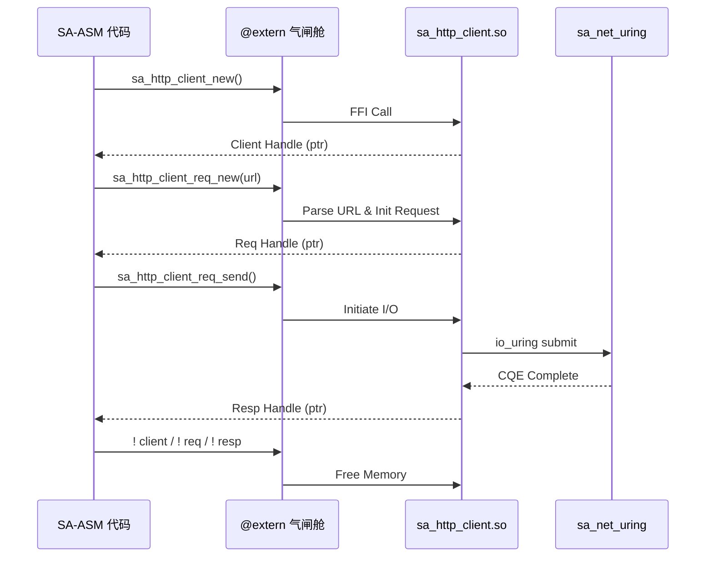

# SA-ASM HTTP Client 插件：架构与开发指南

> 状态说明：本文描述 HTTP Client 插件的目标架构和 SA-facing ABI 方向。当前独立工程位于 `/home/vscode/projects/sa_plugins/sa_plugin_http_client`，真实实现以该工程的 `src/plugin.zig` / `src/http_saasm_api.zig` / `build.zig` 为准。插件文档中的 grant/syscall 阻断属于宿主权限系统目标设计；当前必须用 `.sai`/symbol smoke 和 native smoke 验证实际可用接口。

## 1. 架构目标与定位
`sa_http_client` 插件是 SA-ASM 的官方原生出站网络组件。它提供极速的 HTTP/HTTPS 请求能力，特别针对 **大模型 (如 OpenAI) API 调用**、**爬虫抓取** 和 **SSE 流式响应** 进行了深度优化。

由于 SA 采用“零信任沙箱”架构，HTTP 客户端被设计为可热插拔的独立 Linux 动态库 (`.so`)。出站请求的 grant 审计与 syscall 阻断是宿主侧必须补齐的安全目标，不能仅靠插件自身保证。

## 2. 核心架构设计

### 2.1 底层依托与 FFI 边界
- **底层引擎**: 该插件的内核由 Zig 的 `std.http.Client` 提供支持，通过 FFI (C-ABI) 桥接暴露给 SA 解释器。
- **TLS 支持**: 内置 TLS/SSL 加密，无需外部 `openssl` 依赖（使用 Zig 静态编译的 TLS 库）。
- **零拷贝流水线 (Zero-Copy)**: 这是目标方向。当前插件优先保证 C-ABI 稳定、句柄生命周期清晰、HTTP 行为可测；与 `sa_net_uring` 的深度零拷贝协作需要后续独立验收。

### 2.2 序列图：请求生命周期



## 3. API 规范与 FFI 接口

插件的调用必须通过 `@extern` 声明并在安全的气闸舱中通过 `call` 调用。公开接口应落在插件工程自己的 `.sai` / `.sal`，并由 `nm -D` symbol smoke 验证。

### 3.1 核心句柄类型
HTTP 插件使用不透明的 C 指针 (`ptr`) 表示三种资源，所有资源在生命周期结束时必须显式调用对应的 `_free` 方法（配合 SA 的 `!` 操作符逻辑防泄漏）：
- `Client`: HTTP 连接池管理器
- `Request`: 单次 HTTP 请求上下文
- `Response`: HTTP 响应数据

### 3.2 完整接口定义 (`sa_http_client.sai`)
```sa
// 1. 初始化客户端（use_tls=1 开启 HTTPS，0 为纯 HTTP）
@extern sa_http_client_new(use_tls: u8, &out_client: ptr) -> i32!

// 2. 创建请求
// method: 1=GET, 2=POST, 3=PUT, 4=DELETE
@extern sa_http_client_req_new(client: ptr, method: u8, &url: ptr, url_len: u64, &out_req: ptr) -> i32!

// 3. 设置 Header (按需多次调用)
@extern sa_http_client_req_add_header(req: ptr, &key: ptr, key_len: u64, &val: ptr, val_len: u64) -> i32!

// 4. 发送请求 (会阻塞直到收到响应头)
@extern sa_http_client_req_send(req: ptr, &body_ptr: ptr, body_len: u64, &out_resp: ptr) -> i32!

// 5. 读取响应
@extern sa_http_client_resp_status(resp: ptr) -> u16
@extern sa_http_client_resp_header(resp: ptr, &key: ptr, key_len: u64, &out_val: ptr) -> i32
@extern sa_http_client_resp_body_reader(resp: ptr, &out_reader: ptr) -> i32!

// 6. 资源释放 (防泄漏)
@extern sa_http_client_free(^client: ptr) -> i32!
@extern sa_http_client_req_free(^req: ptr) -> i32!
@extern sa_http_client_resp_free(^resp: ptr) -> i32!
```

## 4. 实战案例：发送 POST 请求

以下是一段真实合法的 SA-ASM 代码，演示如何使用该插件发送带有 Header 的 JSON POST 请求。

```sa
@ffi_wrapper fetch_data() -> i32!:
L_ENTRY:
    res = call @sa_http_client_new(1, &client)
    _ = ? res

    #def URL_LEN = 30
    url = alloc URL_LEN

    res = call @sa_http_client_req_new(client, 2, &url, URL_LEN, &req)
    _ = ? res

    res = call @sa_http_client_req_add_header(req, &key, 12, &val, 16)
    res = call @sa_http_client_req_send(req, &body_data, body_len, &resp)
    _ = ? res

    status = call @sa_http_client_resp_status(resp)
    _ = call @sa_http_client_resp_free(^resp)
    _ = call @sa_http_client_req_free(^req)
    _ = call @sa_http_client_free(^client)

    !url
    return 0
```

## 5. 安全性与零信任 (Zero-Trust) 管控

SA-ASM 是“零信任”引擎。调用 `sa_http_client_new` 并不是随时随地合法的。

### 5.1 权限声明 (`grants`)
如果你的模块试图发起 HTTP 请求，你的项目文件 (`sa.mod`) 或包配置必须明确拥有：
```json
"grants": ["net_tx:api.example.com"]
```
目标行为：如果包在未授权的上下文中调用该 FFI 接口，宿主权限层应截断请求，并向上层抛出明确权限错误。当前文档不应把这一点视作所有插件都已具备的运行时保障。

### 5.2 证书锁定 (Pinning)
除了基础的 TLS 验证外，对于极高安全要求的场景，SA 支持后端服务器证书指纹绑定，抵御中间人 (MITM) 与根证书劫持。
```json
"pinning": {
    "api.example.com": "sha256/XXXXXXXXXXXXXXXXXXXXXXXXXXXXXXXXX="
}
```
