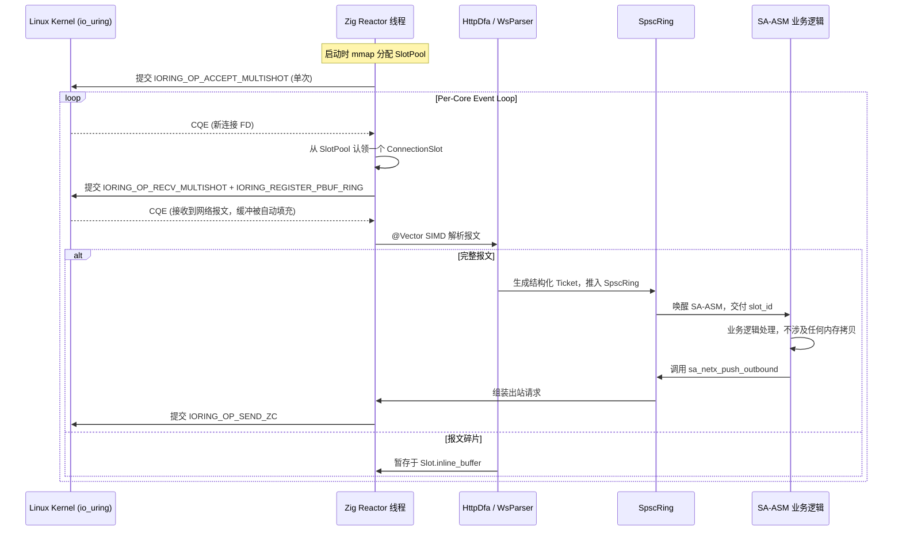

# SA-ASM 极速网络引擎架构与开发计划 (Hyper-Performance Network Engine v0.9)

> v0.9 修订要点（对照 v0.8 的硬伤）：
> - 明确新引擎与现有 `sa_std.net` 的边界（**并行模块**而非替换）。
> - 把 SIMD 解掩码、HTTP DFA 拆包**留在 Zig 侧**（`@Vector` + `std.mem`），SA-ASM 只看结构化 Ticket。
> - 修正 `IORING_OP_SEND_ZC` 的所有权与小包成本陷阱，分层使用 `SEND` / `SEND_ZC`。
> - 修正"零系统调用"为"消灭每请求 syscall"（SQPOLL 是可选项，列代价）。
> - SPSC / MPSC 取舍：**per-core sharded SPSC** 为主，复用现有 `sa_std/sync/mpsc.sa` 仅作慢路径。
> - 显式规划 TLS 终结、连接生命周期、背压、定时器、对标 Bun 的两条 KPI。

## 0. 战略目标与设计哲学

本架构旨在打造一个能在内网裸跑、可以暴打现代运行时（Bun/Node/Go）的底层网络基座。我们将彻底抛弃"Web 框架"的概念，将网络层还原为 **"基于 `io_uring` 的极速网络字节流到内存切片的翻译器"**。

**核心哲学：物理打败魔法**
1. **每请求零分配 (Per-Request Zero Allocation)**：稳态运行时不再 `malloc/free`；连接、buffer、ticket 全部启动时预分配并循环复用。
2. **零拷贝 (Zero Copy) 与 DMA 扇出**：从网卡到业务逻辑，内存数据只存在一份；广播消息利用内核 DMA 扇出（`SEND_ZC`）。
3. **消灭每请求 syscall (Per-Request Syscall Elimination)**：用 `io_uring` 的 SQ/CQ 环把 I/O 提交与收割批量化；可选 `IORING_SETUP_SQPOLL` 进一步消除 `io_uring_enter`，但代价是一个常驻满载的内核轮询线程，按场景择机启用。
4. **SIMD 降维打击**：协议包袱（WebSocket 掩码、`\r\n` 扫描）由 Zig `@Vector` 直接吃掉，不污染 SA-ASM ISA。

### 0.1 边界裁决（必须先写死）
| 议题 | 决定 |
| :--- | :--- |
| TLS / HTTPS | **由前置反向代理（Nginx / Envoy / HAProxy）终结**；SA 引擎只在安全内网裸跑 HTTP/TCP/WS。 |
| HTTP/2、HTTP/3 (QUIC) | **本期不做**；HTTP/1.1 + WebSocket + Raw Binary 三套协议先打透。 |
| 协议解析归属 | **HTTP/WS 拆包、SIMD 解掩码留在 Zig 侧**；SA-ASM 只接收已经结构化的 Ticket。 |
| 连接槽所有权 | **Zig 拥有 `ConnectionSlot` 数组**；SA-ASM 仅持有 `slot_id: u32` 句柄，永远不直接 deref 槽位结构。 |
| 现有 `sa_std.net` | **保留不动**，作为兼容性慢路径；新引擎以 `sa_netx_*` 命名空间并行存在于 `src/runtime/sa_net_uring.zig`。 |

### 0.2 项目目录架构（落到现仓库的施工映射）

```
SA 编译器（现有 src/）
├── flattener/             ← 网络引擎零修改复用
├── referee/               ← 网络引擎零修改复用
├── emit_llvm.zig          ← 零修改；目标三元组保持 x86_64-linux-gnu / aarch64-linux-gnu
├── emit_wasm/             ← 网络引擎不使用（WASM 不暴露 io_uring）
├── common/                ← 零修改复用（atomic / ptr_add / load / store 已就绪）
├── verifier.zig           ← 零修改；新增 sa_netx_* extern 走现有契约校验路径
└── runtime/
    ├── sa_std.zig         ← 保留不动（1519 行，117 个 sa_* export，含旧版 sa_net_tcp_*）
    ├── sa_std.h           ← 保留不动
    ├── native_sys.zig     ← 保留不动
    └── sa_net_uring.zig   ← 【新增】io_uring 网络引擎主体（与 sa_std.zig 并列）
        ├── ConnectionSlot  连接槽数组（4 KB inline + overflow 链）
        ├── SlotPool        启动期 mmap(MAP_POPULATE|MAP_HUGETLB) 预分配
        ├── Reactor         per-core io_uring 实例 + multishot accept/recv
        ├── PbufRing        IORING_REGISTER_PBUF_RING provided buffer 环
        ├── HttpDfaParser   @Vector(32, u8) 扫描 \r\n / Header 偏移
        ├── WsFrameParser   @Vector(16/32, u8) 解掩码 + 状态机
        ├── SpscRing        per-reactor↔per-SA-core 的 inbound/outbound 环
        ├── BroadcastArena  SEND_ZC 共享切片池 + refcount + generation
        ├── TimerWheel      IORING_OP_TIMEOUT 配对的 idle/handshake 超时
        └── 导出符号：sa_netx_init / sa_netx_listen / sa_netx_recv_ticket /
                      sa_netx_push_outbound / sa_netx_broadcast /
                      sa_netx_close_slot / sa_netx_shutdown

SA 标准库（现有 sa_std/）
├── net.sa              ← 保留不动（旧版同步 TCP API）
├── net.sai        ← 保留不动
├── net.sal       ← 保留不动
├── core/
│   └── mem.sa          ← 保留不动；网络热路径禁止调用（标量循环，仅冷路径用）
├── sync/
│   ├── mpsc.sa         ← 保留不动；仅作跨分片回收的慢路径
│   └── mpsc.sal  ← 保留不动
└── 【新增】
    ├── netx.sai   # @extern 契约：sa_netx_* 一族 FFI 声明
    ├── netx.sal  # Ticket_SIZE / Ticket_slot_id / NetxProto_* 偏移
    └── netx.sa         # @import 两个上面的文件，作为 SA 业务层入口

业务示范（后续阶段补）
└── examples/netx_echo/
    ├── echo.sa         # 最小 echo server：recv_ticket → push_outbound
    ├── flash_sale.sa   # 秒杀 demo：扣库存 + 广播售罄
    └── ws_bench.sa     # 对标 Bun 的 32 client ping-pong

文档（现有 docs/）
├── network_engine_plan.md ← 本文档
├── std_rfc.md             ← 后续登记 sa_netx_* 加入标准库的 RFC
└── whitepaper.md          ← 长期路线图引用本计划
```

**改动量预算（仅供参考，实施时再核）**：
| 区域 | 行数 | 性质 |
| :--- | ---: | :--- |
| `src/runtime/sa_net_uring.zig`（全新） | ~2500–3500 | 新增 |
| `sa_std/netx.sai` | ~30 | 新增 |
| `sa_std/netx.sal` | ~20 | 新增 |
| `sa_std/netx.sa` | ~5 | 新增 |
| `src/verifier.zig` / `src/common/*` | 0 | 零修改 |
| `src/runtime/sa_std.zig` | 0 | 零修改（避免破坏 117 个现有 export） |
| `sa_std/net.*` | 0 | 零修改（保留旧 API） |
| `build.zig` | ~10 | 注册新模块 |

---

## 1. 物理地基：连接池与 io_uring（Zig 运行时层）

> 实施目录：新建 `src/runtime/sa_net_uring.zig`，与现有 `src/runtime/sa_std.zig` 并列；导出符号一律以 `sa_netx_` 前缀，避免与现有 117 个 `sa_*` 导出冲突。

### 1.0 核心架构时序 (I/O 生命周期与内存管理)

在深入底层数据结构之前，下面展示了零系统调用 (Zero-Syscall) 网络接收和预分配内存池的运作流：



### 1.1 全局预分配连接池 (Connection Slot Pool)

启动瞬间向 OS 申请连续内存数组，容量按部署目标定（10 万 ~ 100 万）。槽位**完全由 Zig 拥有**，SA-ASM 看不见此结构。

**Zig 侧数据结构（参考定义，实施时落到 `sa_net_uring.zig`）**：
```zig
const ConnectionState = enum(u8) {
    Free,        // 槽位空闲
    Accepting,   // multishot accept 占位
    Handshake,   // TCP 已建立，等待 HTTP/Upgrade 头
    Reading,     // recv SQE 在飞，禁止重复 arm
    Http,        // 稳态 HTTP/1.1
    WebSocket,   // 稳态 WebSocket
    RawBinary,   // 集群内部二进制 RPC
    HalfClosed,  // 对端 FIN，出站尚未排空
    Closing,     // 已发 FIN，等待最后一个 CQE
};

// 严格按 64 字节对齐，消灭伪共享 (False Sharing)
const ConnectionSlot = align(64) struct {
    fd: i32,
    state: ConnectionState,
    proto_flags: u8,            // keep-alive / chunked / WS-compress 等位标
    op_code: u16,               // 解析后的业务路由
    payload_offset: u16,
    payload_len: u16,
    buffer_used: u16,
    last_active_ns: i64,        // 用于 IORING_OP_TIMEOUT 配对清扫
    overflow_buf: ?[*]u8,       // 大 Header / 大 WS 帧的溢出缓冲（按需借用）
    overflow_len: u32,
    inflight_zc: u16,           // 未完成的 SEND_ZC notification 计数
    buffer: [4096]u8,           // inline scratch；超出走 overflow_buf
};
```

**容量规划**：
- 100 万槽位 × 4 KB inline = 4 GB；启动时一次性 `mmap(MAP_POPULATE | MAP_HUGETLB)`，必要时启用透明大页。
- 溢出缓冲走单独的 huge-page 池（建议 32 KB / 256 KB / 2 MB 三档 size-class），关连接归还。
- 真正巨型 payload（> 64 KB，比如文件上传）一律走 `IORING_OP_SPLICE`，不进 inline buffer。

### 1.2 io_uring 核心引擎

弃用 `epoll`，使用 Zig 的 `std.os.linux.IoUring`（已存在于 Zig 标准库，无需新依赖）。

- **Per-core sharded reactor**：reactor 线程数 = 物理核数 / 业务比例，`sched_setaffinity` 绑核；每核一个独立 `io_uring` 实例，避免跨核 SQ 抢占。
- **关键 SQE 操作流**：
  1. 启动时为 listen socket arm `IORING_OP_ACCEPT_MULTISHOT`，单 SQE 持续产 CQE。
  2. 新连接到达 → 占用空闲 Slot → 立即 arm `IORING_OP_RECV_MULTISHOT` + provided buffer ring（`IORING_REGISTER_PBUF_RING`），让内核选 buffer 写入。
  3. 业务出站 → 据 payload 大小走 `IORING_OP_SEND`（小包）或 `IORING_OP_SEND_ZC`（大广播，见 §4）。
  4. 闲置连接 → 配套 `IORING_OP_TIMEOUT` 清扫（idle timeout / 握手超时）。
- **SQPOLL 策略**（可选）：超高吞吐场景可启用 `IORING_SETUP_SQPOLL`，代价是每个 ring 一个常驻满载内核线程；建议默认关闭，仅在 benchmark / 单租户裸金属下开启。

### 1.3 与现有 `sa_std.net` 的关系

| 模块 | 角色 | 何时使用 |
| :--- | :--- | :--- |
| `sa_net_*` (现有，`src/runtime/sa_std.zig`) | 通用 / 阻塞 / 句柄 / Mutex 注册表 | 调试、命令行工具、不在意延迟的场景 |
| `sa_netx_*` (新增，`src/runtime/sa_net_uring.zig`) | 极速 / 无锁 / 槽位 / io_uring | 服务器主进程、所有 1k+ QPS 路径 |

两套路径共存，**新引擎不接管现有 `sa_net_tcp_*`**，避免破坏现有测试与示例。

---

## 2. 协议"薄膜"：零拷贝解析与 SIMD 加速（Zig 侧）

> 这一层全部在 Zig 中实现。SA-ASM 永不接触原始字节流。

### 2.1 零分配 DFA HTTP 解析器（Zig）

数据到达 `slot.buffer` 后，Zig 解析器：
- 用 `@Vector(16, u8)` / `std.mem.indexOfScalar` 寻找 `\r\n` 与 `:` 分隔符。
- 不分配 `HashMap<String, String>`，不复制字符串。
- 仅在 `ConnectionSlot` 上记录路由 op_code 与若干字段的 `(offset, len)` 二元组。
- 输出一个紧凑的 `Ticket`（见 §3.1）压入入站环，由 SA-ASM 业务消费。

### 2.2 零分配 WebSocket 升级

- 命中 `Upgrade: websocket` → 在栈上算 `Base64(SHA1(key + magic))`（栈数组，无堆）。
- `slot.state` 由 `Http` 拨至 `WebSocket`，**fd 不变、buffer 不迁移、不重建连接**。

### 2.3 SIMD 暴力解掩码（Zig `@Vector`）

**禁止逐字节标量循环**。在 `sa_net_uring.zig` 中：
```zig
const V = @Vector(16, u8);  // SSE2/NEON 基线；x86_64 可升 32 字节 AVX2

fn unmask(payload: []u8, mask: [4]u8) void {
    const m4: u32 = @bitCast(mask);
    const m: V = @bitCast(@as(@Vector(4, u32), @splat(m4)));
    var i: usize = 0;
    while (i + 16 <= payload.len) : (i += 16) {
        const chunk: V = @bitCast(payload[i..][0..16].*);
        const x: V = chunk ^ m;
        payload[i..][0..16].* = @bitCast(x);
    }
    // tail：≤ 15 字节标量收尾
    while (i < payload.len) : (i += 1) payload[i] ^= mask[i & 3];
}
```
LLVM 后端会自动选 AVX2 / NEON 指令；若需 32 字节宽度，把 `@Vector(16, u8)` 调成 `@Vector(32, u8)` 即可。

**SA-ASM ISA 不需要新增向量算子**——这是关键的取舍：保持 SA-ASM 简洁，把字节流杂活留给 Zig。

### 2.4 `\r\n` 扫描与 Header 切分

同 §2.3 的思路：用 `@Vector(32, u8)` 一次比较 32 字节，配合 `@reduce(.Or, x == @as(V, @splat('\r')))` 快速定位换行。无需自研状态机也能跑到接近内存带宽。

---

## 3. 三环拓扑（Triple Ring-Buffers）与 SA 气闸舱

### 3.1 Per-core sharded SPSC（默认拓扑）

> ⚠️ 现有 `sa_std/sync/mpsc.sa` 实际上是 **MPSC**（tail 上的 `cmpxchg` 决定多生产者）。本引擎默认采用**每核一对独立的 SPSC** 来彻底消除 cmpxchg 抖动；MPSC 仅作跨核回收等慢路径。

每个 reactor 核 ↔ 每个 SA-ASM 计算核之间，绑定 **3 个独立 SPSC 环**：

1. **入站环 (Inbound Ring, SPSC)**：reactor → SA。
   - `Ticket` 紧凑布局：
     ```
     #def Ticket_SIZE = 24
     #def Ticket_slot_id   = +0   // u32
     #def Ticket_op_code   = +4   // u16
     #def Ticket_proto     = +6   // u8 (Http / Ws / Raw)
     #def Ticket_flags     = +7   // u8
     #def Ticket_payload   = +8   // *u8
     #def Ticket_payload_len = +16 // u32
     #def Ticket_pad       = +20  // u32 reserved
     ```
   - SA-ASM 通过 `load ticket+Ticket_payload as ptr` + `load ticket+Ticket_payload_len as u32` 直接读取偏移直读 payload；**无需 bitcast 指令**，保持当前 ISA 不变。

2. **执行环 / 数据库核心**：SA-ASM 算子单线程消费 Ticket，运行带所有权的算法（扣库存、写聊天记录等）。

3. **出站推送环 (Outbound Ring, SPSC)**：SA → reactor。
   - 入队载荷：`{ slot_id: u32, msg_ptr: *u8, msg_len: u32, fanout_count: u32, gen: u32 }`（24 字节）。
   - `fanout_count = 1` 表示单点发送；`> 1` 表示广播，触发 §4 路径。

**为何 SPSC 而非 MPSC**：sharded 模型中 reactor↔SA 是 1:1，没有任何并发写入者；CAS 即使无竞争也比纯 store/load 慢 5–10 ns，对 ping-pong 跑分不可接受。MPSC 仅在跨分片回收（罕见）时使用现有 `sa_std/sync/mpsc.sa` 的实现。

### 3.2 SA-ASM 边界对接（计划新增 FFI 契约，不修改现有代码）

> 以下声明应当在后续工作中追加到 `sa_std/net.sai` 与 `sa_std/net.sal`，本期仅作计划登记，**不动现有 sa_std**。

新增 `sa_std/netx.sai`（与现有 `net.sai` 共存）：
```
@extern sa_netx_init(slot_capacity: u64, reactor_count: u32) -> i32!
@extern sa_netx_listen(&host: ptr, host_len: u64, port: u16) -> i32!
@extern sa_netx_recv_ticket(reactor_id: u32, &out_ticket: ptr) -> i32!
@extern sa_netx_push_outbound(reactor_id: u32, slot_id: u32, &msg: ptr, len: u32) -> i32!
@extern sa_netx_broadcast(reactor_id: u32, &slot_ids: ptr, n: u32, &msg: ptr, len: u32) -> i32!
@extern sa_netx_close_slot(slot_id: u32) -> i32!
@extern sa_netx_shutdown() -> i32!
```

新增 `sa_std/netx.sal`：
```
#def Ticket_SIZE = 24
#def Ticket_slot_id      = +0
#def Ticket_op_code      = +4
#def Ticket_proto        = +6
#def Ticket_flags        = +7
#def Ticket_payload      = +8
#def Ticket_payload_len  = +16
#def Ticket_pad          = +20

#def NetxProto_HTTP = 1
#def NetxProto_WS   = 2
#def NetxProto_RAW  = 3
```

### 3.3 背压策略（必须明确）

入站环满 → reactor **停止 arm `IORING_OP_RECV_MULTISHOT`**，让 TCP 接收窗口自然收窄、对端被动放慢。**绝不丢包，也不分配新 buffer**。
出站环满 → SA 算子在 `sa_netx_push_outbound` 上忙等若干 ns 后返回 `EAGAIN`，由业务决定丢弃或保留。

### 3.4 连接生命周期完整状态机
```
Free → Accepting → Handshake → (Http | WebSocket | RawBinary)
              ↘ Reading（recv SQE 在飞中，禁止重复 arm）
                    ↓
                 HalfClosed（收到 FIN，但 outbound 还没排空）
                    ↓
                  Closing（已发 FIN，等最后一个 ZC notification）
                    ↓
                   Free
```
每一次状态转换都伴随一次原子 store；Reactor 只读 `state` 决策是否 arm 新 SQE。

---

## 4. 核武级反击：内核级 DMA 扇出广播（仅适用于真广播场景）

> ⚠️ **重要分层**：SEND_ZC 不是万能键。它在 **小消息（< ~1.5 KB）+ 1:1 通信** 场景下因为 notification CQE 的额外 round-trip 反而**慢于普通 `IORING_OP_SEND`**。本引擎只在以下场景启用 SEND_ZC：
> - 单 payload **≥ 1.5 KB**，或
> - **fanout_count ≥ 8**（一条消息发给至少 8 个连接），或
> - 被业务显式标记 `NETX_FLAG_BROADCAST`。
>
> 其余场景一律走 `IORING_OP_SEND` + provided buffer，这才是对标 Bun ping-pong 跑分的正确武器。

### 4.1 RFC 6455 协议优势利用

WebSocket 规定服务器下发的数据**不可加掩码**。一份广播消息对所有客户端在物理字节层面 100% 完全相同，因此可以共用同一块物理内存。

### 4.2 SEND_ZC 的所有权与 refcount

`IORING_OP_SEND_ZC` 是**异步零拷贝**——内核会在数据真正离开网卡后回一个 notification CQE。在此之前**不可释放、不可改写**那块内存。计划必须遵守：

1. 算子在 Arena 中生成 1 份带 WS Header 的连续切片 `[WS Header | Payload]`，并打上 `gen` 代纪元号。
2. 切片入"广播池"，附带 refcount = `fanout_count`。
3. Reactor 为 `fanout_count` 个连接各 arm 一个 `IORING_OP_SEND_ZC`，所有 SQE 的 `addr` 指向**同一块**物理内存；`user_data` 编码 `(gen, slot_id)` 以便回收。
4. 每收到一个 ZC notification CQE → refcount-- ；归零后切片归还 Arena。

> 这一段是与 v0.8 "绝对所有权"哲学的**显式松绑**：广播切片在生命周期内是"内核 + N 个连接"的共享只读内存，不是 SA 单一所有者。这是物理现实，不是哲学失败。

### 4.3 批量提交与 SQ 容量

- SQ ring 默认深度 4096–32768。10 万扇出需要分批：每批填满 SQ → `io_uring_enter(SUBMIT, 0)` → 立即填下一批。
- 启用 `IORING_SETUP_SQPOLL` 可省去 enter syscall，但代价见 §0。
- SQE 的 `len` 字段直接用 payload 长度；header 与 payload 必须**物理相邻**，否则 `writev` 可省一笔。

### 4.4 内核行为
Linux 内核接受 SQE 批后，由网卡 DMA 控制器并行从用户态物理内存读取数据，**不复制到内核 socket buffer**，直接 DMA 到 NIC ring。CPU L1 不受污染。

---

## 5. 性能模型与对标 Bun

### 5.1 两类 KPI 必须分开度量

| KPI | 场景 | 武器 | 与 Bun 对比 |
| :--- | :--- | :--- | :--- |
| **K1: 单点 ping-pong** | 32 client × 64B 双向消息（Bun 官方跑分场景） | `IORING_OP_RECV_MULTISHOT` + `IORING_OP_SEND` + provided buffer + sharded SPSC + SIMD unmask | 目标：≥ Bun 当前 2.5M msg/s，**不依赖 SEND_ZC** |
| **K2: 广播扇出** | 1 source × 10⁵ receivers × 1 KB payload | `IORING_OP_SEND_ZC` + DMA 扇出 + 共享物理切片 | 目标：≥ 10× Bun 同场景吞吐，CPU 占用 ≤ Bun 的 30% |

K1 是 SA 与 Bun 的"正面短兵相接"；K2 是 SA 架构的真正护城河。**两条线必须分别立 benchmark**，不要在一张表上混淆。

### 5.2 性能瓶颈预算（K1 场景，单核 5GHz）

| 阶段 | 周期预算 | 实现 |
| :--- | :--- | :--- |
| recv 完成 → CQE 解析 | 30 ns | io_uring busy-poll |
| WS 帧头解析 | 10 ns | 标量 |
| SIMD 解掩码（64B） | 8 ns | `@Vector(32, u8)` 一周期 |
| Ticket 入站环 SPSC | 15 ns | release store |
| SA 业务（pong 直回） | 50 ns | 拷贝指针 + outbound push |
| Outbound SPSC 出 | 15 ns | acquire load |
| WS Header 拼装 + send SQE | 40 ns | 写 sqe |
| **合计每消息** | **~170 ns** | **理论 ~5.9M msg/s 单核** |

32 client 跑分通常打满 1-2 个核，目标 2.5M–5M msg/s 是合理推算。

---

## 6. 里程碑与验证指标

| 里程碑 | 描述 | 预期目标 / 验收标准 |
| :--- | :--- | :--- |
| **M0: 编译器准备** | 确认 SA-ASM 现有 ISA（atomic、ptr_add、load/store as T）足够支撑 §3.1 的 Ticket 直读；登记 `sa_netx.*` 接口/布局 文件骨架。 | SA-ASM 无需新增 SIMD/bitcast 指令；新 接口/布局 文件评审通过。 |
| **M1: 物理基座** | 新建 `src/runtime/sa_net_uring.zig`，建立 `ConnectionSlot` 池 + io_uring 单 reactor 骨架 + `ACCEPT_MULTISHOT` + `RECV_MULTISHOT` + provided buffer ring。 | 预分配 100 万 Slot 启动无 OOM；TCP 握手与 echo 跑通；零运行时 `malloc`（用 perf 抓 `__libc_malloc` 调用 == 0）。 |
| **M2: HTTP/WS 拆包** | Zig 侧 DFA + SIMD 解掩码；状态拨转 `Http → WebSocket`。 | `curl` 与 `wscat` 联通；逐字节 fuzz 1M 次无 panic；WS 解掩码热路径 perf 占比 < 1%。 |
| **M3: 三环 + SA 贯通** | per-core sharded SPSC 实现；`sa_netx_*` FFI 全部接入 SA-ASM 业务；Raw Binary 偏移直读跑通。 | 端到端 echo；SA-ASM 业务核心吃 Ticket 时间 < 80 ns。 |
| **M4: K1 跑分 (Bun ping-pong)** | 不启用 SEND_ZC；只用 `SEND` + provided buffer + sharded SPSC。 | 单机 32 client 64B ping-pong **≥ 2,500,000 msg/s**（持平 Bun）；CPU 占用 ≤ 50%。 |
| **M5: SEND_ZC 与 DMA 扇出** | SEND_ZC + 广播切片 refcount + 代纪元回收；启用 `IORING_OP_TIMEOUT` 做 idle 清扫。 | K2：1 source × 10⁵ receivers × 1 KB **≥ 30 GB/s 总吞吐**（10× Bun）。 |
| **M6: 反向超越 Bun** | 把 K1 跑分的瓶颈消干净（busy-poll、SQPOLL 调优、CPU pinning、零分配审计）。 | 单机 32 client 64B ping-pong **≥ 3,500,000 msg/s**（≥ 1.4× Bun）。 |

---

## 7. 风险登记

| 风险 | 概率 | 影响 | 缓解 |
| :--- | :--- | :--- | :--- |
| 内核版本 < 6.0，`SEND_ZC` 不可用 | 中 | M5 失效 | M5 自动降级为 `SENDMSG` + `MSG_ZEROCOPY`（5.0+）或 `sendmmsg` |
| `IORING_OP_RECV_MULTISHOT` 在某些发行版 disable | 低 | M1 退化为单发 RECV | 编译期探测内核能力，运行时 fallback |
| SA-ASM Ticket 偏移直读触发对齐惩罚 | 低 | 若干 ns 抖动 | Ticket 强制 8 字节对齐，payload 起始地址 8 字节对齐 |
| 现有 `sa_std/core/mem.sa` 的 `sa_mem_set` 逐字节循环被误用于热路径 | 中 | 性能崩盘 | 新引擎 §1.1 明确规定连接池清零由 Zig `@memset` 处理，禁止 SA-ASM 路径触达 `sa_mem_set`/`sa_mem_copy` |
| TLS 必须本地终结的需求出现 | 低 | §0.1 决议失效 | 仍走前置代理；如真需要，集成 `boringssl` 作为独立 Zig 模块，不污染 SA-ASM |
| Bun/Deno 在 M4-M6 期间有大幅迭代 | 中 | KPI 跟随上调 | KPI 表标注 "vs Bun vX.Y on Linux 6.x"，每次跑分锁版本 |

---

## 8. 与现有代码的契合点（实施时必读）

| 实施点 | 现有依赖 | 备注 |
| :--- | :--- | :--- |
| Ticket 偏移直读 | `src/common/instruction.zig` 已有 `load ... as u32/u64`、`ptr_add` | **无需扩 ISA** |
| 原子操作 | `src/common/instruction.zig` 已有 `atomic_load/store/cmpxchg/atomic_rmw/fence` | sharded SPSC 可直接复用 |
| 慢路径 MPSC（跨分片回收） | `sa_std/sync/mpsc.sa` | 现有实现可用，仅作非热路径 |
| Memcpy/memset | `sa_std/core/mem.sa` 标量循环 | **禁止用于网络热路径**；仅冷路径或单元测试用 |
| 现有 `sa_net_*` | `src/runtime/sa_std.zig` 1353-1517 行 | 保留不动；`sa_netx_*` 全新模块并行 |
| epoll 现存绑定 | `src/runtime/sa_std.zig` 1121-1183 行 | 与 io_uring 互不影响，可继续用于其他工具 |

---

*注：本文档为架构蓝图与路线规划。实施工作由后续 PR 完成；本文档不直接驱动代码修改。所有 Zig 侧实现严格遵循"启动时分配、运行时不分配"的物理法则；SA-ASM 侧严格遵循线性所有权与单一所有者契约。*
